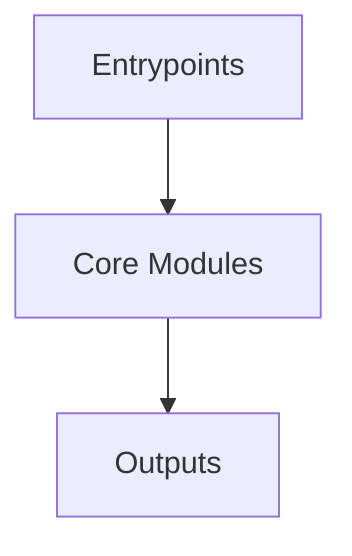

# Overview
Repository `Chart.js` appears to implement a modular system with 1057 source files at commit `6372280085625b43ef34d7b70f3e86b063d22a10`.

## Architecture
Major components inferred from file/module analysis:
- `docs`: be used as a standalone file, but rather as a reference for developers who want to understand the behavior of the category axis in Chart.js
- `root`: The root module of the Chart.js repository is responsible for defining the configuration and dependencies of the library
- `auto`: The `auto` module in the `chart.js` repository is responsible for automatically generating the necessary code for a chart based on the input data
- `helpers`: The Chart.js helpers module is a package that provides a set of helper functions for other packages that need to support bundlers that do not support exports
- `test`: The `test` module in the `chart.js` repository is responsible for configuring the testing environment and dependencies for the package in a Node.js environment
- `src`: : scaleOptions           })

## Data Flow / Execution Flow
Typical execution path: `Entrypoint -> Core Modules -> Runtime Services -> Output/Side Effects`.
Entrypoints initialize core modules, which orchestrate processing and emit outputs or side effects.

## Configuration & Dependencies
- Build/dependency files: package.json, auto/package.json, docs/package.json, helpers/package.json, test/integration/node-commonjs/package.json, test/integration/node/package.json, test/integration/react-browser/package.json, test/integration/typescript-node-next/package.json, test/integration/typescript-node/package.json
- Config files: tsconfig.json, test/fixtures/core.scale/cartesian-axis-border-settings.json, test/integration/react-browser/tsconfig.json, test/integration/typescript-node-next/tsconfig.json, test/integration/typescript-node/tsconfig.json, test/types/tsconfig.json

## How to Run / Key Scripts
- Detected entrypoints: src/index.ts, src/controllers/index.js, src/core/index.ts, src/elements/index.js, src/helpers/index.ts, src/platform/index.js, src/plugins/index.js, src/plugins/plugin.filler/index.js, src/scales/index.js, test/index.js, test/integration/typescript-node-next/src/index.ts, test/integration/typescript-node/src/index.ts
- Use repository build scripts/package manager tasks based on detected build files.

## Notable Design Choices / Extension Points
- The codebase is organized in modules that can be extended by adding new feature files under existing module boundaries.
- Extension is likely centered around entrypoint wiring, configuration files, and module-specific implementations.
