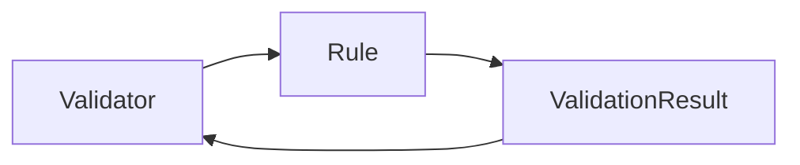

Overview
================

FluentValidation is a .NET library for validating .NET objects. It provides a simple and powerful way to validate objects, and it is widely used in .NET development. FluentValidation is designed to be easy to use, and it provides a lot of features that make it easy to validate objects.

Architecture
============

FluentValidation is a .NET library that provides a simple and powerful way to validate .NET objects. It is designed to be easy to use, and it provides a lot of features that make it easy to validate objects.

The architecture of FluentValidation is based on the following components:

* Validator: The validator is the core component of FluentValidation. It is responsible for validating objects against a set of rules.
* Rule: A rule is a set of validation logic that is applied to an object. Rules can be defined using a fluent API, and they can be combined to create complex validation logic.
* ValidationResult: The validation result is the result of validating an object against a set of rules. It contains information about the validation errors, and it can be used to determine whether the object is valid or not.

Data Flow / Execution Flow
============================

The data flow of FluentValidation is as follows:

1. The validator is created and configured with a set of rules.
2. The validator is invoked with an object to be validated.
3. The validator applies the rules to the object, and it generates a validation result.
4. The validation result is returned to the caller.

Configuration & Dependencies
============================

FluentValidation can be configured using a variety of methods, including:

* Using a configuration file
* Using a code-based configuration
* Using a combination of both

FluentValidation also has a number of dependencies, including:

* .NET Standard 2.0
* .NET Framework 4.6.1
* .NET Core 2.0

How to Run / Key Scripts
=========================

FluentValidation can be run using the following scripts:

* `dotnet run`: This script runs the FluentValidation application.
* `dotnet test`: This script runs the FluentValidation tests.

Notable Design Choices / Extension Points
=====================================

FluentValidation provides a number of extension points that allow developers to customize the behavior of the library. These include:

* Using a custom validator factory
* Using a custom validation result
* Using a custom validation error
* Using a custom validation context
* Using a custom validation rule

Mermaid Architecture Diagram
============================

Here is a Mermaid architecture diagram that shows the architecture of FluentValidation:

This diagram shows the relationship between the validator, rule, and validation result in FluentValidation. The validator is responsible for validating objects against a set of rules, and the rule is responsible for defining the validation logic. The validation result is the result of validating an object against a set of rules.