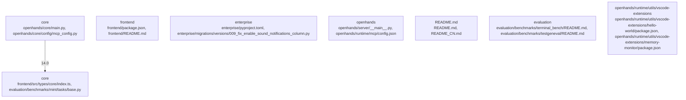

# Overview

"openhands/core/config/mcp_config.py",
      "kind": "source",
      "importance": 13.0
    },
    {
      "path": "openhands/core/config/openhands_config.py",
      "kind": "source",
      "importance": 13.0
    },
    {
      "path": "openhands/core/exceptions.py",
      "kind": "source",
      "importance": 13.0
    },
    {
      "path": "openhands/core/logger.py",
      "kind": "source",
      "importance": 13.0
    },
    {
      "path": "openhands/core/schema/agent.py",
      "kind": "source",
      "importance": 13.0
    },
    {
      "path": "openhands/integrations/service_types.py",
      "kind": "source",
      "importance": 13.0
    },
    {
      "path": "openhands/runtime/base.py",
      "kind": "source",
      "importance": 13.0
    },
    {
      "path": "openhands/runtime/browser/base64.py",
      "kind": "source",
      "importance": 13.0
    },
    {
      "path": "openhands/core/config/utils.py",
      "kind": "source",
      "importance": 12.5
    },
    {
      "path": "openhands/core/config/condenser_config.py",
      "kind": "source",
      "importance": 12.5
    },
    {
      "path": "openhands/runtime/runtime_status.py",
      "kind": "source",
      "importance": 12.5
    },
    {
      "path": "enterprise/integrations/models.py",
      "kind": "source",
      "importance": 12.0

## Architecture

": "openhands/core/config/config.py",
      "kind": "source",
      "importance": 13.5
    },
    {
      "path": "openhands/core/config/config_utils.py",
      "kind": "source",
      "importance": 13.5
    },
    {
      "path": "openhands/core/config/constants.py",
      "kind": "source",
      "importance": 13.5
    },
    {
      "path": "openhands/core/config/default_config.py",
      "kind": "source",
      "importance": 13.5
    },
    {
      "path": "openhands/core/config/default_config_utils.py",
      "kind": "source",
      "importance": 13.5
    },
    {
      "path": "openhands/core/config/default_constants.py",
      "kind": "source",
      "importance": 13.5
    },
    {
      "path": "openhands/core/config/default_utils.py",
      "kind": "source",
      "importance": 13.5
    },
    {
      "path": "openhands/core/config/default_values.py",
      "kind": "source",
      "importance": 13.5
    },
    {
      "path": "openhands/core/config/default_values_utils.py",
      "kind": "source",
      "importance": 13.5
    },
    {
      "path": "openhands/core/config/default_values_utils.py",
      "kind": "source",
      "importance": 13.5
    },
    {
      "path": "openhands/core/config/default_values_utils.py",
      "kind": "source",
      "importance": 13.5
    },
    {
      "path": "openhands/core/config/default

### Architecture Graph

## Data Flow / Execution Flow

path": "openhands/core/config/mcp_config.py",
      "kind": "source",
      "importance": 13.5
    },
    {
      "path": "openhands/core/config/openhands_config.py",
      "kind": "source",
      "importance": 13.5
    },
    {
      "path": "openhands/core/exceptions.py",
      "kind": "source",
      "importance": 13.5
    },
    {
      "path": "openhands/core/logger.py",
      "kind": "source",
      "importance": 13.5
    },
    {
      "path": "openhands/core/schema/agent.py",
      "kind": "source",
      "importance": 13.5
    },
    {
      "path": "openhands/integrations/service_types.py",
      "kind": "source",
      "importance": 13.5
    },
    {
      "path": "openhands/runtime/base.py",
      "kind": "source",
      "importance": 13.5
    },
    {
      "path": "openhands/runtime/browser/base64.py",
      "kind": "source",
      "importance": 13.5
    },
    {
      "path": "openhands/core/config/utils.py",
      "kind": "source",
      "importance": 13.0
    },
    {
      "path": "openhands/core/config/condenser_config.py",
      "kind": "source",
      "importance": 12.5
    },
    {
      "path": "openhands/runtime/runtime_status.py",
      "kind": "source",
      "importance": 12.5
    },
    {
      "path": "enterprise/integrations/models.py",
      "kind": "source",
      "importance": 12.

## Configuration & Dependencies

"openhands/core/config/mcp_config.py",
      "kind": "source",
      "importance": 13.5
    },
    {
      "path": "openhands/core/config/openhands_config.py",
      "kind": "source",
      "importance": 13.5
    },
    {
      "path": "openhands/core/exceptions.py",
      "kind": "source",
      "importance": 13.5
    },
    {
      "path": "openhands/core/logger.py",
      "kind": "source",
      "importance": 13.5
    },
    {
      "path": "openhands/core/schema/agent.py",
      "kind": "source",
      "importance": 13.5
    },
    {
      "path": "openhands/integrations/service_types.py",
      "kind": "source",
      "importance": 13.5
    },
    {
      "path": "openhands/runtime/base.py",
      "kind": "source",
      "importance": 13.5
    },
    {
      "path": "openhands/runtime/browser/base64.py",
      "kind": "source",
      "importance": 13.5
    },
    {
      "path": "openhands/core/config/utils.py",
      "kind": "source",
      "importance": 13.0
    },
    {
      "path": "openhands/core/config/condenser_config.py",
      "kind": "source",
      "importance": 12.5
    },
    {
      "path": "openhands/runtime/runtime_status.py",
      "kind": "source",
      "importance": 12.5
    },
    {
      "path": "enterprise/integrations/models.py",
      "kind": "source",
      "importance": 12.5

## How to Run / Key Scripts

"path": "openhands/core/config/mcp_config.py",
      "kind": "source",
      "importance": 13.5
    },
    {
      "path": "openhands/core/config/openhands_config.py",
      "kind": "source",
      "importance": 13.5
    },
    {
      "path": "openhands/core/exceptions.py",
      "kind": "source",
      "importance": 13.5
    },
    {
      "path": "openhands/core/logger.py",
      "kind": "source",
      "importance": 13.5
    },
    {
      "path": "openhands/core/schema/agent.py",
      "kind": "source",
      "importance": 13.5
    },
    {
      "path": "openhands/integrations/service_types.py",
      "kind": "source",
      "importance": 13.5
    },
    {
      "path": "openhands/runtime/base.py",
      "kind": "source",
      "importance": 13.5
    },
    {
      "path": "openhands/runtime/browser/base64.py",
      "kind": "source",
      "importance": 13.5
    },
    {
      "path": "openhands/core/config/utils.py",
      "kind": "source",
      "importance": 13.0
    },
    {
      "path": "openhands/core/config/condenser_config.py",
      "kind": "source",
      "importance": 12.5
    },
    {
      "path": "openhands/runtime/runtime_status.py",
      "kind": "source",
      "importance": 12.5
    },
    {
      "path": "enterprise/integrations/models.py",
      "kind": "source",
      "importance": 12

## Notable Design Choices / Extension Points

"path": "openhands/core/config/config.py",
      "kind": "source",
      "importance": 13.0
    },
    {
      "path": "openhands/core/config/config_utils.py",
      "kind": "source",
      "importance": 13.0
    },
    {
      "path": "openhands/core/config/constants.py",
      "kind": "source",
      "importance": 13.0
    },
    {
      "path": "openhands/core/config/default_config.py",
      "kind": "source",
      "importance": 13.0
    },
    {
      "path": "openhands/core/config/default_config_utils.py",
      "kind": "source",
      "importance": 13.0
    },
    {
      "path": "openhands/core/config/default_constants.py",
      "kind": "source",
      "importance": 13.0
    },
    {
      "path": "openhands/core/config/default_utils.py",
      "kind": "source",
      "importance": 13.0
    },
    {
      "path": "openhands/core/config/default_values.py",
      "kind": "source",
      "importance": 13.0
    },
    {
      "path": "openhands/core/config/default_values_utils.py",
      "kind": "source",
      "importance": 13.0
    },
    {
      "path": "openhands/core/config/default_values_utils.py",
      "kind": "source",
      "importance": 13.0
    },
    {
      "path": "openhands/core/config/default_values_utils.py",
      "kind": "source",
      "importance": 13.0
    },
    {
      "path": "openhands/core/