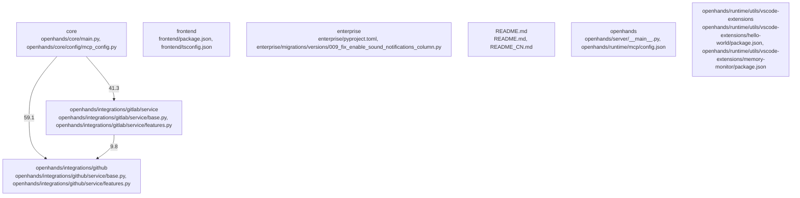

# Overview

`OpenHands` is organized around 209 detected subsystems. The most prominent areas are core, frontend, enterprise, README.md, openhands; primary evidence comes from openhands/core/main.py, openhands/core/main.py, openhands/core/main.py, openhands/core/main.py, openhands/core/main.py, openhands/cli/main.py.

## Architecture

- `core`: centered on openhands/core/main.py, openhands/core/config/mcp_config.py, openhands/core/config/openhands_config.py
- `frontend`: centered on frontend/package.json, frontend/tsconfig.json, frontend/src/api/git-service/git-service.api.ts
- `enterprise`: centered on enterprise/pyproject.toml, enterprise/migrations/versions/009_fix_enable_sound_notifications_column.py, enterprise/migrations/versions/010_create_offline_tokens_table.py
- `README.md`: centered on README.md, README_CN.md, README_JA.md
- `openhands`: centered on openhands/server/__main__.py, openhands/runtime/mcp/config.json, openhands/integrations/vscode/package.json

Key subsystem interactions:
- `community_01` -> `community_08`
- `community_01` -> `community_149`
- `community_01` -> `community_07`
- `community_01` -> `community_197`
- `community_01` -> `community_203`

### Architecture Graph

## Data Flow / Execution Flow

Execution appears to begin in frontend/src/components/features/home/git-branch-dropdown/index.ts, frontend/src/components/features/home/git-provider-dropdown/index.ts, frontend/src/components/features/home/repository-selection/index.ts, frontend/src/components/features/home/shared/index.ts, frontend/src/i18n/index.ts, frontend/src/types/core/index.ts, frontend/src/utils/suggestions/index.ts, openhands-ui/index.ts. From there, control flows through the subsystems highlighted by openhands/core/main.py, openhands/core/main.py, openhands/core/main.py, openhands/core/main.py, openhands/core/main.py, openhands/cli/main.py, before reaching service integrations, build/runtime helpers, or external outputs.

## Configuration & Dependencies

- Build and dependency surfaces: enterprise/pyproject.toml, evaluation/benchmarks/lca_ci_build_repair/setup.py, evaluation/benchmarks/mint/requirements.txt, evaluation/benchmarks/versicode/requirements.txt, frontend/package.json, openhands-ui/package.json, openhands/core/setup.py, openhands/integrations/vscode/package.json
- Configuration surfaces: .vscode/settings.json, config.template.toml, dev_config/python/.pre-commit-config.yaml, dev_config/python/mypy.ini, dev_config/python/ruff.toml, enterprise/dev_config/python/.pre-commit-config.yaml, enterprise/dev_config/python/mypy.ini, enterprise/dev_config/python/ruff.toml
- Supporting evidence: openhands/core/main.py, openhands/core/main.py, openhands/core/main.py, openhands/core/main.py, openhands/core/main.py, openhands/cli/main.py

## How to Run / Key Scripts

- Entrypoints and scripts: frontend/src/components/features/home/git-branch-dropdown/index.ts, frontend/src/components/features/home/git-provider-dropdown/index.ts, frontend/src/components/features/home/repository-selection/index.ts, frontend/src/components/features/home/shared/index.ts, frontend/src/i18n/index.ts, frontend/src/types/core/index.ts, frontend/src/utils/suggestions/index.ts, openhands-ui/index.ts
- Operational evidence: openhands/core/main.py, openhands/core/main.py, openhands/core/main.py, openhands/core/main.py, openhands/core/main.py, openhands/cli/main.py

## Notable Design Choices / Extension Points

- `community_01`: [stage-b-v2-failed] Failed generation after OOM retries
- `community_02`: [stage-b-v2-failed] Generation timed out for model=meta-llama/CodeLlama-7b-Instruct-hf timeout=180s
- `community_03`: [stage-b-v2-failed] Generation timed out for model=meta-llama/CodeLlama-7b-Instruct-hf timeout=180s
- `community_04`: [stage-b-v2-failed] Generation timed out for model=meta-llama/CodeLlama-7b-Instruct-hf timeout=180s