# Overview

index.js",
      "kind": "entrypoint",
      "importance": 10.0
    },
    {
      "path": "spec/fixtures/api/app-path/lib/index.js",
      "kind": "entrypoint",
      "importance": 9.0
    },
    {
      "path": "spec/fixtures/api/electron-main-module/app/index.js",
      "kind": "entrypoint",
      "importance": 9.0
    },
    {
      "path": "spec/fixtures/crash-cases/api-browser-destroy/index.js",
      "kind": "entrypoint",
      "importance": 8.0
    },
    {
      "path": "spec/fixtures/crash-cases/early-in-memory-session-create/index.js",
      "kind": "entrypoint",
      "importance": 8.0
    },
    {
      "path": "spec/fixtures/crash-cases/in-memory-session-double-free/index.js",
      "kind": "entrypoint",
      "importance": 8.0
    },
    {
      "path": "spec/fixtures/crash-cases/quit-on-crashed-event/index.js",
      "kind": "entrypoint",
      "importance": 8.0
    },
    {
      "path": "spec/fixtures/api/command-line/package.json",
      "kind": "config",
      "importance": 7.0
    },
    {
      "path": "spec/fixtures/api/context-bridge/context-bridge-mutability/package.json",
      "kind": "config",
      "importance": 7.0
    },
    {
      "path": "spec/fixtures/api/cookie-app/package.json",
      "kind": "config",
      "importance": 7.0
    },
    {
      "path": "spec/fixtures/api/default-

## Architecture

/index.js",
      "kind": "entrypoint",
      "importance": 10.0
    },
    {
      "path": "spec/index.js",
      "kind": "entrypoint",
      "importance": 10.0
    },
    {
      "path": "spec/fixtures/api/app-path/lib/index.js",
      "kind": "entrypoint",
      "importance": 9.0
    },
    {
      "path": "spec/fixtures/api/electron-main-module/app/index.js",
      "kind": "entrypoint",
      "importance": 9.0
    },
    {
      "path": "spec/fixtures/crash-cases/api-browser-destroy/index.js",
      "kind": "entrypoint",
      "importance": 8.0
    },
    {
      "path": "spec/fixtures/crash-cases/early-in-memory-session-create/index.js",
      "kind": "entrypoint",
      "importance": 8.0
    },
    {
      "path": "spec/fixtures/crash-cases/in-memory-session-double-free/index.js",
      "kind": "entrypoint",
      "importance": 8.0
    },
    {
      "path": "spec/fixtures/crash-cases/quit-on-crashed-event/index.js",
      "kind": "entrypoint",
      "importance": 8.0
    },
    {
      "path": "spec/fixtures/crash-cases/api-browser-destroy/index.js",
      "kind": "entrypoint",
      "importance": 7.0
    },
    {
      "path": "spec/fixtures/crash-cases/early-in-memory-session-create/index.js",
      "kind": "entrypoint",
      "importance": 7.0
    },
    {
      "path": "spec/fixtures/cr

### Architecture Graph

```mermaid

flowchart TD
  community_01[shell\nshell/browser/api/electron_api_extensions.cc, shell/browser/api/electron_api_extensions.h]
  community_02[spec\nspec/fixtures/api/app-path/lib/index.js, spec/fixtures/api/electron-main-module/app/index.js]
  community_03[docs\ndocs/api/extensions-api.md, docs/api/extensions.md]
  community_04[patches\npatches/chromium/chore_defer_usb_service_getdevices_request_until_usb_service_is.patch, patches/chromium/custom_protocols_plzserviceworker.patch]
  community_05[README.md\nREADME.md, tsconfig.default_app.json]
  community_06[lib\nlib/browser/api/service-worker-main.ts, lib/browser/api/auto-updater.ts]
  community_07[script\nscript/gen-filenames.ts, script/gen-hunspell-filenames.js]
  community_08[lib\nscript/lib/util.py, script/lib/config.py]

```

## Data Flow / Execution Flow

spec/fixtures/api/app-path/lib/index.js",
      "kind": "entrypoint",
      "importance": 10.0
    },
    {
      "path": "spec/fixtures/api/electron-main-module/app/index.js",
      "kind": "entrypoint",
      "importance": 10.0
    },
    {
      "path": "spec/fixtures/crash-cases/api-browser-destroy/index.js",
      "kind": "entrypoint",
      "importance": 10.0
    },
    {
      "path": "spec/fixtures/crash-cases/early-in-memory-session-create/index.js",
      "kind": "entrypoint",
      "importance": 10.0
    },
    {
      "path": "spec/fixtures/crash-cases/in-memory-session-double-free/index.js",
      "kind": "entrypoint",
      "importance": 10.0
    },
    {
      "path": "spec/fixtures/crash-cases/quit-on-crashed-event/index.js",
      "kind": "entrypoint",
      "importance": 10.0
    },
    {
      "path": "spec/fixtures/crash-cases/api-browser-destroy/index.js",
      "kind": "entrypoint",
      "importance": 10.0
    },
    {
      "path": "spec/fixtures/crash-cases/early-in-memory-session-create/index.js",
      "kind": "entrypoint",
      "importance": 10.0
    },
    {
      "path": "spec/fixtures/crash-cases/in-memory-session-double-free/index.js",
      "kind": "entrypoint",
      "importance": 10.0
    },
    {
      "path": "spec/fixtures/crash-cases/quit-on-crashed

## Configuration & Dependencies

index.js",
      "kind": "entrypoint",
      "importance": 10.0
    },
    {
      "path": "spec/fixtures/api/app-path/lib/index.js",
      "kind": "entrypoint",
      "importance": 9.0
    },
    {
      "path": "spec/fixtures/api/electron-main-module/app/index.js",
      "kind": "entrypoint",
      "importance": 9.0
    },
    {
      "path": "spec/fixtures/crash-cases/api-browser-destroy/index.js",
      "kind": "entrypoint",
      "importance": 8.0
    },
    {
      "path": "spec/fixtures/crash-cases/early-in-memory-session-create/index.js",
      "kind": "entrypoint",
      "importance": 8.0
    },
    {
      "path": "spec/fixtures/crash-cases/in-memory-session-double-free/index.js",
      "kind": "entrypoint",
      "importance": 8.0
    },
    {
      "path": "spec/fixtures/crash-cases/quit-on-crashed-event/index.js",
      "kind": "entrypoint",
      "importance": 8.0
    },
    {
      "path": "spec/fixtures/api/command-line/package.json",
      "kind": "config",
      "importance": 7.0
    },
    {
      "path": "spec/fixtures/api/context-bridge/context-bridge-mutability/package.json",
      "kind": "config",
      "importance": 7.0
    },
    {
      "path": "spec/fixtures/api/cookie-app/package.json",
      "kind": "config",
      "importance": 7.0
    },
    {
      "path": "spec/fixtures/api/default-

## How to Run / Key Scripts

"spec/fixtures/api/app-path/lib/index.js",
      "kind": "entrypoint",
      "importance": 10.0
    },
    {
      "path": "spec/fixtures/api/electron-main-module/app/index.js",
      "kind": "entrypoint",
      "importance": 10.0
    },
    {
      "path": "spec/fixtures/crash-cases/api-browser-destroy/index.js",
      "kind": "entrypoint",
      "importance": 10.0
    },
    {
      "path": "spec/fixtures/crash-cases/early-in-memory-session-create/index.js",
      "kind": "entrypoint",
      "importance": 10.0
    },
    {
      "path": "spec/fixtures/crash-cases/in-memory-session-double-free/index.js",
      "kind": "entrypoint",
      "importance": 10.0
    },
    {
      "path": "spec/fixtures/crash-cases/quit-on-crashed-event/index.js",
      "kind": "entrypoint",
      "importance": 10.0
    },
    {
      "path": "spec/fixtures/api/command-line/package.json",
      "kind": "config",
      "importance": 9.0
    },
    {
      "path": "spec/fixtures/api/context-bridge/context-bridge-mutability/package.json",
      "kind": "config",
      "importance": 9.0
    },
    {
      "path": "spec/fixtures/api/cookie-app/package.json",
      "kind": "config",
      "importance": 9.0
    },
    {
      "path": "spec/fixtures/api/default-menu/package.json",
      "kind": "config",
      "importance": 9.0
    },

## Notable Design Choices / Extension Points

": "spec/fixtures/api/app-path/lib/index.js",
      "kind": "entrypoint",
      "importance": 10.0
    },
    {
      "path": "spec/fixtures/api/electron-main-module/app/index.js",
      "kind": "entrypoint",
      "importance": 10.0
    },
    {
      "path": "spec/fixtures/crash-cases/api-browser-destroy/index.js",
      "kind": "entrypoint",
      "importance": 10.0
    },
    {
      "path": "spec/fixtures/crash-cases/early-in-memory-session-create/index.js",
      "kind": "entrypoint",
      "importance": 10.0
    },
    {
      "path": "spec/fixtures/crash-cases/in-memory-session-double-free/index.js",
      "kind": "entrypoint",
      "importance": 10.0
    },
    {
      "path": "spec/fixtures/crash-cases/quit-on-crashed-event/index.js",
      "kind": "entrypoint",
      "importance": 10.0
    },
    {
      "path": "spec/fixtures/api/command-line/package.json",
      "kind": "config",
      "importance": 9.0
    },
    {
      "path": "spec/fixtures/api/context-bridge/context-bridge-mutability/package.json",
      "kind": "config",
      "importance": 9.0
    },
    {
      "path": "spec/fixtures/api/cookie-app/package.json",
      "kind": "config",
      "importance": 9.0
    },
    {
      "path": "spec/fixtures/api/default-menu/package.json",
      "kind": "config",
      "importance": 9.0
    },