# Overview

`electron` is organized around 275 detected subsystems. The most prominent areas are shell, docs, README.md, lib, docs; primary evidence comes from script/release/notes/index.ts, script/release/notes/index.ts, npm/index.js, npm/index.js, script/release/notes/index.ts, script/release/notes/index.ts.

## Architecture

- `shell`: centered on shell/browser/api/electron_api_extensions.cc, shell/browser/api/electron_api_extensions.h, shell/browser/api/electron_api_service_worker_context.cc
- `docs`: centered on docs/api/extensions-api.md, docs/api/extensions.md, docs/api/ipc-main-service-worker.md
- `README.md`: centered on README.md, tsconfig.default_app.json, tsconfig.electron.json
- `lib`: centered on lib/browser/api/service-worker-main.ts, lib/browser/api/content-tracing.ts, lib/browser/api/crash-reporter.ts
- `docs`: centered on docs/README.md, docs/breaking-changes.md, docs/experimental.md

Key subsystem interactions:
- `community_06` -> `community_107`
- `community_190` -> `community_47`
- `community_107` -> `community_47`
- `community_06` -> `community_106`
- `community_06` -> `community_224`

### Architecture Graph

```mermaid

flowchart TD
  community_01[shell\nshell/browser/api/electron_api_extensions.cc, shell/browser/api/electron_api_extensions.h]
  community_02[docs\ndocs/api/extensions-api.md, docs/api/extensions.md]
  community_03[README.md\nREADME.md, tsconfig.default_app.json]
  community_04[lib\nlib/browser/api/service-worker-main.ts, lib/browser/api/content-tracing.ts]
  community_05[docs\ndocs/README.md, docs/breaking-changes.md]
  community_06[lib\nscript/lib/util.py, script/lib/config.py]
  community_07[shell/browser/extensions\nshell/browser/extensions/electron_browser_context_keyed_service_factories.cc, shell/browser/extensions/electron_browser_context_keyed_service_factories.h]
  community_08[shell/common/extensions/api\nshell/common/extensions/api/BUILD.gn, shell/common/extensions/api/_api_features.json]

```

## Data Flow / Execution Flow

Execution appears to begin in npm/index.js, script/release/notes/index.ts, spec/fixtures/api/app-path/lib/index.js, spec/fixtures/api/electron-main-module/app/index.js, spec/fixtures/auto-update/check-with-headers/index.js, spec/fixtures/auto-update/check/index.js, spec/fixtures/auto-update/initial/index.js, spec/fixtures/auto-update/update-json/index.js. From there, control flows through the subsystems highlighted by npm/index.js, npm/index.js, script/release/notes/index.ts, script/release/notes/index.ts, script/release/notes/index.ts, script/release/notes/index.ts, before reaching service integrations, build/runtime helpers, or external outputs.

## Configuration & Dependencies

- Build and dependency surfaces: default_app/package.json, npm/package.json, package.json, spec/fixtures/api/app-path/package.json, spec/fixtures/api/command-line/package.json, spec/fixtures/api/context-bridge/context-bridge-mutability/package.json, spec/fixtures/api/cookie-app/package.json, spec/fixtures/api/default-menu/package.json
- Configuration surfaces: patches/config.json, spec/ts-smoke/tsconfig.json, tsconfig.default_app.json, tsconfig.electron.json, tsconfig.json, tsconfig.script.json, tsconfig.spec.json
- Supporting evidence: package.json, package.json, package.json, package.json, default_app/package.json, npm/package.json

## How to Run / Key Scripts

- Entrypoints and scripts: npm/index.js, script/release/notes/index.ts, spec/fixtures/api/app-path/lib/index.js, spec/fixtures/api/electron-main-module/app/index.js, spec/fixtures/auto-update/check-with-headers/index.js, spec/fixtures/auto-update/check/index.js, spec/fixtures/auto-update/initial/index.js, spec/fixtures/auto-update/update-json/index.js
- Operational evidence: script/release/notes/index.ts, script/release/notes/index.ts, npm/index.js, npm/index.js, script/release/notes/index.ts, script/release/notes/index.ts

## Notable Design Choices / Extension Points

- `community_01`: [stage-b-v2-failed] Generation timed out for model=meta-llama/CodeLlama-7b-Instruct-hf timeout=180s
- `community_02`: [stage-b-v2-failed] Generation timed out for model=meta-llama/CodeLlama-7b-Instruct-hf timeout=180s
- `community_03`: [stage-b-v2-failed] Generation timed out for model=meta-llama/CodeLlama-7b-Instruct-hf timeout=180s
- `community_04`: [stage-b-v2-failed] Generation timed out for model=meta-llama/CodeLlama-7b-Instruct-hf timeout=180s