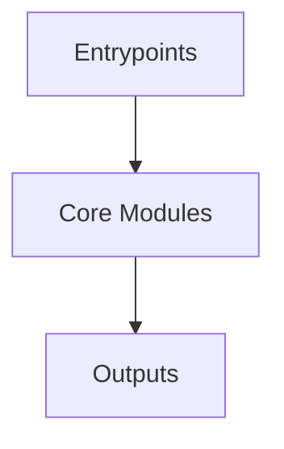

# Overview
Repository `git-credential-manager` appears to implement a modular system with 476 source files at commit `b62021fdd7f0e28bf851580e0afd834976bd79d1`.

## Architecture
Major components inferred from file/module analysis:
- `docs`: The Git Credential Manager (GCM) is a cross-platform credential manager for Git that provides secure storage and retrieval of credentials for Git repositories
- `src`: 
- `root`: The git-credential-manager repository is a secure Git credential helper that supports multiple source control hosting services and platforms

## Data Flow / Execution Flow
Typical execution path: `Entrypoint -> Core Modules -> Runtime Services -> Output/Side Effects`.
Entrypoints initialize core modules, which orchestrate processing and emit outputs or side effects.

## Configuration & Dependencies
- Build/dependency files: src/linux/Packaging.Linux/Packaging.Linux.csproj, src/osx/Installer.Mac/Installer.Mac.csproj, src/shared/Atlassian.Bitbucket.Tests/Atlassian.Bitbucket.Tests.csproj, src/shared/Atlassian.Bitbucket/Atlassian.Bitbucket.csproj, src/shared/Core.Tests/Core.Tests.csproj, src/shared/Core/Core.csproj, src/shared/DotnetTool/DotnetTool.csproj, src/shared/Git-Credential-Manager/Git-Credential-Manager.csproj, src/shared/GitHub.Tests/GitHub.Tests.csproj, src/shared/GitHub/GitHub.csproj, src/shared/GitLab.Tests/GitLab.Tests.csproj, src/shared/GitLab/GitLab.csproj, src/shared/Microsoft.AzureRepos.Tests/Microsoft.AzureRepos.Tests.csproj, src/shared/Microsoft.AzureRepos/Microsoft.AzureRepos.csproj, src/shared/TestInfrastructure/TestInfrastructure.csproj, src/windows/Installer.Windows/Installer.Windows.csproj
- Config files: not clearly detected

## How to Run / Key Scripts
- Detected entrypoints: not clearly detected
- Use repository build scripts/package manager tasks based on detected build files.

## Notable Design Choices / Extension Points
- The codebase is organized in modules that can be extended by adding new feature files under existing module boundaries.
- Extension is likely centered around entrypoint wiring, configuration files, and module-specific implementations.
