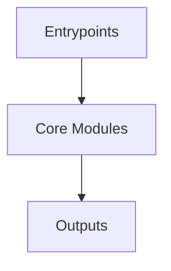

# Overview
Repository `graphrag` appears to implement a modular system with 602 source files at commit `a398cc38bb75c17ee37894f2f2a751e2231d9347`.

## Architecture
Major components inferred from file/module analysis:
- `graphrag`: D_IDS`, `PERIOD_START`, `PERIOD_END`: These fields define the structure of a set of IDs and dates that are associated with a particular period
- `docs`: The `init` command is used to initialize a new GraphRAG workspace and generate the necessary configuration files
- `root`: The root module of the GraphRAG repository is responsible for providing a starting point for users who want to explore the use of GraphRAG in their own projects
- `tests`: The `tests/verbs/util.py` module is part of the `graphrag` repository and serves as a utility for testing the `graphrag` library
- `unified-search-app`: The `unified-search-app` module is a Python application that uses the `graphrag` library to perform unified search across multiple data sources

## Data Flow / Execution Flow
Typical execution path: `Entrypoint -> Core Modules -> Runtime Services -> Output/Side Effects`.
Entrypoints initialize core modules, which orchestrate processing and emit outputs or side effects.

## Configuration & Dependencies
- Build/dependency files: pyproject.toml, unified-search-app/pyproject.toml
- Config files: cspell.config.yaml, .vscode/settings.json, tests/fixtures/azure/config.json, tests/fixtures/azure/settings.yml, tests/fixtures/min-csv/config.json, tests/fixtures/min-csv/settings.yml, tests/fixtures/text/config.json, tests/fixtures/text/settings.yml, tests/unit/config/fixtures/minimal_config/settings.yaml, tests/unit/config/fixtures/minimal_config_missing_env_var/settings.yaml

## How to Run / Key Scripts
- Detected entrypoints: graphrag/__main__.py, graphrag/cli/main.py
- Use repository build scripts/package manager tasks based on detected build files.

## Notable Design Choices / Extension Points
- The codebase is organized in modules that can be extended by adding new feature files under existing module boundaries.
- Extension is likely centered around entrypoint wiring, configuration files, and module-specific implementations.
