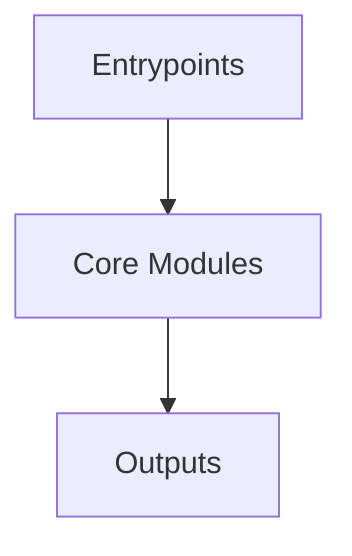

# Overview
Repository `libsql` appears to implement a modular system with 3177 source files at commit `6e55668cdb1d1d7406ea7fd6eea22991ac1ac301`.

## Architecture
Major components inferred from file/module analysis:
- `libsql-ffi`: The libsql-ffi/bundled/SQLite3MultipleCiphers/CMakeLists.txt file is responsible for building the SQLite3MultipleCiphers library
- `libsql-sqlite3`: The primary purpose of this file is to provide a mechanism for automatically migrating a SQLite database to a new version of the `libsql` repository
- `vendored`: The `vendored/sqlite3-parser/CMakeLists.txt` file is responsible for building the `rlemon` executable using the `lemon` library
- `docs`: describes the HTTP version 1 of the Hrana protocol
- `libsql-server`: The `libsql-server` repository is a Rust library that provides a SQL database server

## Data Flow / Execution Flow
Typical execution path: `Entrypoint -> Core Modules -> Runtime Services -> Output/Side Effects`.
Entrypoints initialize core modules, which orchestrate processing and emit outputs or side effects.

## Configuration & Dependencies
- Build/dependency files: libsql-ffi/bundled/SQLite3MultipleCiphers/CMakeLists.txt, libsql-ffi/bundled/SQLite3MultipleCiphers/conan/all/test_package/CMakeLists.txt, libsql-sqlite3/benchmark/requirements.txt, libsql-sqlite3/ext/crr/package.json, vendored/sqlite3-parser/CMakeLists.txt
- Config files: .cargo/config.toml, .config/nextest.toml, libsql-ffi/bundled/SQLite3MultipleCiphers/conan/config.yml

## How to Run / Key Scripts
- Detected entrypoints: not clearly detected
- Use repository build scripts/package manager tasks based on detected build files.

## Notable Design Choices / Extension Points
- The codebase is organized in modules that can be extended by adding new feature files under existing module boundaries.
- Extension is likely centered around entrypoint wiring, configuration files, and module-specific implementations.
