# Overview

or functionality.

## Architecture

- `logstash-core`: centered on logstash-core/lib/logstash-core.rb, logstash-core/lib/logstash/bootstrap_check/default_config.rb, logstash-core/lib/logstash/config/pipeline_config.rb
- `tools`: centered on tools/dependencies-report/src/main/resources/notices/aws-sdk-core-NOTICE.txt, tools/dependencies-report/src/main/resources/notices/com.fasterxml.jackson.core!jackson-annotations-NOTICE.txt, tools/dependencies-report/src/main/resources/notices/com.fasterxml.jackson.core!jackson-core-NOTICE.txt
- `docs`: centered on docs/extend/java-filter-plugin.md, docs/extend/java-input-plugin.md, docs/extend/java-output-plugin.md
- `README.md`: centered on README.md, build.gradle, .pre-commit-config.yaml
- `docs/extend`: centered on docs/extend/codec-new-plugin.md, docs/extend/community-maintainer.md, docs/extend/contribute-to-core.md

Key subsystem interactions:
- `community_226` -> `community_77`

### Architecture Graph

```mermaid

flowchart TD
  community_01[logstash-core\nlogstash-core/lib/logstash-core.rb, logstash-core/lib/logstash/bootstrap_check/default_config.rb]
  community_02[tools\ntools/dependencies-report/src/main/resources/notices/aws-sdk-core-NOTICE.txt, tools/dependencies-report/src/main/resources/notices/com.fasterxml.jackson.core!jackson-annotations-NOTICE.txt]
  community_03[docs\ndocs/extend/java-filter-plugin.md, docs/extend/java-input-plugin.md]
  community_04[README.md\nREADME.md, build.gradle]
  community_05[docs/extend\ndocs/extend/codec-new-plugin.md, docs/extend/community-maintainer.md]
  community_06[lib/pluginmanager/templates/codec-plugin\nlib/pluginmanager/templates/codec-plugin/README.md, lib/pluginmanager/templates/codec-plugin/.ruby-version]
  community_07[lib/pluginmanager/templates/filter-plugin\nlib/pluginmanager/templates/filter-plugin/README.md, lib/pluginmanager/templates/filter-plugin/.ruby-version]
  community_08[lib/pluginmanager/templates/input-plugin\nlib/pluginmanager/templates/input-plugin/README.md, lib/pluginmanager/templates/input-plugin/.ruby-version]

```

## Data Flow / Execution Flow

Execution appears to begin in .buildkite/scripts/health-report-tests/main.py. From there, control flows through the subsystems highlighted by logstash-core/build.gradle, buildSrc/build.gradle, logstash-core/build.gradle, logstash-core/build.gradle, logstash-core/build.gradle, logstash-core/build.gradle, before reaching service integrations, build/runtime helpers, or external outputs.

## Configuration & Dependencies

- Build and dependency surfaces: .buildkite/scripts/health-report-tests/requirements.txt, build.gradle, buildSrc/build.gradle, logstash-core/benchmarks/build.gradle, logstash-core/build.gradle, qa/integration/build.gradle, tools/benchmark-cli/build.gradle, tools/dependencies-report/build.gradle
- Configuration surfaces: .buildkite/scripts/benchmark/config/filebeat.yml, .buildkite/scripts/benchmark/config/logstash.yml, .buildkite/scripts/benchmark/config/pipelines.yml, .buildkite/scripts/health-report-tests/config/pipelines.yml, .pre-commit-config.yaml, ci/serverless/config/logstash.yml, config/logstash.yml, config/pipelines.yml
- Supporting evidence: logstash-core/build.gradle, logstash-core/build.gradle, buildSrc/build.gradle, logstash-core/build.gradle, logstash-core/build.gradle, logstash-core/build.gradle

## How to Run / Key Scripts

- Entrypoints and scripts: .buildkite/scripts/health-report-tests/main.py
- Operational evidence: logstash-core/build.gradle, logstash-core/build.gradle, buildSrc/build.gradle, logstash-core/build.gradle, logstash-core/build.gradle, logstash-core/build.gradle

## Notable Design Choices / Extension Points

to support additional features or functionality.