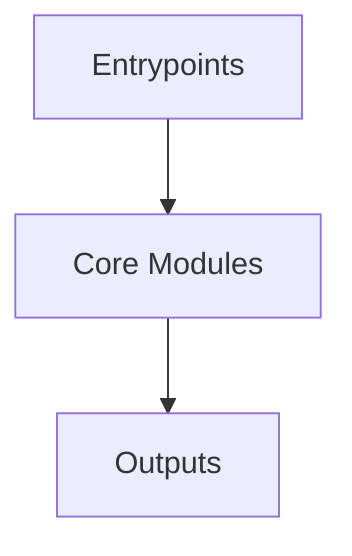

# Overview
Repository `logstash` appears to implement a modular system with 2024 source files at commit `895cfa5b14633ae9b9e671105f7b7935c9f2b9f1`.

## Architecture
Major components inferred from file/module analysis:
- `logstash-core`: The logstash-core module is a critical component of the Logstash data processing pipeline tool
- `docs`: to deploy and manage Logstash instances in a distributed environment
- `root`: The root module of the Logstash repository is responsible for managing the overall build process and dependencies
- `.buildkite`: The `.buildkite` module in the Logstash repository is responsible for setting up and tearing down the Logstash instance, as well as running the integration tests
- `buildSrc`: The buildSrc/build.gradle file is a critical component of the Logstash build system, responsible for configuring the build process and ensuring that the software is properly tested
- `qa`: The qa/integration/build.gradle file is a Gradle build script that is part of the Logstash project, a data processing pipeline tool
- `tools`: The `tools` module in the Logstash repository is responsible for defining the dependencies and configuration for various tools used in the Logstash development and maintenance process
- `x-pack`: The x-pack/build.gradle file in the Logstash X-Pack repository is a Gradle build script that configures the build process for the X-Pack plugin, which is a plugin for Logstash that provides additional features and functi...

## Data Flow / Execution Flow
Typical execution path: `Entrypoint -> Core Modules -> Runtime Services -> Output/Side Effects`.
Entrypoints initialize core modules, which orchestrate processing and emit outputs or side effects.

## Configuration & Dependencies
- Build/dependency files: build.gradle, .buildkite/scripts/health-report-tests/requirements.txt, buildSrc/build.gradle, logstash-core/build.gradle, logstash-core/benchmarks/build.gradle, qa/integration/build.gradle, tools/benchmark-cli/build.gradle, tools/dependencies-report/build.gradle, tools/jvm-options-parser/build.gradle, x-pack/build.gradle
- Config files: .pre-commit-config.yaml, .buildkite/scripts/benchmark/config/filebeat.yml, .buildkite/scripts/benchmark/config/logstash.yml, .buildkite/scripts/benchmark/config/pipelines.yml, .buildkite/scripts/health-report-tests/config/pipelines.yml, ci/serverless/config/logstash.yml, config/logstash.yml, config/pipelines.yml, docker/data/logstash/config/logstash-full.yml, docker/data/logstash/config/logstash-oss.yml, docker/data/logstash/config/pipelines.yml, qa/docker/fixtures/multiple_pipelines/config/pipelines.yml, qa/integration/fixtures/env_variables_config_spec.yml, qa/integration/fixtures/reload_config_spec.yml, qa/integration/fixtures/settings_spec.yml, x-pack/distributions/internal/observabilitySRE/qa/acceptance/docker/elasticsearch/config/elasticsearch-fips.yml, x-pack/distributions/internal/observabilitySRE/qa/acceptance/docker/filebeat/config/filebeat-fips.yml, x-pack/distributions/internal/observabilitySRE/qa/acceptance/docker/logstash/config/logstash-fips.yml, x-pack/distributions/internal/observabilitySRE/qa/smoke/docker/elasticsearch/config/elasticsearch-fips.yml, x-pack/distributions/internal/observabilitySRE/qa/smoke/docker/logstash/config/logstash.yml, x-pack/spec/config_management/fixtures/pipelines.json

## How to Run / Key Scripts
- Detected entrypoints: .buildkite/scripts/health-report-tests/main.py
- Use repository build scripts/package manager tasks based on detected build files.

## Notable Design Choices / Extension Points
- The codebase is organized in modules that can be extended by adding new feature files under existing module boundaries.
- Extension is likely centered around entrypoint wiring, configuration files, and module-specific implementations.
