# Overview

subsystem of the Logstash ecosystem, responsible for processing and managing log data. It provides a flexible and scalable framework for processing log data, allowing users to customize and extend the functionality of Logstash.

## community_02
Subsystem Summary: Tools

Purpose:
The Tools subsystem is responsible for providing a set of tools and utilities for managing and extending the Logstash ecosystem. These tools include the Logstash plugin manager, the Logstash dependency report, and the Logstash benchmarking tool.

Internal Structure:
The Tools subsystem is composed of several key components, including the Logstash plugin manager, the Logstash dependency report, and the Logstash benchmarking tool. The Logstash plugin manager is responsible for managing the installation and configuration of Logstash plugins, while the Logstash dependency report provides a visual representation of the dependencies of the Logstash ecosystem. The Logstash benchmarking tool is responsible for measuring the performance of the Logstash ecosystem.

Dependencies:
The Tools subsystem has several dependencies, including the Logstash ecosystem, the Logstash plugin manager, and the Logstash dependency report. These dependencies are managed through the use of plugins and filters, which are customizable and extendable.

Runtime Role:
The Tools subsystem plays a critical role in the runtime of the Logstash ecosystem, as it provides a set of tools and utilities for managing and extending the Logstash ecosystem. These tools include the Logstash plugin manager, the Logstash dependency report, and the Logstash benchmarking tool, which are used to manage and monitor the Logstash ecosystem.

Likely Extension Points:
The Tools subsystem has several likely extension points, including the addition of new tools and utilities, the customization of existing tools and utilities, and the creation of new pipeline components. These extension points allow users to customize and extend the functionality of the Logstash ecosystem, making it a highly flexible and scalable ecosystem.

In conclusion, the Tools subsystem is a critical subsystem of the Logstash ecosystem, responsible for providing a set of tools and utilities for managing and extending the Logstash ecosystem. It provides a flexible

## Architecture

critical subsystem of the Logstash ecosystem, responsible for processing and managing log data. It provides a flexible and scalable framework for processing log data, allowing users to customize and extend the functionality of Logstash.

## community_02
Subsystem Summary: Tools

Purpose:
The Tools subsystem is responsible for providing a set of tools and utilities for managing and extending the Logstash ecosystem. These tools include the Logstash Dependencies Report, the Logstash Health Report, and the Logstash Benchmark.

Internal Structure:
The Tools subsystem is composed of several key components, including the Logstash Dependencies Report, the Logstash Health Report, and the Logstash Benchmark. Each of these components is responsible for a specific tool or utility, and are managed through the use of plugins and filters.

Dependencies:
The Tools subsystem has several dependencies, including the Logstash pipeline, the Logstash agent, and the Logstash configuration. These dependencies are managed through the use of plugins and filters, which are customizable and extendable.

Runtime Role:
The Tools subsystem plays a critical role in the runtime of the Logstash ecosystem, as it provides a set of tools and utilities for managing and extending the Logstash ecosystem. These tools include the Logstash Dependencies Report, the Logstash Health Report, and the Logstash Benchmark, which are used to monitor and optimize the performance of the Logstash ecosystem.

Likely Extension Points:
The Tools subsystem has several likely extension points, including the addition of new plugins and filters, the customization of existing plugins and filters, and the creation of new pipeline components. These extension points allow users to customize and extend the functionality of the Tools subsystem, making it a highly flexible and scalable ecosystem.

In conclusion, the Tools subsystem is a critical subsystem of the Logstash ecosystem, responsible for providing a set of tools and utilities for managing and extending the Logstash ecosystem. It provides a flexible and scalable framework for managing and optimizing the performance of the Logstash ecosystem, making it a highly extensible and scalable ecosystem.

## community_03
Subsystem Summary: D

### Architecture Graph

```mermaid

flowchart TD
  community_01[logstash-core\nlogstash-core/lib/logstash-core.rb, logstash-core/lib/logstash/bootstrap_check/default_config.rb]
  community_02[tools\ntools/dependencies-report/src/main/resources/notices/aws-sdk-core-NOTICE.txt, tools/dependencies-report/src/main/resources/notices/com.fasterxml.jackson.core!jackson-annotations-NOTICE.txt]
  community_03[docs\ndocs/extend/java-codec-plugin.md, docs/extend/java-filter-plugin.md]
  community_04[qa\nqa/docker/fixtures/multiple_pipelines/config/pipelines.yml, qa/integration/build.gradle]
  community_05[lib\nlib/pluginmanager/gem_installer.rb, lib/pluginmanager/offline_plugin_packager.rb]
  community_06[x-pack\nx-pack/spec/config_management/fixtures/pipelines.json, x-pack/distributions/internal/observabilitySRE/qa/acceptance/docker/elasticsearch/config/elasticsearch-fips.yml]
  community_07[README.md\nREADME.md, build.gradle]
  community_08[.buildkite\n.buildkite/scripts/health-report-tests/config/pipelines.yml, .buildkite/scripts/health-report-tests/requirements.txt]

```

## Data Flow / Execution Flow

a critical subsystem of the Logstash ecosystem, responsible for processing and managing log data. It provides a flexible and scalable framework for processing log data, allowing users to customize and extend the functionality of Logstash.

## community_02
Subsystem Summary: Tools

Purpose:
The Tools subsystem is responsible for providing a set of tools and utilities for managing and extending the Logstash ecosystem. These tools include the Logstash plugin manager, the Logstash dependency report, and the Logstash benchmarking tool.

Internal Structure:
The Tools subsystem is composed of several key components, including the Logstash plugin manager, the Logstash dependency report, and the Logstash benchmarking tool. These components are responsible for managing and extending the Logstash ecosystem, respectively.

Dependencies:
The Tools subsystem has several dependencies, including the Logstash ecosystem, the Logstash plugin manager, and the Logstash dependency report. These dependencies are managed through the use of plugins and filters, which are customizable and extendable.

Runtime Role:
The Tools subsystem plays a critical role in the runtime of the Logstash ecosystem, as it provides a set of tools and utilities for managing and extending the Logstash ecosystem. These tools allow users to customize and extend the functionality of Logstash, making it a highly flexible and scalable ecosystem.

Likely Extension Points:
The Tools subsystem has several likely extension points, including the addition of new plugins and filters, the customization of existing plugins and filters, and the creation of new pipeline components. These extension points allow users to customize and extend the functionality of Logstash, making it a highly flexible and scalable ecosystem.

In conclusion, the Tools subsystem is a critical subsystem of the Logstash ecosystem, responsible for providing a set of tools and utilities for managing and extending the Logstash ecosystem. These tools allow users to customize and extend the functionality of Logstash, making it a highly flexible and scalable ecosystem.

## community_03
Subsystem Summary: Docs

Purpose:
The Docs subsystem is responsible for providing documentation and guides for the Logstash e

## Configuration & Dependencies

subsystem of the Logstash ecosystem, responsible for processing and managing log data. It provides a flexible and scalable framework for processing log data, allowing users to customize and extend the functionality of Logstash.

## community_02
Subsystem Summary: Tools

Purpose:
The Tools subsystem is responsible for providing a set of tools and utilities for managing and extending the Logstash ecosystem. These tools include the Logstash plugin manager, the Logstash dependency report, and the Logstash benchmarking tool.

Internal Structure:
The Tools subsystem is composed of several key components, including the Logstash plugin manager, the Logstash dependency report, and the Logstash benchmarking tool. These components are responsible for managing and extending the Logstash ecosystem, respectively.

Dependencies:
The Tools subsystem has several dependencies, including the Logstash ecosystem, the Logstash plugin manager, and the Logstash dependency report. These dependencies are managed through the use of plugins and filters, which are customizable and extendable.

Runtime Role:
The Tools subsystem plays a critical role in the runtime of the Logstash ecosystem, as it provides a set of tools and utilities for managing and extending the ecosystem. These tools allow users to customize and extend the functionality of Logstash, making it a highly flexible and scalable ecosystem.

Likely Extension Points:
The Tools subsystem has several likely extension points, including the addition of new plugins and filters, the customization of existing plugins and filters, and the creation of new pipeline components. These extension points allow users to customize and extend the functionality of Logstash, making it a highly flexible and scalable ecosystem.

In conclusion, the Tools subsystem is a critical subsystem of the Logstash ecosystem, responsible for providing a set of tools and utilities for managing and extending the ecosystem. These tools allow users to customize and extend the functionality of Logstash, making it a highly flexible and scalable ecosystem.

## community_03
Subsystem Summary: Docs

Purpose:
The Docs subsystem is responsible for providing documentation and guides for the Logstash ecosystem. This documentation includes user gu

## How to Run / Key Scripts

is a critical subsystem of the Logstash ecosystem, responsible for processing and managing log data. It provides a flexible and scalable framework for processing log data, allowing users to customize and extend the functionality of Logstash.

## community_02
Subsystem Summary: Tools

Purpose:
The Tools subsystem is responsible for providing a set of tools and utilities for working with the Logstash ecosystem. These tools include the Logstash Dependencies Report, the Logstash Health Report, and the Logstash Performance Report.

Internal Structure:
The Tools subsystem is composed of several key components, including the Logstash Dependencies Report, the Logstash Health Report, and the Logstash Performance Report. These components are responsible for providing a set of tools and utilities for working with the Logstash ecosystem.

Dependencies:
The Tools subsystem has several dependencies, including the Logstash ecosystem, the Logstash pipeline, and the Logstash agent. These dependencies are managed through the use of plugins and filters, which are customizable and extendable.

Runtime Role:
The Tools subsystem plays a critical role in the runtime of the Logstash ecosystem, as it provides a set of tools and utilities for working with the Logstash ecosystem. These tools allow users to monitor and manage the Logstash ecosystem, as well as to troubleshoot and optimize its performance.

Likely Extension Points:
The Tools subsystem has several likely extension points, including the addition of new tools and utilities, the customization of existing tools and utilities, and the creation of new pipeline components. These extension points allow users to customize and extend the functionality of the Tools subsystem, making it a highly flexible and scalable ecosystem.

In conclusion, the Tools subsystem is a critical subsystem of the Logstash ecosystem, responsible for providing a set of tools and utilities for working with the Logstash ecosystem. It plays a critical role in the runtime of the Logstash ecosystem, and has several likely extension points for customization and extension.

## community_03
Subsystem Summary: Docs

Purpose:
The Docs subsystem is responsible for providing documentation and guides for working with the

## Notable Design Choices / Extension Points

Core is a critical subsystem of the Logstash ecosystem, responsible for processing and managing log data. It provides a flexible and scalable framework for processing log data, allowing users to customize and extend the functionality of Logstash. Its internal structure, dependencies, runtime role, and likely extension points make it a highly valuable and important subsystem in the Logstash ecosystem.

## community_02
Subsystem Summary: Tools

Purpose:
The Tools subsystem is responsible for providing a set of tools and utilities for the Logstash ecosystem. These tools include the Logstash Dependencies Report, the Logstash Health Report, and the Logstash Benchmark.

Internal Structure:
The Tools subsystem is composed of several key components, including the Logstash Dependencies Report, the Logstash Health Report, and the Logstash Benchmark. These components are responsible for providing the tools and utilities for the Logstash ecosystem.

Dependencies:
The Tools subsystem has several dependencies, including the Logstash Core, the Logstash Dependencies Report, the Logstash Health Report, and the Logstash Benchmark. These dependencies are managed through the use of plugins and filters, which are customizable and extendable.

Runtime Role:
The Tools subsystem plays a critical role in the runtime of the Logstash ecosystem, as it provides a set of tools and utilities for managing and monitoring the Logstash ecosystem. It allows users to monitor the health of the Logstash ecosystem, identify potential issues, and optimize the performance of the Logstash ecosystem.

Likely Extension Points:
The Tools subsystem has several likely extension points, including the addition of new tools and utilities, the customization of existing tools and utilities, and the creation of new pipeline components. These extension points allow users to customize and extend the functionality of the Tools subsystem, making it a highly valuable and important subsystem in the Logstash ecosystem.

In conclusion, the Tools subsystem is a critical subsystem of the Logstash ecosystem, responsible for providing a set of tools and utilities for managing and monitoring the Logstash ecosystem. Its internal structure, dependencies, runtime role, and likely extension points make it a highly valuable and