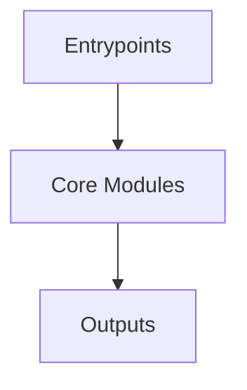

# Overview
Repository `marktext` appears to implement a modular system with 563 source files at commit `11c8cc1e1929a7975df39fa5f4503130fef53547`.

## Architecture
Major components inferred from file/module analysis:
- `src`: The `src/renderer/services/notification/index.js` file is a critical component of the MarkText application's architecture, as it provides a consistent way of displaying notifications to the user
- `root`: The `package.json` file in the `marktext` repository defines the dependencies and scripts for the project
- `docs`: show-help`    | <kbd>Ctrl</kbd>+<kbd>Shift</kbd>+<kbd>H</kbd> | Show help menu                        | | `help.show-about`   | <kbd>Ctrl</kbd>+<kbd>Shift</kbd>+<kbd>A</kbd> | Show about dialog                     | | `h...

## Data Flow / Execution Flow
Typical execution path: `Entrypoint -> Core Modules -> Runtime Services -> Output/Side Effects`.
Entrypoints initialize core modules, which orchestrate processing and emit outputs or side effects.

## Configuration & Dependencies
- Build/dependency files: package.json, src/muya/package.json
- Config files: .vscode/settings.json, src/main/jsconfig.json, src/renderer/jsconfig.json

## How to Run / Key Scripts
- Detected entrypoints: src/common/filesystem/index.js, src/common/keybinding/index.js, src/main/index.js, src/main/app/index.js, src/main/cli/index.js, src/main/commands/index.js, src/main/contextMenu/editor/index.js, src/main/dataCenter/index.js, src/main/filesystem/index.js, src/main/keyboard/index.js, src/main/menu/index.js, src/main/menu/actions/index.js, src/main/menu/templates/index.js, src/main/preferences/index.js, src/main/spellchecker/index.js, src/main/utils/index.js, src/muya/lib/index.js, src/muya/lib/config/index.js, src/muya/lib/contentState/index.js, src/muya/lib/parser/index.js, src/muya/lib/parser/marked/index.js, src/muya/lib/parser/render/index.js, src/muya/lib/parser/render/renderBlock/index.js, src/muya/lib/parser/render/renderInlines/index.js, src/muya/lib/prism/index.js, src/muya/lib/renderers/index.js, src/muya/lib/selection/index.js, src/muya/lib/ui/baseFloat/index.js, src/muya/lib/ui/baseScrollFloat/index.js, src/muya/lib/ui/codePicker/index.js, src/muya/lib/ui/emojiPicker/index.js, src/muya/lib/ui/emojis/index.js, src/muya/lib/ui/fileIcons/index.js, src/muya/lib/ui/footnoteTool/index.js, src/muya/lib/ui/formatPicker/index.js, src/muya/lib/ui/frontMenu/index.js, src/muya/lib/ui/imagePicker/index.js, src/muya/lib/ui/imageSelector/index.js, src/muya/lib/ui/imageToolbar/index.js, src/muya/lib/ui/linkTools/index.js, src/muya/lib/ui/quickInsert/index.js, src/muya/lib/ui/tablePicker/index.js, src/muya/lib/ui/tableTools/index.js, src/muya/lib/ui/tooltip/index.js, src/muya/lib/ui/transformer/index.js, src/muya/lib/utils/index.js, src/renderer/assets/symbolIcon/index.js, src/renderer/axios/index.js, src/renderer/bus/index.js, src/renderer/codeMirror/index.js, src/renderer/commands/index.js, src/renderer/contextMenu/sideBar/index.js, src/renderer/contextMenu/tabs/index.js, src/renderer/mixins/index.js, src/renderer/router/index.js, src/renderer/services/index.js, src/renderer/services/notification/index.js, src/renderer/spellchecker/index.js, src/renderer/store/index.js, src/renderer/util/index.js, test/unit/index.js
- Use repository build scripts/package manager tasks based on detected build files.

## Notable Design Choices / Extension Points
- The codebase is organized in modules that can be extended by adding new feature files under existing module boundaries.
- Extension is likely centered around entrypoint wiring, configuration files, and module-specific implementations.
