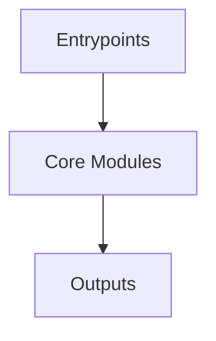

# Overview
Repository `material-components-android` appears to implement a modular system with 3813 source files at commit `c2051db2a9be2a1e23f1128bfc76a9ff29ede7c4`.

## Architecture
Major components inferred from file/module analysis:
- `docs`: com/material-components/ios/catalog/adaptive/supporting-panel-demo-medium.png)  ### Supporting Panel demo on a large screen  ![Supporting Panel demo on a large screen](https://storage.googleapis.com/material-components/i...
- `root`: The `material-components-android` repository is a collection of reusable, Material Design-compliant UI components for Android development
- `catalog`: The `catalog/build.gradle` file is the build script for the `material-components-android` repository, which is a collection of Android libraries for building Material Design apps
- `lib`: This file is the build script for the `material-components-android` library
- `testing`: The `testing` module in the `material-components-android` repository is responsible for defining the build configuration and dependencies for the test app, which is a separate Android application used to test the Materia...
- `tests`: The `tests` module in the `material-components-android` repository is responsible for setting up the testing environment for the Material Components library

## Data Flow / Execution Flow
Typical execution path: `Entrypoint -> Core Modules -> Runtime Services -> Output/Side Effects`.
Entrypoints initialize core modules, which orchestrate processing and emit outputs or side effects.

## Configuration & Dependencies
- Build/dependency files: build.gradle, catalog/build.gradle, lib/build.gradle, testing/java/com/google/android/material/testapp/build.gradle, testing/java/com/google/android/material/testapp/animation/build.gradle, testing/java/com/google/android/material/testapp/base/build.gradle, testing/java/com/google/android/material/testapp/custom/build.gradle, testing/java/com/google/android/material/testapp/theme/build.gradle, tests/build.gradle, tests/javatests/com/google/android/material/animation/build.gradle, tests/javatests/com/google/android/material/theme/build.gradle
- Config files: not clearly detected

## How to Run / Key Scripts
- Detected entrypoints: not clearly detected
- Use repository build scripts/package manager tasks based on detected build files.

## Notable Design Choices / Extension Points
- The codebase is organized in modules that can be extended by adding new feature files under existing module boundaries.
- Extension is likely centered around entrypoint wiring, configuration files, and module-specific implementations.
