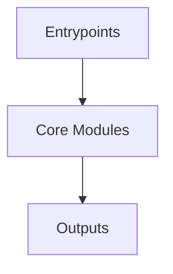

# Overview
Repository `ml-agents` appears to implement a modular system with 1907 source files at commit `4cf2f49ad0a973c95eb41325aa3a46959f187708`.

## Architecture
Major components inferred from file/module analysis:
- `ml-agents-trainer-plugin`: The ml-agents-trainer-plugin module is a plugin for the mlagents-learn framework that provides trainer classes for training agents using the A2C and DQN algorithms
- `ml-agents`: trainer.py: This file contains the `Trainer` class, which is the primary class for training and interacting with agents in the ML-Agents Toolkit
- `root`: The `ml-agents` repository's `root` module is the top-level module that contains all other modules and files in the repository
- `com.unity.ml-agents`: The `com.unity.ml-agents` package is a Unity package that allows developers to use machine learning to create intelligent character behaviors in Unity environments
- `ml-agents-envs`: The `StatsSideChannel` class in the `mlagents_envs` package is a custom side channel that inherits from the `SideChannel` class
- `ml-agents-plugin-examples`: The `ml-agents-plugin-examples` module is a package that provides examples of plugins for the `mlagents-learn` tool

## Data Flow / Execution Flow
Typical execution path: `Entrypoint -> Core Modules -> Runtime Services -> Output/Side Effects`.
Entrypoints initialize core modules, which orchestrate processing and emit outputs or side effects.

## Configuration & Dependencies
- Build/dependency files: com.unity.ml-agents/package.json, ml-agents-envs/setup.py, ml-agents-plugin-examples/setup.py, ml-agents-trainer-plugin/setup.py, ml-agents/setup.py
- Config files: .pre-commit-config.yaml, .yamato/wrench/wrench_config.json, DevProject/ProjectSettings/SceneTemplateSettings.json, DevProject/ProjectSettings/Packages/com.unity.testtools.codecoverage/Settings.json, PerformanceProject/ProjectSettings/Packages/com.unity.testtools.codecoverage/Settings.json, Project/ProjectSettings/SceneTemplateSettings.json, config/imitation/Crawler.yaml, config/imitation/Hallway.yaml, config/imitation/PushBlock.yaml, config/imitation/Pyramids.yaml, config/poca/DungeonEscape.yaml, config/poca/PushBlockCollab.yaml, config/poca/SoccerTwos.yaml, config/poca/StrikersVsGoalie.yaml, config/ppo/3DBall.yaml, config/ppo/3DBallHard.yaml, config/ppo/3DBall_randomize.yaml, config/ppo/Basic.yaml, config/ppo/Crawler.yaml, config/ppo/FoodCollector.yaml, config/ppo/GridWorld.yaml, config/ppo/Hallway.yaml, config/ppo/Match3.yaml, config/ppo/PushBlock.yaml, config/ppo/Pyramids.yaml, config/ppo/PyramidsRND.yaml, config/ppo/Sorter_curriculum.yaml, config/ppo/Visual3DBall.yaml, config/ppo/VisualFoodCollector.yaml, config/ppo/Walker.yaml, config/ppo/WallJump.yaml, config/ppo/WallJump_curriculum.yaml, config/ppo/Worm.yaml, config/sac/3DBall.yaml, config/sac/3DBallHard.yaml, config/sac/Basic.yaml, config/sac/Crawler.yaml, config/sac/FoodCollector.yaml, config/sac/GridWorld.yaml, config/sac/Hallway.yaml, config/sac/PushBlock.yaml, config/sac/Pyramids.yaml, config/sac/Walker.yaml, config/sac/WallJump.yaml, config/sac/Worm.yaml, ml-agents-envs/pydoc-config.yaml, ml-agents/pydoc-config.yaml

## How to Run / Key Scripts
- Detected entrypoints: not clearly detected
- Use repository build scripts/package manager tasks based on detected build files.

## Notable Design Choices / Extension Points
- The codebase is organized in modules that can be extended by adding new feature files under existing module boundaries.
- Extension is likely centered around entrypoint wiring, configuration files, and module-specific implementations.
