# Overview
Repository `ml-agents` at commit `4cf2f49ad0a973c95eb41325aa3a46959f187708` is documented using a graph-aware V2 pipeline. The architecture IR contains 1956 nodes, 5403 edges, and 205 detected subsystems.

## Architecture
The repository was decomposed into communities derived from dependency and package signals.
Top subsystems:
- `com.unity.ml-agents`: com.unity.ml-agents centers on com.unity.ml-agents/Documentation~/Readme.md, com.unity.ml-agents/README.md, com.unity.ml-agents/package.json
- `mlagents_envs`: Overall, the `DimensionProperty` class is an important part of the architectural system in the `ml-agents` repository, and it plays a critical role in defining the properties of the observations in the environment
- `config`: config centers on config/ppo/Match3.yaml, config/ppo/PushBlock.yaml, config/ppo/Pyramids.yaml
- `docs`: docs centers on docs/Inference-Engine.md, docs/Python-Custom-Trainer-Plugin.md, docs/Readme.md
- `config/ppo`: config/ppo centers on config/ppo/3DBall.yaml, config/ppo/3DBallHard.yaml, config/ppo/3DBall_randomize.yaml
- `config/sac`: config/sac centers on config/sac/3DBall.yaml, config/sac/3DBallHard.yaml, config/sac/Basic.yaml
- `ml-agents-envs`: ml-agents-envs centers on ml-agents-envs/mlagents_envs/communicator_objects/engine_configuration_pb2.py, ml-agents-envs/mlagents_envs/communicator_objects/engine_configuration_pb2.pyi, ml-agents-envs/colabs/Colab_PettingZoo.ipynb
- `com.unity.ml-agents/Runtime`: com.unity.ml-agents/Runtime centers on com.unity.ml-agents/Runtime/Academy.cs, com.unity.ml-agents/Runtime/Academy.cs.meta, com.unity.ml-agents/Runtime/Actuators.meta

### Architecture Graph

```mermaid
flowchart TD
  community_01[com.unity.ml-agents\ncom.unity.ml-agents/Documentation~/Readme.md, com.unity.ml-agents/README.md]
  community_02[mlagents_envs\nml-agents-envs/mlagents_envs/base_env.py, ml-agents-envs/mlagents_envs/logging_util.py]
  community_03[config\nconfig/ppo/Match3.yaml, config/ppo/PushBlock.yaml]
  community_04[docs\ndocs/Inference-Engine.md, docs/Python-Custom-Trainer-Plugin.md]
  community_05[config/ppo\nconfig/ppo/3DBall.yaml, config/ppo/3DBallHard.yaml]
  community_06[config/sac\nconfig/sac/3DBall.yaml, config/sac/3DBallHard.yaml]
  community_07[ml-agents-envs\nml-agents-envs/mlagents_envs/communicator_objects/engine_configuration_pb2.py, ml-agents-envs/mlagents_envs/communicator_objects/engine_configuration_pb2.pyi]
  community_08[com.unity.ml-agents/Runtime\ncom.unity.ml-agents/Runtime/Academy.cs, com.unity.ml-agents/Runtime/Academy.cs.meta]
```

Top cross-community interactions:
- `community_02` -> `community_41` (weight=20.4)

## Data Flow / Execution Flow
Evidence suggests execution moves across: ml-agents-envs/mlagents_envs/logging_util.py, pytest.ini, ml-agents-envs/mlagents_envs/exception.py, ml-agents-envs/mlagents_envs/exception.py, ml-agents/mlagents/trainers/buffer.py, ml-agents/mlagents/trainers/trajectory.py, ml-agents-envs/mlagents_envs/logging_util.py, ml-agents-envs/mlagents_envs/base_env.py.
Entrypoints hand off to subsystem-specific modules discovered in the architecture graph before producing outputs or side effects.

## Configuration & Dependencies
- Build/dependency files: com.unity.ml-agents/package.json, ml-agents-envs/setup.py, ml-agents-plugin-examples/setup.py, ml-agents-trainer-plugin/setup.py, ml-agents/setup.py
- Config surfaces: ml-agents/mlagents/trainers/settings.py, ml-agents-envs/mlagents_envs/exception.py, ml-agents-envs/mlagents_envs/exception.py, ml-agents/mlagents/trainers/settings.py, ml-agents/mlagents/trainers/settings.py, ml-agents/mlagents/trainers/settings.py, ml-agents/mlagents/trainers/settings.py, ml-agents-envs/mlagents_envs/logging_util.py
- Docs anchors: com.unity.ml-agents/CONTRIBUTING.md, com.unity.ml-agents/Documentation~/CONTRIBUTING.md, com.unity.ml-agents/Documentation~/Learning-Environment-Design-Agents.md, com.unity.ml-agents/Documentation~/Learning-Environment-Design.md, com.unity.ml-agents/Documentation~/Readme.md, com.unity.ml-agents/README.md, docs/API-Reference.md, docs/Background-Machine-Learning.md

## How to Run / Key Scripts
- Entrypoints: not clearly detected
- Likely operational scripts/docs: pytest.ini, ml-agents-envs/mlagents_envs/exception.py, ml-agents-envs/mlagents_envs/exception.py, ml-agents-envs/mlagents_envs/exception.py, ml-agents/mlagents/trainers/settings.py, ml-agents-envs/mlagents_envs/exception.py, ml-agents/mlagents/trainers/settings.py, ml-agents-envs/mlagents_envs/base_env.py

## Notable Design Choices / Extension Points
- V2 graph decomposition highlights subsystem boundaries using import, package, and configuration signals.
- Extension points are typically concentrated around high-centrality files, registries, interfaces, and build/config entry surfaces.
