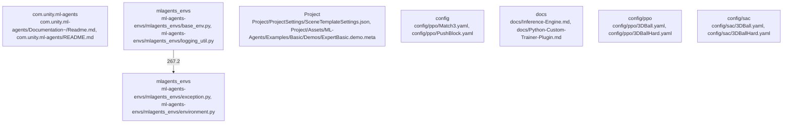

# Overview

type of action space.
* `action_size`: The number of discrete actions in the action space.

Subsystem Summary: ML-Agents Environments

Purpose:
The ML-Agents Environments subsystem is a set of Python packages that provide a set of tools for training and evaluating machine learning models in Unity games. It includes a set of environments, which are used to simulate the game or environment in which the model will be trained, as well as a set of agents, which are used to interact with the environment and collect data.

Internal Structure:
The ML-Agents Environments subsystem is organized into several components, including the environments and the agents. The environments provide a set of tools for simulating the game or environment in which the model will be trained, while the agents provide a set of tools for interacting with the environment and collecting data.

Dependencies:
The ML-Agents Environments subsystem has several dependencies, including Unity and TensorFlow. It also depends on several other Python packages, including gym and numpy.

Runtime Role:
The ML-Agents Environments subsystem is designed to be used at runtime in Unity games. It provides a set of tools for training and evaluating machine learning models, and can be used to create a wide range of AI-powered games and experiences.

Likely Extension Points:
There are several potential extension points for the ML-Agents Environments subsystem, including the ability to add new environments and agents, the ability to integrate with other Unity packages, and the ability to create new pre-built agents. Additionally, the subsystem could be extended to support other platforms and environments, such as mobile devices and web browsers.

## community_03
Subsystem Summary: ML-Agents Trainer Plugin

Purpose:
The ML-Agents Trainer Plugin subsystem is a Unity package that provides a set of tools for training machine learning models in Unity games. It includes a set of pre-built agents that can be used to train and deploy models, as well as a set of tools for creating new agents and training models.

Internal Structure:
The ML-Agents Trainer Plugin subsystem is organized into several components, including the pre-built agents and the training tools. The pre-built agents provide a

## Architecture

the type of action space, either `discrete` or `continuous`.

## community_03
Subsystem Summary: Project

Purpose:
The Project subsystem is a Unity package that provides a set of tools for creating and managing Unity projects. It includes a set of pre-built scenes, a scene template system, and a set of pre-built assets.

Internal Structure:
The Project subsystem is organized into several components, including the scene template system, the pre-built scenes, and the pre-built assets. The scene template system provides a set of tools for creating and managing scene templates, while the pre-built scenes and assets are a set of examples of how to use the Project subsystem to create and manage Unity projects.

Dependencies:
The Project subsystem has several dependencies, including Unity and the Unity ML-Agents package. It also depends on several other Unity packages, including Unity ML-Agents Toolkit and Unity ML-Agents Plugin.

Runtime Role:
The Project subsystem is designed to be used at runtime in Unity games. It provides a set of tools for creating and managing Unity projects, and can be used to create a wide range of games and experiences.

Likely Extension Points:
There are several potential extension points for the Project subsystem, including the ability to add new pre-built scenes and assets, the ability to integrate with other Unity packages, and the ability to create new scene templates. Additionally, the subsystem could be extended to support other platforms and environments, such as mobile devices and web browsers.

## community_04
Subsystem Summary: ml-agents-envs

Purpose:
The ml-agents-envs subsystem is a Python package that provides a set of tools for creating and managing machine learning environments in Unity games. It includes a set of pre-built environments, a set of tools for creating and managing environments, and a set of pre-built agents.

Internal Structure:
The ml-agents-envs subsystem is organized into several components, including the pre-built environments, the environment creation tools, and the pre-built agents. The pre-built environments are a set of examples of how to use the ml-agents-envs subsystem to create and manage machine learning environments in Unity games.

### Architecture Graph

## Data Flow / Execution Flow

representing the type of action space.
* `action_size`: The size of the action space.

## community_03
Subsystem Summary: ML-Agents Environments

Purpose:
The ML-Agents Environments subsystem is a set of Python packages that provide a set of tools for training and evaluating machine learning models in Unity games. It includes a set of environments, which are used to simulate the game or simulation, and a set of agents, which are used to interact with the environment and learn from it.

Internal Structure:
The ML-Agents Environments subsystem is organized into several components, including the environments and the agents. The environments provide a set of tools for simulating the game or simulation, while the agents provide a set of tools for interacting with the environment and learning from it.

Dependencies:
The ML-Agents Environments subsystem has several dependencies, including Unity and TensorFlow. It also depends on several other Python packages, including gym and numpy.

Runtime Role:
The ML-Agents Environments subsystem is designed to be used at runtime in Unity games. It provides a set of tools for training and evaluating machine learning models, and can be used to create a wide range of AI-powered games and experiences.

Likely Extension Points:
There are several potential extension points for the ML-Agents Environments subsystem, including the ability to add new environments, the ability to integrate with other Unity packages, and the ability to create new agents. Additionally, the subsystem could be extended to support other platforms and environments, such as mobile devices and web browsers.

## community_04
Subsystem Summary: ML-Agents Inference Engine

Purpose:
The ML-Agents Inference Engine subsystem is a set of Python packages that provide a set of tools for deploying and running trained machine learning models in Unity games. It includes a set of inference engines, which are used to run the trained models, and a set of agents, which are used to interact with the inference engine and provide feedback.

Internal Structure:
The ML-Agents Inference Engine subsystem is organized into several components, including the inference engines and the agents. The inference engines provide a set of tools for deploying and running the trained models, while the agents

## Configuration & Dependencies

type of action space.

## community_03
Subsystem Summary: ML-Agents Environments

Purpose:
The ML-Agents Environments subsystem is a set of Python packages that provide a set of tools for training and evaluating machine learning models in Unity games. It includes a set of environments that can be used to train and evaluate models, as well as a set of tools for creating and running custom environments.

Internal Structure:
The ML-Agents Environments subsystem is organized into several components, including the environments, the communication protocol, and the side channels. The environments provide a set of tools for training and evaluating machine learning models, while the communication protocol and side channels provide a set of tools for communicating with Unity and other external systems.

Dependencies:
The ML-Agents Environments subsystem has several dependencies, including Unity and TensorFlow. It also depends on several other Python packages, including gym and numpy.

Runtime Role:
The ML-Agents Environments subsystem is designed to be used at runtime in Unity games. It provides a set of tools for training and evaluating machine learning models, and can be used to create a wide range of AI-powered games and experiences.

Likely Extension Points:
There are several potential extension points for the ML-Agents Environments subsystem, including the ability to add new environments, the ability to integrate with other Unity packages, and the ability to create new communication protocols and side channels. Additionally, the subsystem could be extended to support other platforms and environments, such as mobile devices and web browsers.

## community_04
Subsystem Summary: ML-Agents Inference Engine

Purpose:
The ML-Agents Inference Engine subsystem is a set of Python packages that provide a set of tools for deploying and running trained machine learning models in Unity games. It includes a set of inference engines that can be used to deploy and run models, as well as a set of tools for creating and running custom inference engines.

Internal Structure:
The ML-Agents Inference Engine subsystem is organized into several components, including the inference engines, the communication protocol, and the side channels. The inference engines provide a set of tools for deploying and running trained machine learning models, while the communication protocol and side channels

## How to Run / Key Scripts

string representing the type of action space.
* `action_size`: The size of the action space.

## community_03
Subsystem Summary: ML-Agents Environments

Purpose:
The ML-Agents Environments subsystem is a set of tools for training and deploying machine learning models in Unity games. It includes a set of environments that can be used to train and deploy models, as well as a set of tools for creating and managing environments.

Internal Structure:
The ML-Agents Environments subsystem is organized into several components, including the environments, the environment manager, and the environment factory. The environments provide a set of tools for training and evaluating machine learning models, while the environment manager and environment factory provide a set of tools for creating and managing environments.

Dependencies:
The ML-Agents Environments subsystem has several dependencies, including Unity and TensorFlow. It also depends on several other Unity packages, including Unity ML-Agents and Unity ML-Agents Toolkit.

Runtime Role:
The ML-Agents Environments subsystem is designed to be used at runtime in Unity games. It provides a set of tools for training and deploying machine learning models, and can be used to create a wide range of AI-powered games and experiences.

Likely Extension Points:
There are several potential extension points for the ML-Agents Environments subsystem, including the ability to add new environments, the ability to integrate with other Unity packages, and the ability to create new tools for creating and managing environments. Additionally, the subsystem could be extended to support other platforms and environments, such as mobile devices and web browsers.

## community_04
Subsystem Summary: ML-Agents Inference Engine

Purpose:
The ML-Agents Inference Engine subsystem is a set of tools for deploying and running trained machine learning models in Unity games. It includes a set of tools for creating and managing inference engines, as well as a set of tools for deploying and running models.

Internal Structure:
The ML-Agents Inference Engine subsystem is organized into several components, including the inference engine, the model manager, and the model factory. The inference engine provides a set of tools for deploying and running trained models, while the model

## Notable Design Choices / Extension Points

A string representing the type of action space.
* `action_size`: The number of discrete actions in the action space.

## community_03
Subsystem Summary: ML-Agents Environments

Purpose:
The ML-Agents Environments subsystem is a set of tools for training and evaluating machine learning models in Unity games. It provides a set of environments that can be used to train and evaluate models, as well as a set of tools for creating and managing environments.

Internal Structure:
The ML-Agents Environments subsystem is organized into several components, including the environment manager, the environment factory, and the environment. The environment manager provides a set of tools for managing environments, while the environment factory provides a set of tools for creating and managing environments. The environment is the core component of the subsystem, and provides a set of tools for interacting with the Unity game engine.

Dependencies:
The ML-Agents Environments subsystem has several dependencies, including Unity and TensorFlow. It also depends on several other Unity packages, including Unity ML-Agents and Unity ML-Agents Toolkit.

Runtime Role:
The ML-Agents Environments subsystem is designed to be used at runtime in Unity games. It provides a set of tools for training and evaluating machine learning models, and can be used to create a wide range of AI-powered games and experiences.

Likely Extension Points:
There are several potential extension points for the ML-Agents Environments subsystem, including the ability to add new environments, the ability to integrate with other Unity packages, and the ability to create new tools for managing environments. Additionally, the subsystem could be extended to support other platforms and environments, such as mobile devices and web browsers.

## community_04
Subsystem Summary: ML-Agents Inference Engine

Purpose:
The ML-Agents Inference Engine subsystem is a set of tools for deploying and running trained machine learning models in Unity games. It provides a set of tools for creating and managing inference engines, as well as a set of tools for deploying and running models.

Internal Structure:
The ML-Agents Inference Engine subsystem is organized into several components, including the inference engine manager, the inference engine factory,