# Overview

`puppeteer-core` package is a critical part of the `puppeteer` repository, as it defines the build process for the package and provides the necessary dependencies and devDependencies for the build and unit tests. It is also a key component of the overall architecture of the repository, as it is responsible for managing the dependencies and devDependencies required for the build and unit tests.

The `puppeteer-core` package is not extensively documented, but it is clear from the evidence that it defines the build process for the `puppeteer` package and provides the necessary dependencies and devDependencies for the build and unit tests. It has several key files, including `package.json`, `tsconfig.json`, `tsconfig.cjs.json`, `tsconfig.esm.json`, and `tsconfig.node.json`. These files define the build process, as well as the dependencies and devDependencies required for the build and unit tests.

The `puppeteer-core` package is a critical part of the `puppeteer` repository, as it defines the build process for the package and provides the necessary dependencies and devDependencies for the build and unit tests. It is also a key component of the overall architecture of the repository, as it is responsible for managing the dependencies and devDependencies required for the build and unit tests.

The `puppeteer-core` package is not extensively documented, but it is clear from the evidence that it defines the build process for the `puppeteer` package and provides the necessary dependencies and devDependencies for the build and unit tests. It has several key files, including `package.json`, `tsconfig.json`, `tsconfig.cjs.json`, `tsconfig.esm.json`, and `tsconfig.node.json`. These files define the build process, as well as the dependencies and devDependencies required for the build and unit tests.

The `puppeteer-core` package is a critical part of the `puppeteer` repository, as it defines the build process for the package and provides the necessary dependencies and devDependencies for the build and unit tests. It is also a key component of the overall architecture of the repository, as it is responsible for managing the dependencies and devDependencies required for the build and unit tests.

The `puppete

## Architecture

- `website`: centered on website/src/theme/SearchMetadata/index.js, website/versioned_docs/version-24.17.1/api/puppeteer.browser.installextension.md, website/versioned_docs/version-24.17.1/api/puppeteer.browser.uninstallextension.md
- `docs`: centered on docs/api/puppeteer.browser.installextension.md, docs/api/puppeteer.browser.uninstallextension.md, docs/api/puppeteer.extensiontransport.close.md
- `packages`: centered on packages/testserver/src/index.ts, packages/browsers/src/tsconfig.cjs.json, packages/browsers/src/tsconfig.esm.json
- `README.md`: centered on README.md, package.json, release-please-config.json
- `packages/puppeteer-core/src`: centered on packages/puppeteer-core/src/index.ts, packages/puppeteer-core/src/tsconfig.cjs.json, packages/puppeteer-core/src/tsconfig.esm.json

Key subsystem interactions:
- `community_40` -> `community_44`

### Architecture Graph

```mermaid

flowchart TD
  community_01[website\nwebsite/src/theme/SearchMetadata/index.js, website/versioned_docs/version-24.17.1/api/puppeteer.browser.installextension.md]
  community_02[docs\ndocs/api/puppeteer.browser.installextension.md, docs/api/puppeteer.browser.uninstallextension.md]
  community_03[packages\npackages/testserver/src/index.ts, packages/browsers/src/tsconfig.cjs.json]
  community_04[README.md\nREADME.md, package.json]
  community_05[packages/puppeteer-core/src\npackages/puppeteer-core/src/index.ts, packages/puppeteer-core/src/tsconfig.cjs.json]
  community_06[packages/puppeteer-core\npackages/puppeteer-core/package.json, packages/puppeteer-core/tsconfig.json]
  community_07[docs\ndocs/CHANGELOG.md, docs/contributing.md]
  community_08[packages/puppeteer-core/src/bidi/core\npackages/puppeteer-core/src/bidi/core/README.md, packages/puppeteer-core/src/bidi/core/Browser.ts]

```

## Data Flow / Execution Flow

Execution appears to begin in packages/ng-schematics/src/builders/puppeteer/index.ts, packages/ng-schematics/src/schematics/config/index.ts, packages/ng-schematics/src/schematics/e2e/index.ts, packages/ng-schematics/src/schematics/ng-add/index.ts, packages/puppeteer-core/src/index.ts, packages/testserver/src/index.ts, test/assets/simple-extension-firefox/index.js, test/assets/simple-extension/index.js. From there, control flows through the subsystems highlighted by packages/testserver/src/index.ts, packages/testserver/src/index.ts, website/src/theme/SearchPage/index.js, website/src/theme/SearchPage/index.js, packages/ng-schematics/src/schematics/config/index.ts, packages/ng-schematics/src/builders/puppeteer/index.ts, before reaching service integrations, build/runtime helpers, or external outputs.

## Configuration & Dependencies

- Build and dependency surfaces: examples/puppeteer-in-browser/package.json, examples/puppeteer-in-extension/package.json, package.json, packages/browsers/package.json, packages/ng-schematics/package.json, packages/puppeteer-core/package.json, packages/puppeteer-core/third_party/parsel-js/package.json, packages/puppeteer/package.json
- Configuration surfaces: packages/browsers/src/tsconfig.cjs.json, packages/browsers/src/tsconfig.esm.json, packages/browsers/test/src/tsconfig.json, packages/browsers/tsconfig.json, packages/ng-schematics/src/schematics/config/schema.json, packages/ng-schematics/test/tsconfig.json, packages/ng-schematics/tsconfig.json, packages/puppeteer-core/src/tsconfig.cjs.json
- Supporting evidence: packages/puppeteer-core/third_party/parsel-js/package.json, packages/puppeteer-core/package.json, packages/puppeteer-core/package.json, packages/puppeteer-core/package.json, packages/testserver/package.json, packages/ng-schematics/package.json

## How to Run / Key Scripts

- Entrypoints and scripts: packages/ng-schematics/src/builders/puppeteer/index.ts, packages/ng-schematics/src/schematics/config/index.ts, packages/ng-schematics/src/schematics/e2e/index.ts, packages/ng-schematics/src/schematics/ng-add/index.ts, packages/puppeteer-core/src/index.ts, packages/testserver/src/index.ts, test/assets/simple-extension-firefox/index.js, test/assets/simple-extension/index.js
- Operational evidence: packages/ng-schematics/src/schematics/ng-add/index.ts, packages/ng-schematics/src/builders/puppeteer/index.ts, packages/ng-schematics/src/builders/puppeteer/index.ts, packages/ng-schematics/src/builders/puppeteer/index.ts, packages/ng-schematics/src/builders/puppeteer/index.ts, packages/ng-schematics/src/builders/puppeteer/index.ts

## Notable Design Choices / Extension Points

. The package is published to the npm registry under the name `@puppeteer/core`.

The `puppeteer-core` package is a critical part of the `puppeteer` repository, as it provides the core functionality for controlling headless Chrome or Chromium over the DevTools Protocol. It is responsible for launching and connecting to a browser instance, as well as interacting with web pages. The package is also responsible for defining the build process and the unit tests for the `puppeteer` package.

The `puppeteer-core` package is not extensively documented, but it is clear from the evidence that it provides the core functionality for controlling headless Chrome or Chromium over the DevTools Protocol. It defines the build process and the unit tests for the `puppeteer` package, and is responsible for launching and connecting to a browser instance, as well as interacting with web pages. The package is published to the npm registry under the name `@puppeteer/core`.