# Overview

at runtime, as it is used to add metadata to the HTML document.

## community_02
Subsystem Summary: Puppeteer

Purpose: The Puppeteer subsystem is responsible for automating web browsers. It defines a `Puppeteer` class that provides a high-level API for interacting with web browsers.

Internal Structure: The Puppeteer subsystem consists of two chunks: `packages/puppeteer-core/src/index.ts` and `packages/puppeteer-core/src/api/Browser.ts`. The first chunk defines the `Puppeteer` class, which provides a high-level API for interacting with web browsers, and the second chunk defines the `Browser` class, which is used to represent a web browser.

Dependencies: The Puppeteer subsystem depends on the `Browser` class. The `Browser` class is used to represent a web browser and provides a low-level API for interacting with web browsers.

Runtime Role: The Puppeteer subsystem is relevant at runtime, as it is used to automate web browsers. The `Browser` class is also relevant at runtime, as it is used to represent a web browser and provide a low-level API for interacting with web browsers.

## community_03
Subsystem Summary: TestServer

Purpose: The TestServer subsystem is responsible for providing a test server for the Puppeteer library. It defines a `TestServer` class that provides a simple HTTP server for testing purposes.

Internal Structure: The TestServer subsystem consists of two chunks: `packages/testserver/src/index.ts` and `packages/testserver/src/server.ts`. The first chunk defines the `TestServer` class, which provides a simple HTTP server for testing purposes, and the second chunk defines the `Server` class, which is used to implement the HTTP server.

Dependencies: The TestServer subsystem depends on the `Server` class. The `Server` class is used to implement the HTTP server and provides a low-level API for interacting with the HTTP server.

Runtime Role: The TestServer subsystem is relevant at runtime, as it is used to provide a test server for the Puppeteer library. The `Server` class is

## Architecture

relevant at runtime, as it is used to add metadata to the HTML document.

## community_02
Subsystem Summary: Puppeteer

Purpose: The Puppeteer subsystem is responsible for automating web browsers. It defines a `Puppeteer` class that provides a high-level API for interacting with web browsers.

Internal Structure: The Puppeteer subsystem consists of two chunks: `packages/puppeteer-core/src/index.ts` and `packages/puppeteer-core/src/api/Browser.ts`. The first chunk defines the `Puppeteer` class, which provides a high-level API for interacting with web browsers, and the second chunk defines the `Browser` class, which provides a low-level API for interacting with web browsers.

Dependencies: The Puppeteer subsystem depends on the `Browser` class. The `Browser` class is used to interact with web browsers, and the `Puppeteer` class is used to provide a high-level API for interacting with web browsers.

Runtime Role: The Puppeteer subsystem is relevant at runtime, as it is used to automate web browsers. The `Browser` class is also relevant at runtime, as it is used to interact with web browsers.

## community_03
Subsystem Summary: TestServer

Purpose: The TestServer subsystem is responsible for providing a test server for the Puppeteer library. It defines a `TestServer` class that provides a simple HTTP server for testing.

Internal Structure: The TestServer subsystem consists of two chunks: `packages/testserver/src/index.ts` and `packages/testserver/src/server.ts`. The first chunk defines the `TestServer` class, which provides a simple HTTP server for testing, and the second chunk defines the `Server` class, which is used to implement the HTTP server.

Dependencies: The TestServer subsystem depends on the `Server` class. The `Server` class is used to implement the HTTP server, and the `TestServer` class is used to provide a simple HTTP server for testing.

Runtime Role: The TestServer subsystem is relevant at runtime, as it is used to provide a test server for the Puppeteer library

### Architecture Graph

```mermaid

flowchart TD
  community_01[website\nwebsite/src/theme/SearchMetadata/index.js, website/versioned_docs/version-24.17.1/api/puppeteer.browser.installextension.md]
  community_02[docs\ndocs/api/puppeteer.browser.installextension.md, docs/api/puppeteer.browser.uninstallextension.md]
  community_03[packages\npackages/testserver/src/index.ts, packages/browsers/package.json]
  community_04[test\ntest/src/cdp/extensions.spec.ts, test/src/webExtension.spec.ts]
  community_05[README.md\nREADME.md, package.json]
  community_06[packages/puppeteer-core/src\npackages/puppeteer-core/src/index.ts, packages/puppeteer-core/src/tsconfig.cjs.json]
  community_07[docs\ndocs/CHANGELOG.md, docs/contributing.md]
  community_08[packages/puppeteer-core\npackages/puppeteer-core/package.json, packages/puppeteer-core/tsconfig.json]

```

## Data Flow / Execution Flow

used to add the metadata to the HTML document, and the `MonotonicCountMap` class is used to generate a monotonically increasing counter for each tag.

## community_02
Subsystem Summary: Puppeteer

Purpose: The Puppeteer subsystem is responsible for automating web browsers. It defines a `Puppeteer` class that provides a high-level API for interacting with web browsers.

Internal Structure: The Puppeteer subsystem consists of two chunks: `packages/puppeteer-core/src/index.ts` and `packages/puppeteer-core/src/puppeteer-core-browser.ts`. The first chunk defines the `Puppeteer` class, which provides a high-level API for interacting with web browsers, and the second chunk defines the `PuppeteerCore` class, which is used to launch and control web browsers.

Dependencies: The Puppeteer subsystem depends on the `PuppeteerCore` class. The `PuppeteerCore` class is used to launch and control web browsers.

Runtime Role: The Puppeteer subsystem is relevant at runtime, as it is used to automate web browsers. The `Puppeteer` class is used to provide a high-level API for interacting with web browsers, and the `PuppeteerCore` class is used to launch and control web browsers.

## community_03
Subsystem Summary: Testserver

Purpose: The Testserver subsystem is responsible for providing a test server for Puppeteer. It defines a `TestServer` class that provides a simple HTTP server for testing Puppeteer.

Internal Structure: The Testserver subsystem consists of two chunks: `packages/testserver/src/index.ts` and `packages/testserver/src/server.ts`. The first chunk defines the `TestServer` class, which provides a simple HTTP server for testing Puppeteer, and the second chunk defines the `Server` class, which is used to start and stop the HTTP server.

Dependencies: The Testserver subsystem depends on the `Server` class. The `Server` class is used to start and stop the HTTP server.

Runtime Role: The Testserver subsystem

## Configuration & Dependencies

at runtime, as it is used to add metadata to the HTML document.

## community_02
Subsystem Summary: Puppeteer

Purpose: The Puppeteer subsystem is responsible for automating web browsers. It defines a `Puppeteer` class that provides a high-level API for interacting with web browsers.

Internal Structure: The Puppeteer subsystem consists of two chunks: `packages/puppeteer-core/src/index.ts` and `packages/puppeteer-core/src/puppeteer-core-browser.ts`. The first chunk defines the `Puppeteer` class, which provides a high-level API for interacting with web browsers, and the second chunk defines the `PuppeteerCore` class, which is used to launch and control web browsers.

Dependencies: The Puppeteer subsystem depends on the `PuppeteerCore` class. The `PuppeteerCore` class is used to launch and control web browsers.

Runtime Role: The Puppeteer subsystem is relevant at runtime, as it is used to automate web browsers. The `PuppeteerCore` class is also relevant at runtime, as it is used to launch and control web browsers.

## community_03
Subsystem Summary: Testserver

Purpose: The Testserver subsystem is responsible for providing a test server for the Puppeteer library. It defines a `TestServer` class that provides a simple HTTP server for testing.

Internal Structure: The Testserver subsystem consists of two chunks: `packages/testserver/src/index.ts` and `packages/testserver/src/server.ts`. The first chunk defines the `TestServer` class, which provides a simple HTTP server for testing, and the second chunk defines the `Server` class, which is used to launch and control the test server.

Dependencies: The Testserver subsystem depends on the `Server` class. The `Server` class is used to launch and control the test server.

Runtime Role: The Testserver subsystem is relevant at runtime, as it is used to provide a test server for the Puppeteer library. The `Server` class is also relevant at runtime, as it is used to launch and control the

## How to Run / Key Scripts

is used to add the metadata to the HTML document, and the `MonotonicCountMap` class is used to generate a monotonically increasing counter for each tag.

## community_02
Subsystem Summary: Puppeteer

Purpose: The Puppeteer subsystem is responsible for automating web browsers. It defines a `Puppeteer` class that provides a high-level API for interacting with web browsers.

Internal Structure: The Puppeteer subsystem consists of two chunks: `packages/puppeteer-core/src/index.ts` and `packages/puppeteer-core/src/api/Browser.ts`. The first chunk defines the `Puppeteer` class, which provides a high-level API for interacting with web browsers, and the second chunk defines the `Browser` class, which is used to represent a web browser.

Dependencies: The Puppeteer subsystem depends on the `Browser` class. The `Browser` class is used to represent a web browser and provides a low-level API for interacting with web browsers.

Runtime Role: The Puppeteer subsystem is relevant at runtime, as it is used to automate web browsers. The `Puppeteer` class is used to provide a high-level API for interacting with web browsers, and the `Browser` class is used to represent a web browser and provide a low-level API for interacting with web browsers.

## community_03
Subsystem Summary: Testserver

Purpose: The Testserver subsystem is responsible for providing a test server for the Puppeteer library. It defines a `TestServer` class that provides a simple HTTP server for testing Puppeteer.

Internal Structure: The Testserver subsystem consists of two chunks: `packages/testserver/src/index.ts` and `packages/testserver/src/server.ts`. The first chunk defines the `TestServer` class, which provides a simple HTTP server for testing Puppeteer, and the second chunk defines the `Server` class, which is used to implement the HTTP server.

Dependencies: The Testserver subsystem depends on the `Server` class. The `Server` class is used to implement the HTTP server and provides a low-level API for interacting with

## Notable Design Choices / Extension Points

component is used to add the metadata to the HTML document, and the `MonotonicCountMap` class is used to generate a monotonically increasing counter for each tag.

## community_02
Subsystem Summary: Puppeteer

Purpose: The Puppeteer subsystem is responsible for automating web browsers. It provides a high-level API for launching and controlling web browsers, as well as a number of lower-level APIs for interacting with the browser.

Internal Structure: The Puppeteer subsystem consists of a number of chunks, including `packages/puppeteer-core/src/index.ts`, `packages/puppeteer-core/src/api/Browser.ts`, `packages/puppeteer-core/src/api/BrowserContext.ts`, and `packages/puppeteer-core/src/api/CDPSession.ts`. These chunks define the high-level API for launching and controlling web browsers, as well as the lower-level APIs for interacting with the browser.

Dependencies: The Puppeteer subsystem depends on a number of other subsystems, including the `Head` component and the `MonotonicCountMap` class. The `Head` component is used to add metadata to the HTML document, and the `MonotonicCountMap` class is used to generate a monotonically increasing counter for each tag.

Runtime Role: The Puppeteer subsystem is relevant at runtime, as it is used to automate web browsers. The `Head` component is used to add metadata to the HTML document, and the `MonotonicCountMap` class is used to generate a monotonically increasing counter for each tag.

## community_03
Subsystem Summary: Testserver

Purpose: The Testserver subsystem is responsible for providing a simple web server for testing purposes. It provides a number of features, including support for serving static files, handling HTTP requests, and providing a simple API for interacting with the server.

Internal Structure: The Testserver subsystem consists of a number of chunks, including `packages/testserver/src/index.ts`. This chunk defines the `TestServer` class, which provides a simple web server for testing purposes.

Dependencies: The Testserver subsystem depends