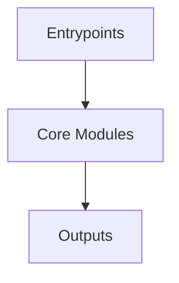

# Overview
Repository `qmk_firmware` appears to implement a modular system with 22246 source files at commit `1a58fce043e7f2e2b938dee03945dabc29e48d73`.

## Architecture
Major components inferred from file/module analysis:
- `docs`: /rgb_ws2812" },                     { "text": "RGB LEDs", "link": "/features/rgb_leds" },                     { "text": "RGB Matrix", "link": "/features/rgb_matrix" },                     { "text": "RGB Lighting", "link"...
- `lib`: to encode Python objects as JSON data
- `root`: The `qmk_firmware` repository is a collection of keyboard firmware for Atmel AVR and ARM controllers, and more specifically, the OLKB product line, the ErgoDox EZ keyboard, and the Clueboard product line
- `builddefs`: The builddefs module in the qmk_firmware repository is responsible for defining the dependencies and scripts required to build and run the project
- `keyboards`: The `keyboards/ergodox_ez/util/keymap_beautifier/requirements.txt` file is a requirements file for the `keymap_beautifier` module in the `keyboards/ergodox_ez/util` directory of the `qmk_firmware` repository
- `util`: The `util/ci/requirements.txt` file in the `qmk_firmware` repository specifies the dependencies required to run the continuous integration (CI) process
- `data`: The data module in the qmk_firmware repository is responsible for storing and managing metadata about keyboards supported by QMK

## Data Flow / Execution Flow
Typical execution path: `Entrypoint -> Core Modules -> Runtime Services -> Output/Side Effects`.
Entrypoints initialize core modules, which orchestrate processing and emit outputs or side effects.

## Configuration & Dependencies
- Build/dependency files: requirements.txt, builddefs/docsgen/package.json, keyboards/ergodox_ez/util/keymap_beautifier/requirements.txt, util/ci/requirements.txt
- Config files: .vscode/settings.json

## How to Run / Key Scripts
- Detected entrypoints: builddefs/docsgen/.vitepress/theme/index.ts, lib/python/qmk/cli/doctor/main.py
- Use repository build scripts/package manager tasks based on detected build files.

## Notable Design Choices / Extension Points
- The codebase is organized in modules that can be extended by adding new feature files under existing module boundaries.
- Extension is likely centered around entrypoint wiring, configuration files, and module-specific implementations.
