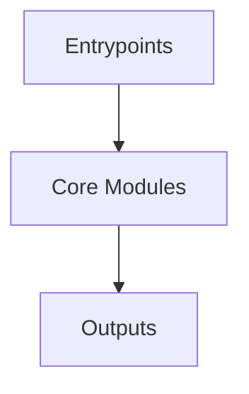

# Overview
Repository `storybook` appears to implement a modular system with 4777 source files at commit `f739234e9972691f757430404d8988e40b2dcf4c`.

## Architecture
Major components inferred from file/module analysis:
- `code`: of this package is to provide a way to document and display UI components in Storybook
- `root`: The `root` module of the `@storybook/root` repository is responsible for providing a set of scripts and dependencies for building and testing the Storybook framework

## Data Flow / Execution Flow
Typical execution path: `Entrypoint -> Core Modules -> Runtime Services -> Output/Side Effects`.
Entrypoints initialize core modules, which orchestrate processing and emit outputs or side effects.

## Configuration & Dependencies
- Build/dependency files: package.json, code/package.json, code/addons/a11y/package.json, code/addons/docs/package.json, code/addons/links/package.json, code/addons/onboarding/package.json, code/addons/pseudo-states/package.json, code/addons/themes/package.json, code/addons/vitest/package.json, code/addons/jest/package.json, code/builders/builder-vite/package.json, code/builders/builder-webpack5/package.json, code/core/package.json, code/core/src/common/js-package-manager/fixtures/multiple-lockfiles-pnpm-closer/inner/package.json, code/core/src/common/js-package-manager/fixtures/multiple-lockfiles/package.json, code/core/src/common/js-package-manager/fixtures/pnpm-workspace/package.json, code/core/src/common/js-package-manager/fixtures/pnpm-workspace/package/package.json, code/frameworks/angular/package.json, code/frameworks/ember/package.json, code/frameworks/html-vite/package.json, code/frameworks/nextjs-vite/package.json, code/frameworks/nextjs/package.json, code/frameworks/preact-vite/package.json, code/frameworks/react-native-web-vite/package.json, code/frameworks/react-vite/package.json, code/frameworks/react-webpack5/package.json, code/frameworks/server-webpack5/package.json, code/frameworks/svelte-vite/package.json, code/frameworks/sveltekit/package.json, code/frameworks/vue3-vite/package.json, code/frameworks/web-components-vite/package.json, code/lib/cli-sb/package.json, code/lib/cli-storybook/package.json, code/lib/codemod/package.json, code/lib/core-webpack/package.json, code/lib/create-storybook/package.json, code/lib/csf-plugin/package.json, code/lib/eslint-plugin/package.json, code/lib/react-dom-shim/package.json, code/presets/create-react-app/package.json, code/presets/react-webpack/package.json, code/presets/server-webpack/package.json, code/renderers/html/package.json, code/renderers/preact/package.json, code/renderers/react/package.json, code/renderers/server/package.json, code/renderers/svelte/package.json, code/renderers/vue3/package.json, code/renderers/web-components/package.json, scripts/package.json, scripts/eslint-plugin-local-rules/package.json, test-storybooks/ember-cli/package.json, test-storybooks/external-docs/package.json, test-storybooks/portable-stories-kitchen-sink/nextjs/package.json, test-storybooks/portable-stories-kitchen-sink/react/package.json, test-storybooks/portable-stories-kitchen-sink/svelte/package.json, test-storybooks/portable-stories-kitchen-sink/vue3/package.json, test-storybooks/server-kitchen-sink/package.json, test-storybooks/standalone-preview/package.json, test-storybooks/yarn-pnp/package.json
- Config files: .circleci/config.yml, .vscode/settings.json, code/chromatic.config.json, code/tsconfig.json, code/.vscode/settings.json, code/addons/a11y/tsconfig.json, code/addons/docs/tsconfig.json, code/addons/links/tsconfig.json, code/addons/onboarding/tsconfig.json, code/addons/pseudo-states/tsconfig.json, code/addons/themes/tsconfig.json, code/addons/vitest/tsconfig.json, code/addons/jest/tsconfig.json, code/builders/builder-vite/tsconfig.json, code/builders/builder-webpack5/tsconfig.json, code/core/tsconfig.json, code/core/assets/server/addon.tsconfig.json, code/frameworks/angular/tsconfig.json, code/frameworks/angular/tsconfig.spec.json, code/frameworks/angular/src/client/docs/__testfixtures__/doc-button/tsconfig.json, code/frameworks/angular/src/server/__mocks-ng-workspace__/minimal-config/angular.json, code/frameworks/angular/src/server/__mocks-ng-workspace__/minimal-config/tsconfig.json, code/frameworks/angular/src/server/__mocks-ng-workspace__/minimal-config/src/tsconfig.app.json, code/frameworks/angular/src/server/__mocks-ng-workspace__/some-config/angular.json, code/frameworks/angular/src/server/__mocks-ng-workspace__/some-config/tsconfig.json, code/frameworks/angular/src/server/__mocks-ng-workspace__/some-config/src/tsconfig.app.json, code/frameworks/angular/src/server/__mocks-ng-workspace__/with-angularBrowserTarget/tsconfig.json, code/frameworks/angular/src/server/__mocks-ng-workspace__/with-angularBrowserTarget/src/tsconfig.app.json, code/frameworks/angular/src/server/__mocks-ng-workspace__/with-lib/tsconfig.json, code/frameworks/angular/src/server/__mocks-ng-workspace__/with-lib/projects/pattern-lib/tsconfig.lib.json, code/frameworks/angular/src/server/__mocks-ng-workspace__/with-nx-workspace/tsconfig.json, code/frameworks/angular/src/server/__mocks-ng-workspace__/with-nx-workspace/src/tsconfig.app.json, code/frameworks/angular/src/server/__mocks-ng-workspace__/with-nx/tsconfig.json, code/frameworks/angular/src/server/__mocks-ng-workspace__/with-nx/src/tsconfig.app.json, code/frameworks/angular/src/server/__mocks-ng-workspace__/with-options-styles/tsconfig.json, code/frameworks/angular/src/server/__mocks-ng-workspace__/with-options-styles/src/tsconfig.app.json, code/frameworks/angular/src/server/__mocks-ng-workspace__/without-projects-entry/tsconfig.json, code/frameworks/angular/src/server/__mocks-ng-workspace__/without-projects-entry/projects/pattern-lib/tsconfig.lib.json, code/frameworks/angular/src/server/__mocks-ng-workspace__/without-tsConfig/angular.json, code/frameworks/angular/src/server/__mocks-ng-workspace__/without-tsConfig/tsconfig.json, code/frameworks/angular/src/server/__mocks-ng-workspace__/without-tsConfig/src/tsconfig.app.json, code/frameworks/ember/tsconfig.json, code/frameworks/html-vite/tsconfig.json, code/frameworks/nextjs-vite/tsconfig.json, code/frameworks/nextjs/tsconfig.json, code/frameworks/preact-vite/tsconfig.json, code/frameworks/react-native-web-vite/tsconfig.json, code/frameworks/react-vite/tsconfig.json, code/frameworks/react-webpack5/tsconfig.json, code/frameworks/server-webpack5/tsconfig.json, code/frameworks/svelte-vite/tsconfig.json, code/frameworks/sveltekit/tsconfig.json, code/frameworks/vue3-vite/tsconfig.json, code/frameworks/web-components-vite/tsconfig.json, code/lib/cli-storybook/tsconfig.json, code/lib/codemod/tsconfig.json, code/lib/core-webpack/tsconfig.json, code/lib/create-storybook/tsconfig.json, code/lib/create-storybook/templates/angular/application/template-csf/.storybook/tsconfig.doc.json, code/lib/create-storybook/templates/angular/application/template-csf/.storybook/tsconfig.json, code/lib/create-storybook/templates/angular/library/template-csf/.storybook/tsconfig.json, code/lib/create-storybook/templates/aurelia/template-csf/.storybook/tsconfig.json, code/lib/csf-plugin/tsconfig.json, code/lib/eslint-plugin/tsconfig.json, code/lib/react-dom-shim/tsconfig.json, code/presets/create-react-app/tsconfig.json, code/presets/react-webpack/tsconfig.json, code/presets/server-webpack/tsconfig.json, code/renderers/html/tsconfig.json, code/renderers/preact/tsconfig.json, code/renderers/react/tsconfig.json, code/renderers/server/tsconfig.json, code/renderers/svelte/tsconfig.json, code/renderers/vue3/tsconfig.json, code/renderers/web-components/tsconfig.json, scripts/tsconfig.json, test-storybooks/ember-cli/config/optional-features.json, test-storybooks/external-docs/tsconfig.json, test-storybooks/portable-stories-kitchen-sink/nextjs/tsconfig.json, test-storybooks/portable-stories-kitchen-sink/react/tsconfig.json, test-storybooks/portable-stories-kitchen-sink/react/tsconfig.node.json, test-storybooks/portable-stories-kitchen-sink/svelte/tsconfig.json, test-storybooks/portable-stories-kitchen-sink/svelte/tsconfig.node.json, test-storybooks/portable-stories-kitchen-sink/vue3/tsconfig.json, test-storybooks/portable-stories-kitchen-sink/vue3/tsconfig.node.json, test-storybooks/yarn-pnp/tsconfig.json, test-storybooks/yarn-pnp/tsconfig.app.json, test-storybooks/yarn-pnp/tsconfig.node.json

## How to Run / Key Scripts
- Detected entrypoints: code/.storybook/bench/bundle-analyzer/index.js, code/addons/a11y/src/index.ts, code/addons/docs/src/index.ts, code/addons/docs/src/angular/index.ts, code/addons/docs/src/blocks/blocks/index.ts, code/addons/docs/src/blocks/components/index.ts, code/addons/docs/src/blocks/components/ArgsTable/index.ts, code/addons/docs/src/blocks/controls/options/index.ts, code/addons/docs/src/compiler/index.ts, code/addons/docs/src/ember/index.ts, code/addons/docs/src/web-components/index.ts, code/addons/links/src/index.ts, code/addons/links/src/react/index.ts, code/addons/onboarding/src/index.ts, code/addons/pseudo-states/src/index.ts, code/addons/themes/src/index.ts, code/addons/themes/src/decorators/index.ts, code/addons/vitest/src/index.ts, code/addons/vitest/src/vitest-plugin/index.ts, code/addons/jest/src/index.ts, code/builders/builder-vite/src/index.ts, code/builders/builder-vite/src/plugins/index.ts, code/builders/builder-webpack5/src/index.ts, code/core/src/actions/index.ts, code/core/src/actions/models/index.ts, code/core/src/actions/runtime/index.ts, code/core/src/babel/index.ts, code/core/src/builder-manager/index.ts, code/core/src/channels/index.ts, code/core/src/channels/postmessage/index.ts, code/core/src/channels/websocket/index.ts, code/core/src/cli/index.ts, code/core/src/client-logger/index.ts, code/core/src/common/index.ts, code/core/src/common/js-package-manager/index.ts, code/core/src/component-testing/mocks/index.ts, code/core/src/components/index.ts, code/core/src/controls/index.ts, code/core/src/core-events/index.ts, code/core/src/core-server/index.ts, code/core/src/core-server/utils/parser/index.ts, code/core/src/csf-tools/index.ts, code/core/src/csf/index.ts, code/core/src/docs-tools/index.ts, code/core/src/docs-tools/argTypes/index.ts, code/core/src/docs-tools/argTypes/convert/index.ts, code/core/src/docs-tools/argTypes/convert/flow/index.ts, code/core/src/docs-tools/argTypes/convert/proptypes/index.ts, code/core/src/docs-tools/argTypes/convert/typescript/index.ts, code/core/src/docs-tools/argTypes/docgen/index.ts, code/core/src/docs-tools/argTypes/docgen/utils/index.ts, code/core/src/highlight/index.ts, code/core/src/instrumenter/index.ts, code/core/src/manager-api/index.ts, code/core/src/node-logger/index.ts, code/core/src/node-logger/logger/index.ts, code/core/src/node-logger/prompts/index.ts, code/core/src/preview-api/index.ts, code/core/src/preview-api/modules/addons/index.ts, code/core/src/preview-api/modules/preview-web/index.ts, code/core/src/preview-api/modules/store/index.ts, code/core/src/preview-api/modules/store/csf/index.ts, code/core/src/router/index.ts, code/core/src/shared/status-store/index.ts, code/core/src/shared/test-provider-store/index.ts, code/core/src/shared/universal-store/index.ts, code/core/src/telemetry/index.ts, code/core/src/test/index.ts, code/core/src/theming/index.ts, code/core/src/toolbar/index.ts, code/core/src/types/index.ts, code/core/src/viewport/index.ts, code/frameworks/angular/src/index.ts, code/frameworks/angular/src/builders/build-storybook/index.ts, code/frameworks/angular/src/builders/start-storybook/index.ts, code/frameworks/angular/src/client/index.ts, code/frameworks/angular/src/node/index.ts, code/frameworks/angular/template/components/index.js, code/frameworks/ember/src/index.ts, code/frameworks/ember/src/node/index.ts, code/frameworks/ember/template/components/index.js, code/frameworks/html-vite/src/index.ts, code/frameworks/html-vite/src/node/index.ts, code/frameworks/nextjs-vite/src/index.ts, code/frameworks/nextjs-vite/src/export-mocks/cache/index.ts, code/frameworks/nextjs-vite/src/export-mocks/headers/index.ts, code/frameworks/nextjs-vite/src/export-mocks/navigation/index.ts, code/frameworks/nextjs-vite/src/export-mocks/router/index.ts, code/frameworks/nextjs-vite/src/node/index.ts, code/frameworks/nextjs-vite/src/vite-plugin/index.ts, code/frameworks/nextjs/src/index.ts, code/frameworks/nextjs/src/export-mocks/index.ts, code/frameworks/nextjs/src/export-mocks/cache/index.ts, code/frameworks/nextjs/src/export-mocks/headers/index.ts, code/frameworks/nextjs/src/export-mocks/navigation/index.ts, code/frameworks/nextjs/src/export-mocks/router/index.ts, code/frameworks/nextjs/src/font/babel/index.ts, code/frameworks/nextjs/src/node/index.ts, code/frameworks/preact-vite/src/index.ts, code/frameworks/preact-vite/src/node/index.ts, code/frameworks/react-native-web-vite/src/index.ts, code/frameworks/react-native-web-vite/src/node/index.ts, code/frameworks/react-vite/src/index.ts, code/frameworks/react-vite/src/node/index.ts, code/frameworks/react-webpack5/src/index.ts, code/frameworks/react-webpack5/src/node/index.ts, code/frameworks/server-webpack5/src/index.ts, code/frameworks/server-webpack5/src/node/index.ts, code/frameworks/svelte-vite/src/index.ts, code/frameworks/svelte-vite/src/node/index.ts, code/frameworks/sveltekit/src/index.ts, code/frameworks/sveltekit/src/node/index.ts, code/frameworks/vue3-vite/src/index.ts, code/frameworks/vue3-vite/src/node/index.ts, code/frameworks/web-components-vite/src/index.ts, code/frameworks/web-components-vite/src/node/index.ts, code/lib/cli-sb/index.js, code/lib/cli-storybook/src/index.ts, code/lib/cli-storybook/src/autoblock/index.ts, code/lib/cli-storybook/src/automigrate/index.ts, code/lib/cli-storybook/src/automigrate/fixes/index.ts, code/lib/cli-storybook/src/bin/index.ts, code/lib/cli-storybook/src/doctor/index.ts, code/lib/codemod/src/index.ts, code/lib/core-webpack/src/index.ts, code/lib/create-storybook/src/index.ts, code/lib/create-storybook/src/bin/index.ts, code/lib/create-storybook/src/generators/ANGULAR/index.ts, code/lib/create-storybook/src/generators/EMBER/index.ts, code/lib/create-storybook/src/generators/HTML/index.ts, code/lib/create-storybook/src/generators/NEXTJS/index.ts, code/lib/create-storybook/src/generators/NUXT/index.ts, code/lib/create-storybook/src/generators/PREACT/index.ts, code/lib/create-storybook/src/generators/QWIK/index.ts, code/lib/create-storybook/src/generators/REACT/index.ts, code/lib/create-storybook/src/generators/REACT_NATIVE/index.ts, code/lib/create-storybook/src/generators/REACT_NATIVE_WEB/index.ts, code/lib/create-storybook/src/generators/REACT_SCRIPTS/index.ts, code/lib/create-storybook/src/generators/SERVER/index.ts, code/lib/create-storybook/src/generators/SOLID/index.ts, code/lib/create-storybook/src/generators/SVELTE/index.ts, code/lib/create-storybook/src/generators/SVELTEKIT/index.ts, code/lib/create-storybook/src/generators/VUE3/index.ts, code/lib/create-storybook/src/generators/WEB-COMPONENTS/index.ts, code/lib/create-storybook/src/generators/WEBPACK_REACT/index.ts, code/lib/csf-plugin/src/index.ts, code/lib/eslint-plugin/src/index.ts, code/lib/eslint-plugin/src/types/index.ts, code/lib/eslint-plugin/src/utils/index.ts, code/presets/create-react-app/src/index.ts, code/presets/react-webpack/src/index.ts, code/presets/server-webpack/src/index.ts, code/presets/server-webpack/src/lib/compiler/index.ts, code/renderers/html/src/index.ts, code/renderers/html/template/components/index.js, code/renderers/preact/src/index.ts, code/renderers/preact/template/components/index.js, code/renderers/react/src/index.ts, code/renderers/react/src/docs/lib/defaultValues/index.ts, code/renderers/react/src/docs/lib/inspection/index.ts, code/renderers/react/template/components/index.js, code/renderers/server/src/index.ts, code/renderers/svelte/src/index.ts, code/renderers/svelte/template/components/index.js, code/renderers/vue3/src/index.ts, code/renderers/vue3/template/components/index.js, code/renderers/web-components/src/index.ts, code/renderers/web-components/template/components/index.js, code/renderers/web-components/template/stories/demo-wc-card/index.js, scripts/eslint-plugin-local-rules/index.js, test-storybooks/portable-stories-kitchen-sink/react/playwright/index.ts, test-storybooks/portable-stories-kitchen-sink/svelte/playwright/index.ts, test-storybooks/portable-stories-kitchen-sink/vue3/playwright/index.ts
- Use repository build scripts/package manager tasks based on detected build files.

## Notable Design Choices / Extension Points
- The codebase is organized in modules that can be extended by adding new feature files under existing module boundaries.
- Extension is likely centered around entrypoint wiring, configuration files, and module-specific implementations.
