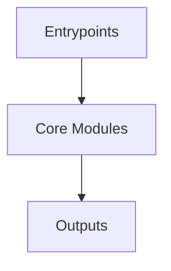

# Overview
Repository `sumatrapdf` appears to implement a modular system with 5292 source files at commit `cdadfde74471e9b06898e5c1e87edd98b4204597`.

## Architecture
Major components inferred from file/module analysis:
- `docs`: The `core-plugins.json` file in the `docs/.obsidian` directory of the SumatraPDF repository is a configuration file that specifies which plugins are enabled by default and which ones are disabled
- `root`: The `root` module in the `sumatrapdf` repository is the primary module responsible for managing the project's codebase and ensuring that it is organized and clean
- `ext`: /libheif/gnome/CMakeLists.txt: This CMakeLists.txt file is responsible for building the gnome-heif library for the sumatrapdf repository
- `mupdf`: This file defines a set of functions for logging text to the console
- `tools`: The `tools` module in the `sumatrapdf` repository is responsible for managing the development and deployment of the SumatraPDF application

## Data Flow / Execution Flow
Typical execution path: `Entrypoint -> Core Modules -> Runtime Services -> Output/Side Effects`.
Entrypoints initialize core modules, which orchestrate processing and emit outputs or side effects.

## Configuration & Dependencies
- Build/dependency files: ext/freetype/CMakeLists.txt, ext/gumbo-parser/setup.py, ext/harfbuzz/CMakeLists.txt, ext/libheif/CMakeLists.txt, ext/libheif/libheif/CMakeLists.txt, ext/libheif/examples/CMakeLists.txt, ext/libheif/gdk-pixbuf/CMakeLists.txt, ext/libheif/gnome/CMakeLists.txt, ext/libjpeg-turbo/CMakeLists.txt, ext/libjpeg-turbo/simd/CMakeLists.txt, ext/libwebp/CMakeLists.txt, ext/libwebp/build.gradle, ext/libwebp/swig/setup.py, ext/openjpeg/doc/CMakeLists.txt, ext/openjpeg/src/CMakeLists.txt, ext/openjpeg/src/lib/CMakeLists.txt, ext/openjpeg/src/lib/openjp2/CMakeLists.txt, ext/zlib-ng/CMakeLists.txt, ext/zlib/CMakeLists.txt, ext/zlib/contrib/dotzlib/DotZLib/DotZLib.csproj, ext/zlib/contrib/nuget/nuget.csproj, mupdf/pyproject.toml, mupdf/setup.py, mupdf/docs/requirements.txt, mupdf/docs/src/requirements.txt, mupdf/platform/wasm/package.json, tools/logview-web/package.json, tools/logview/frontend/package.json, tools/logview/frontend/wailsjs/runtime/package.json, tools/pdfjs/package.json
- Config files: .vscode/settings.json, ext/harfbuzz/.circleci/config.yml, mupdf/platform/wasm/tsconfig.json, tools/logview-web/jsconfig.json, tools/logview/frontend/jsconfig.json

## How to Run / Key Scripts
- Detected entrypoints: mupdf/scripts/wrap/__main__.py
- Use repository build scripts/package manager tasks based on detected build files.

## Notable Design Choices / Extension Points
- The codebase is organized in modules that can be extended by adding new feature files under existing module boundaries.
- Extension is likely centered around entrypoint wiring, configuration files, and module-specific implementations.
