# Overview

is the module source code, and `options`, which are the compiler options. The function first removes the byte order mark (BOM) from the source code, resets the state of the compiler, and validates the component options.

The `compileModule` function then parses the source code using the `_parse` function, which is a Svelte-specific parser that produces an AST (abstract syntax tree) representation of the component. The AST is then analyzed and transformed using the `analyze_component` and `transform_component` functions, which are responsible for analyzing and transforming the component's structure and behavior.

The `compileModule` function also defines several other key objects and APIs, including the `LegacyRoot` object, which is used to represent the root of the component's AST, and the `CompileResult` object, which is used to represent the result of the compilation process.

The `compileModule` function is a critical part of the Svelte compiler, as it is responsible for converting Svelte component source code into a JavaScript module that exports a component. The chunk defines several key APIs and objects that are used throughout the compiler, and it is a critical part of the system's architecture.

The `compile` and `compileModule` functions are the main entry points for the Svelte compiler, and they are responsible for converting Svelte component source code into executable JavaScript code that can be executed in the browser. The `compile` function is used to compile Svelte components, while the `compileModule` function is used to compile JavaScript modules that contain runes. Both functions are critical parts of the Svelte compiler, as they are responsible for converting the component source code into a JavaScript module that exports a component.

## Architecture

- `documentation/docs`: centered on documentation/docs/02-runes/index.md, documentation/docs/index.md, documentation/docs/98-reference/30-runtime-errors.md
- `README.md`: centered on README.md, package.json, CONTRIBUTING.md
- `documentation/docs/02-runes`: centered on documentation/docs/02-runes/01-what-are-runes.md, documentation/docs/02-runes/02-$state.md, documentation/docs/02-runes/03-$derived.md
- `documentation/docs/01-introduction`: centered on documentation/docs/01-introduction/01-overview.md, documentation/docs/01-introduction/02-getting-started.md, documentation/docs/01-introduction/03-svelte-files.md
- `packages/svelte`: centered on packages/svelte/scripts/process-messages/index.js, packages/svelte/src/compiler/phases/1-parse/index.js, packages/svelte/src/compiler/phases/1-parse/acorn.js

Key subsystem interactions:
- `community_13` -> `community_63`
- `community_3005` -> `community_3016`
- `community_45` -> `community_46`
- `community_3016` -> `community_3018`
- `community_13` -> `community_59`

### Architecture Graph

```mermaid

flowchart TD
  community_01[documentation/docs\ndocumentation/docs/02-runes/index.md, documentation/docs/index.md]
  community_02[README.md\nREADME.md, package.json]
  community_03[documentation/docs/02-runes\ndocumentation/docs/02-runes/01-what-are-runes.md, documentation/docs/02-runes/02-$state.md]
  community_04[documentation/docs/01-introduction\ndocumentation/docs/01-introduction/01-overview.md, documentation/docs/01-introduction/02-getting-started.md]
  community_05[packages/svelte\npackages/svelte/scripts/process-messages/index.js, packages/svelte/src/compiler/phases/1-parse/index.js]
  community_06[packages/svelte/src/compiler\npackages/svelte/src/compiler/index.js, packages/svelte/src/compiler/errors.js]
  community_07[documentation/docs/06-runtime\ndocumentation/docs/06-runtime/01-stores.md, documentation/docs/06-runtime/02-context.md]
  community_08[.changeset\n.changeset/README.md, .changeset/config.json]

```

## Data Flow / Execution Flow

Execution appears to begin in benchmarking/compare/index.js, packages/svelte/scripts/process-messages/index.js, packages/svelte/src/animate/index.js, packages/svelte/src/attachments/index.js, packages/svelte/src/compiler/index.js, packages/svelte/src/compiler/migrate/index.js, packages/svelte/src/compiler/phases/1-parse/index.js, packages/svelte/src/compiler/phases/2-analyze/index.js. From there, control flows through the subsystems highlighted by packages/svelte/src/attachments/index.js, packages/svelte/src/compiler/phases/2-analyze/visitors/shared/a11y/index.js, packages/svelte/src/compiler/phases/3-transform/client/transform-template/index.js, packages/svelte/src/compiler/preprocess/index.js, packages/svelte/src/compiler/phases/3-transform/css/index.js, packages/svelte/src/easing/index.js, before reaching service integrations, build/runtime helpers, or external outputs.

## Configuration & Dependencies

- Build and dependency surfaces: package.json, packages/svelte/compiler/package.json, packages/svelte/package.json, playgrounds/sandbox/package.json
- Configuration surfaces: .changeset/config.json, .vscode/settings.json, benchmarking/tsconfig.json, packages/svelte/tests/types/tsconfig.json, packages/svelte/tsconfig.generated.json, packages/svelte/tsconfig.json, packages/svelte/tsconfig.runtime.json, playgrounds/sandbox/tsconfig.json
- Supporting evidence: package.json, packages/svelte/src/compiler/phases/3-transform/client/transform-template/index.js, packages/svelte/src/compiler/index.js, packages/svelte/src/compiler/phases/3-transform/client/transform-template/index.js, packages/svelte/src/compiler/phases/3-transform/css/index.js, packages/svelte/src/compiler/phases/3-transform/client/transform-template/index.js

## How to Run / Key Scripts

- Entrypoints and scripts: benchmarking/compare/index.js, packages/svelte/scripts/process-messages/index.js, packages/svelte/src/animate/index.js, packages/svelte/src/attachments/index.js, packages/svelte/src/compiler/index.js, packages/svelte/src/compiler/migrate/index.js, packages/svelte/src/compiler/phases/1-parse/index.js, packages/svelte/src/compiler/phases/2-analyze/index.js
- Operational evidence: packages/svelte/src/compiler/phases/3-transform/client/transform-template/index.js, packages/svelte/src/compiler/phases/3-transform/client/transform-template/index.js, packages/svelte/src/compiler/phases/2-analyze/index.js, packages/svelte/src/compiler/phases/3-transform/client/transform-template/index.js, packages/svelte/src/events/index.js, packages/svelte/src/attachments/index.js

## Notable Design Choices / Extension Points

`source`, which is the module source code, and `options`, which are the compiler options. The function first removes the byte order mark (BOM) from the source code, resets the state of the compiler, and validates the component options.

The `compileModule` function then parses the source code using the `_parse` function, which is a Svelte-specific parser that produces an AST (abstract syntax tree) representation of the component. The AST is then analyzed and transformed using the `analyze_component` and `transform_component` functions, which are responsible for analyzing and transforming the component's structure and behavior.

The `compileModule` function also defines several other key objects and APIs, including the `LegacyRoot` object, which is used to represent the root of the component's AST, and the `CompileResult` object, which is used to represent the result of the compilation process.

The `compileModule` function is a critical part of the Svelte compiler, as it is responsible for converting Svelte component source code into a JavaScript module that exports a component. The chunk defines several key APIs and objects that are used throughout the compiler, and it is a critical part of the system's architecture.

The `compile` and `compileModule` functions are the main entry points for the Svelte compiler, and they are responsible for converting Svelte component source code into executable JavaScript code that can be executed in the browser. The chunk defines several key APIs and objects that are used throughout the compiler, and it is a critical part of the system's architecture.

The `compile` and `compileModule` functions are the main entry points for the Svelte compiler, and they are responsible for converting Svelte component source code into executable JavaScript code that can be executed in the browser. The chunk defines several key APIs and objects that are used throughout the compiler, and it is a critical part of the system's architecture.

The `compile` and `compileModule` functions are the main entry points for the Svelte compiler, and they are responsible for converting Svelte component source code into executable JavaScript code that can be executed in the browser. The chunk defines several key APIs and objects that are used throughout the compiler, and it is a critical part of the system's architecture.

The `compile` and `compileModule` functions are the