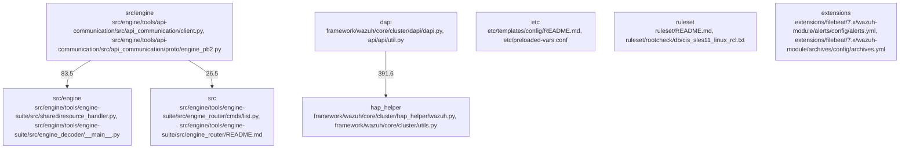

# Overview

HAProxy cluster configuration file and returning a dictionary with the parsed configuration.

The `hap_helper` subsystem is relevant to the runtime of the Wazuh framework, as it provides a way to configure the HAProxy load balancer and manage its connections. The subsystem is also relevant to the dependencies of the Wazuh framework, as it depends on the `haproxy` and `ossec` libraries, which are used to interact with the HAProxy load balancer and the Wazuh agent, respectively.

The `hap_helper` subsystem is an important part of the Wazuh framework, as it provides a way to configure the HAProxy load balancer and manage its connections. The subsystem is designed to be highly configurable, with a number of options for customizing the behavior of the subsystem to meet the specific needs of the organization. The subsystem is also highly extensible, with a number of extension points for customizing and extending the subsystem.

In summary, the `hap_helper` subsystem is a critical component of the Wazuh framework, responsible for handling the HAProxy load balancer and its configuration. The subsystem is divided into two main components: the `haproxy` module and the `utils` module, which provide a way to interact with the HAProxy load balancer and manage its connections. The subsystem is highly configurable and extensible, and is relevant to the runtime and dependencies of the Wazuh framework.

## Architecture

- `src/engine`: centered on src/engine/tools/api-communication/src/api_communication/client.py, src/engine/tools/api-communication/src/api_communication/proto/engine_pb2.py, src/engine/tools/engine-suite/src/shared/default_settings.py
- `src/engine`: centered on src/engine/tools/engine-suite/src/shared/resource_handler.py, src/engine/tools/engine-suite/src/engine_decoder/__main__.py, src/engine/tools/engine-suite/src/engine_diff/__main__.py
- `src`: centered on src/engine/tools/engine-suite/src/engine_router/cmds/list.py, src/engine/tools/engine-suite/src/engine_router/README.md, src/engine/tools/engine-suite/src/engine_router/__init__.py
- `dapi`: centered on framework/wazuh/core/cluster/dapi/dapi.py, api/api/util.py, api/api/controllers/util.py
- `etc`: centered on etc/templates/config/README.md, etc/preloaded-vars.conf, etc/templates/config/almalinux/10/sca.files

Key subsystem interactions:
- `community_04` -> `community_06`
- `community_01` -> `community_02`
- `community_415` -> `community_836`
- `community_01` -> `community_03`
- `community_02` -> `community_318`

### Architecture Graph

## Data Flow / Execution Flow

Execution appears to begin in framework/wazuh/__main__.py, framework/wazuh/core/cluster/server.py, src/alert_forwarder/main.py, src/engine/test/health_test/engine-health-test/src/health_test/__main__.py, src/engine/tools/engine-bench/src/engine_bench/__main__.py, src/engine/tools/engine-suite/src/engine_archiver/__main__.py, src/engine/tools/engine-suite/src/engine_catalog/__main__.py, src/engine/tools/engine-suite/src/engine_clear/__main__.py. From there, control flows through the subsystems highlighted by framework/wazuh/core/cluster/dapi/dapi.py, framework/wazuh/core/common.py, framework/wazuh/core/common.py, framework/wazuh/core/common.py, framework/wazuh/core/common.py, framework/wazuh/core/cluster/dapi/dapi.py, before reaching service integrations, build/runtime helpers, or external outputs.

## Configuration & Dependencies

- Build and dependency surfaces: api/setup.py, extensions/elasticsearch/7.x/qa/requirements.txt, framework/requirements.txt, framework/setup.py, src/CMakeLists.txt, src/data_provider/CMakeLists.txt, src/data_provider/qa/requirements.txt, src/data_provider/src/extended_sources/CMakeLists.txt
- Configuration surfaces: api/api/configuration/api.yaml, api/test/integration/env/configurations/base/manager/config/api/configuration/api.yaml, api/test/integration/env/configurations/base/manager/config/api/configuration/security/security.yaml, api/test/integration/env/configurations/base/manager/configuration_files/master_only/agent_groups.yaml, api/test/integration/env/configurations/base/manager/configuration_files/master_only/agent_info.yaml, api/test/integration/env/configurations/rbac/active/black_config.yaml, api/test/integration/env/configurations/rbac/active/white_config.yaml, api/test/integration/env/configurations/rbac/agent/black_config.yaml
- Supporting evidence: framework/wazuh/core/cluster/utils.py, framework/wazuh/core/cluster/utils.py, framework/wazuh/core/cluster/utils.py, framework/wazuh/core/cluster/utils.py, framework/wazuh/core/utils.py, framework/wazuh/core/cluster/utils.py

## How to Run / Key Scripts

- Entrypoints and scripts: framework/wazuh/__main__.py, framework/wazuh/core/cluster/server.py, src/alert_forwarder/main.py, src/engine/test/health_test/engine-health-test/src/health_test/__main__.py, src/engine/tools/engine-bench/src/engine_bench/__main__.py, src/engine/tools/engine-suite/src/engine_archiver/__main__.py, src/engine/tools/engine-suite/src/engine_catalog/__main__.py, src/engine/tools/engine-suite/src/engine_clear/__main__.py
- Operational evidence: framework/wazuh/core/cluster/utils.py, framework/wazuh/core/cluster/utils.py, framework/wazuh/core/common.py, framework/wazuh/core/utils.py, framework/wazuh/core/common.py, framework/wazuh/core/cluster/utils.py

## Notable Design Choices / Extension Points

responsible for reading the HAProxy cluster configuration file and returning a dictionary with the parsed configuration.

The `hap_helper` subsystem is relevant to the runtime of the Wazuh framework, as it provides a way to configure the HAProxy load balancer and manage its connections. The subsystem is also relevant to the dependencies of the Wazuh framework, as it depends on the `haproxy` and `ossec` libraries, which are used to interact with the HAProxy load balancer and the Wazuh agent, respectively.

The `hap_helper` subsystem is an important part of the Wazuh framework, as it provides a way to configure the HAProxy load balancer and manage its connections. The subsystem is highly configurable, with a number of options for customizing the behavior of the HAProxy load balancer. The subsystem is also highly extensible, with a number of extension points for customizing the behavior of the HAProxy load balancer.

In summary, the `hap_helper` subsystem is a critical component of the Wazuh framework, responsible for handling the HAProxy load balancer and its configuration. The subsystem is highly configurable and highly extensible, and is an important part of the Wazuh framework.