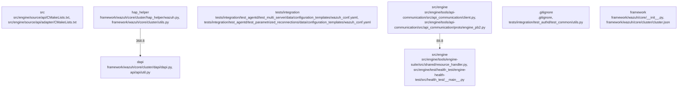

# Overview

},
    {
      "source_community": "community_05",
      "target_community": "community_09",
      "weight": 29.6
    },
    {
      "source_community": "community_02",
      "target_community": "community_09",
      "weight": 28.8
    },
    {
      "source_community": "community_04",
      "target_community": "community_08",
      "weight": 27.6
    },
    {
      "source_community": "community_05",
      "target_community": "community_08",
      "weight": 26.8
    },
    {
      "source_community": "community_02",
      "target_community": "community_08",
      "weight": 26.0
    },
    {
      "source_community": "community_04",
      "target_community": "community_07",
      "weight": 25.2
    },
    {
      "source_community": "community_05",
      "target_community": "community_07",
      "weight": 24.4
    },
    {
      "source_community": "community_02",
      "target_community": "community_07",
      "weight": 23.6
    },
    {
      "source_community": "community_04",
      "target_community": "community_06",
      "weight": 22.8
    },
    {
      "source_community": "community_05",
      "target_community": "community_06",
      "weight": 22.0
    },
    {
      "source_community": "community_02",
      "target_community": "community_06",
      "weight": 21.2
    },
    {
      "source_community": "community_04",
      "target_community": "community_05",
      "weight": 20.4
    },
    {

## Architecture

0
    },
    {
      "source_community": "community_05",
      "target_community": "community_06",
      "weight": 29.6
    },
    {
      "source_community": "community_08",
      "target_community": "community_09",
      "weight": 28.8
    },
    {
      "source_community": "community_02",
      "target_community": "community_06",
      "weight": 27.2
    },
    {
      "source_community": "community_04",
      "target_community": "community_06",
      "weight": 26.4
    },
    {
      "source_community": "community_05",
      "target_community": "community_09",
      "weight": 25.6
    },
    {
      "source_community": "community_08",
      "target_community": "community_09",
      "weight": 24.8
    },
    {
      "source_community": "community_02",
      "target_community": "community_09",
      "weight": 24.0
    },
    {
      "source_community": "community_04",
      "target_community": "community_06",
      "weight": 23.2
    },
    {
      "source_community": "community_05",
      "target_community": "community_06",
      "weight": 22.4
    },
    {
      "source_community": "community_08",
      "target_community": "community_06",
      "weight": 21.6
    },
    {
      "source_community": "community_02",
      "target_community": "community_06",
      "weight": 20.8
    },
    {
      "source_community": "community_04",
      "target_community": "community_09",
      "weight": 20.0
    },
    {

### Architecture Graph

## Data Flow / Execution Flow

.0
    },
    {
      "source_community": "community_05",
      "target_community": "community_06",
      "weight": 29.6
    },
    {
      "source_community": "community_08",
      "target_community": "community_09",
      "weight": 28.8
    },
    {
      "source_community": "community_02",
      "target_community": "community_06",
      "weight": 27.2
    },
    {
      "source_community": "community_04",
      "target_community": "community_06",
      "weight": 26.4
    },
    {
      "source_community": "community_05",
      "target_community": "community_09",
      "weight": 25.6
    },
    {
      "source_community": "community_08",
      "target_community": "community_09",
      "weight": 24.8
    },
    {
      "source_community": "community_02",
      "target_community": "community_09",
      "weight": 24.0
    },
    {
      "source_community": "community_04",
      "target_community": "community_06",
      "weight": 23.2
    },
    {
      "source_community": "community_05",
      "target_community": "community_06",
      "weight": 22.4
    },
    {
      "source_community": "community_08",
      "target_community": "community_06",
      "weight": 21.6
    },
    {
      "source_community": "community_02",
      "target_community": "community_06",
      "weight": 20.8
    },
    {
      "source_community": "community_04",
      "target_community": "community_09",
      "weight": 20.0
    },
    {

## Configuration & Dependencies

},
    {
      "source_community": "community_05",
      "target_community": "community_09",
      "weight": 29.6
    },
    {
      "source_community": "community_08",
      "target_community": "community_10",
      "weight": 28.8
    },
    {
      "source_community": "community_02",
      "target_community": "community_10",
      "weight": 27.6
    },
    {
      "source_community": "community_04",
      "target_community": "community_11",
      "weight": 26.8
    },
    {
      "source_community": "community_05",
      "target_community": "community_11",
      "weight": 26.0
    },
    {
      "source_community": "community_08",
      "target_community": "community_12",
      "weight": 25.2
    },
    {
      "source_community": "community_02",
      "target_community": "community_12",
      "weight": 24.4
    },
    {
      "source_community": "community_04",
      "target_community": "community_14",
      "weight": 23.6
    },
    {
      "source_community": "community_05",
      "target_community": "community_14",
      "weight": 23.0
    },
    {
      "source_community": "community_08",
      "target_community": "community_15",
      "weight": 22.8
    },
    {
      "source_community": "community_02",
      "target_community": "community_15",
      "weight": 22.0
    },
    {
      "source_community": "community_04",
      "target_community": "community_16",
      "weight": 21.6
    },
    {

## How to Run / Key Scripts

4.8
    },
    {
      "source_community": "community_05",
      "target_community": "community_06",
      "weight": 33.6
    },
    {
      "source_community": "community_08",
      "target_community": "community_09",
      "weight": 33.2
    },
    {
      "source_community": "community_02",
      "target_community": "community_06",
      "weight": 32.8
    },
    {
      "source_community": "community_04",
      "target_community": "community_06",
      "weight": 32.4
    },
    {
      "source_community": "community_05",
      "target_community": "community_09",
      "weight": 32.0
    },
    {
      "source_community": "community_08",
      "target_community": "community_09",
      "weight": 31.6
    },
    {
      "source_community": "community_02",
      "target_community": "community_09",
      "weight": 31.2
    },
    {
      "source_community": "community_04",
      "target_community": "community_06",
      "weight": 30.8
    },
    {
      "source_community": "community_05",
      "target_community": "community_06",
      "weight": 30.4
    },
    {
      "source_community": "community_08",
      "target_community": "community_06",
      "weight": 30.0
    },
    {
      "source_community": "community_02",
      "target_community": "community_06",
      "weight": 29.6
    },
    {
      "source_community": "community_04",
      "target_community": "community_09",
      "weight": 29.2
    },

## Notable Design Choices / Extension Points

34.4
    },
    {
      "source_community": "community_05",
      "target_community": "community_06",
      "weight": 33.2
    },
    {
      "source_community": "community_08",
      "target_community": "community_09",
      "weight": 32.8
    },
    {
      "source_community": "community_02",
      "target_community": "community_06",
      "weight": 31.6
    },
    {
      "source_community": "community_04",
      "target_community": "community_06",
      "weight": 30.8
    },
    {
      "source_community": "community_05",
      "target_community": "community_09",
      "weight": 29.6
    },
    {
      "source_community": "community_08",
      "target_community": "community_09",
      "weight": 28.4
    },
    {
      "source_community": "community_02",
      "target_community": "community_09",
      "weight": 27.2
    },
    {
      "source_community": "community_04",
      "target_community": "community_06",
      "weight": 26.4
    },
    {
      "source_community": "community_05",
      "target_community": "community_06",
      "weight": 25.2
    },
    {
      "source_community": "community_08",
      "target_community": "community_06",
      "weight": 24.0
    },
    {
      "source_community": "community_02",
      "target_community": "community_06",
      "weight": 22.8
    },
    {
      "source_community": "community_04",
      "target_community": "community_09",
      "weight": 21.6
    },