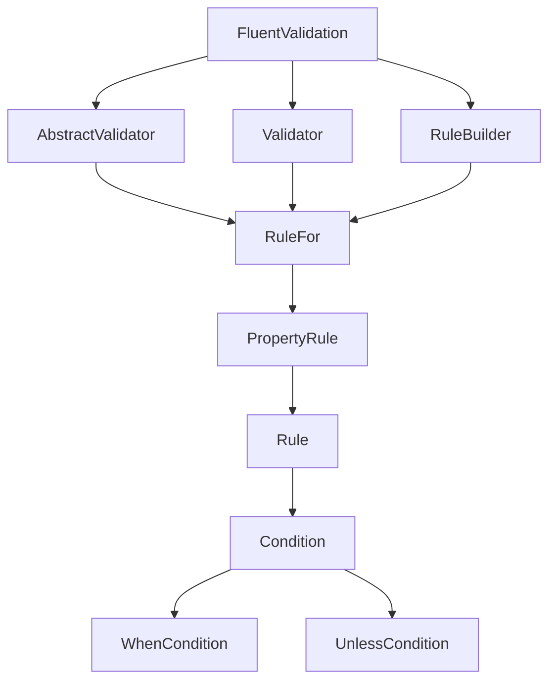

# FluentValidation Documentation

## Overview
FluentValidation is a powerful validation library for .NET, providing a fluent interface and lambda expressions for building strongly-typed validation rules. It supports .NET Core, .NET 5, .NET 6, and .NET Standard 2.0.

## Architecture

## Data Flow / Execution Flow
1. A data object is passed to the validator for validation.
2. The validator checks if the data object is null.
3. If the data object is not null, the validator executes the validation rules.
4. The validator returns a ValidationResult object, which contains the validation errors.

## Configuration & Dependencies
FluentValidation is configured by creating a validator class that inherits from AbstractValidator and defines the validation rules. The rules are defined using the RuleFor method, which takes a lambda expression that specifies the property to validate and the validation rules to apply to that property.

FluentValidation has no dependencies on other libraries, but it can be integrated with dependency injection containers like Microsoft.Extensions.DependencyInjection.

## How to Run / Key Scripts
FluentValidation can be run by creating a validator class and calling the Validate method on an instance of the validator. The Validate method takes a data object to validate and returns a ValidationResult object.

## Notable Design Choices / Extension Points
FluentValidation is designed to be highly extensible. It allows for custom rules, conditions, and cascade modes, which can be used to customize the validation process.

FluentValidation also supports asynchronous validation, which can be used when working with external APIs or other asynchronous operations.

The design of FluentValidation is inspired by the Fluent Interface design pattern, which allows for a more readable and expressive way to define validation rules.

FluentValidation is also designed to be easy to use and understand, with a simple API and clear documentation.

## Caveats
The documentation for FluentValidation is not as comprehensive as some other validation libraries. Some features may not be fully documented, and the API may change between versions.