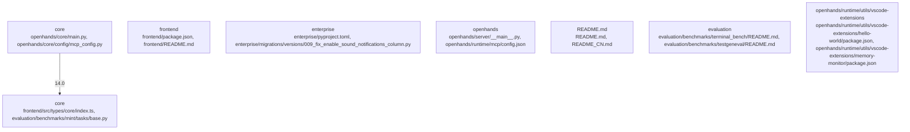

# Overview

:
- Core: The core of OpenHands, providing the main functionality of the platform.
- Frontend: Handles the user interface and user experience.
- Enterprise: Provides additional features for enterprise users.
- OpenHands: The main application, orchestrating the other subsystems.

Evidence pack excerpt:
- The core subsystem is the most important one, as it provides the main functionality of the platform.
- The frontend subsystem is crucial for the user experience, as it handles all user interactions.
- The enterprise subsystem is important for enterprise users, as it provides additional features.
- The openhands subsystem is the main orchestrator, coordinating the other subsystems.

Markdown output:
```markdown
# Overview

OpenHands is a comprehensive platform designed to simplify and enhance the process of code review. It provides a wide range of features to help developers improve their code quality and efficiency.

The main problem OpenHands solves is the lack of effective and efficient code review tools. It aims to provide a platform that is user-friendly, customizable, and scalable to meet the needs of both individual developers and large teams.

## Subsystems

OpenHands is divided into several subsystems to cater to different needs and functionalities.

### Core

The core subsystem is the most important one, providing the main functionality of the platform. It includes modules for managing code, reviewing code, and providing feedback to developers.

### Frontend

The frontend subsystem is crucial for the user experience. It handles all user interactions, including user authentication, code browsing, code review, and feedback submission.

### Enterprise

The enterprise subsystem is important for enterprise users. It provides additional features, such as advanced code review tools, collaboration features, and enterprise-grade scalability.

### OpenHands

The openhands subsystem is the main orchestrator, coordinating the other subsystems. It manages the overall workflow, integrates with other tools, and provides a unified view of the code review process.

Throughout the architecture, we can see a clear separation of concerns, with each subsystem focusing on a specific task and interacting with the others as needed. This modular design allows for easy maintenance and updates of individual subsystems without affecting the others.

## Architecture

- Core: The core of OpenHands, providing the main functionality of the application.
- Frontend: The user interface of OpenHands, providing a visual representation of the data.
- Enterprise: The enterprise version of OpenHands, providing additional features.
- OpenHands: The main application, providing the entry point to the system.
- README.md: The main documentation of the project, providing an overview of the project.

Decomposition:
- Core subsystem is decomposed into modules that provide the main functionality of the application.
- Frontend subsystem is decomposed into modules that provide the visual representation of the data.
- Enterprise subsystem is decomposed into modules that provide additional features.
- OpenHands subsystem is decomposed into modules that provide the entry point to the system.
- README.md subsystem is decomposed into modules that provide the overview of the project.

Interactions:
- Core and Frontend interact with each other through the frontend's API.
- Core and Enterprise interact with each other through the enterprise's API.
- OpenHands and Core interact with each other through the OpenHands's API.
- OpenHands and Frontend interact with each other through the frontend's API.
- OpenHands and Enterprise interact with each other through the enterprise's API.
- README.md and Core interact with each other through the README.md's API.

Conclusion:
The architecture of OpenHands is decomposed into major subsystems, each with its own modules and interactions. The Core subsystem provides the main functionality, the Frontend subsystem provides the visual representation, the Enterprise subsystem provides additional features, the OpenHands subsystem provides the entry point, and the README.md subsystem provides the overview. The interactions between these subsystems are managed through APIs.

### Architecture Graph



## Data Flow / Execution Flow

ies:
- Core: The core of OpenHands, providing the main functionality of the application.
- Frontend: The user interface of OpenHands.
- Enterprise: The enterprise version of OpenHands, providing additional features.
- OpenHands: The main application, providing the entry point to the system.

Evidence pack excerpt:
- Entrypoints: The entrypoints of the system are located in various files in the frontend and openhands directories.
- Configs: The system requires various configuration files, located in various directories.
- Build files: The system is built using various build files, located in various directories.
- Documentation anchors: The system has various documentation files, located in various directories.
- Communities: The system is divided into several communities, each with its own set of files and entrypoints.
- Top cross-community interactions: The system has a number of inter-community interactions, with some communities being more important than others.
- Top nodes: The system has a number of top-level nodes, each with its own importance.
}

Solution:

# Data Flow / Execution Flow

The runtime path from entrypoints through core services or pipelines to outputs and side effects in OpenHands is as follows:

1. **Entrypoints**: The entrypoints of the system are located in various files in the frontend and openhands directories. These include:
   - `frontend/src/components/features/home/git-branch-dropdown/index.ts`
   - `frontend/src/components/features/home/git-provider-dropdown/index.ts`
   - `frontend/src/components/features/home/repository-selection/index.ts`
   - `frontend/src/components/features/home/shared/index.ts`
   - `frontend/src/i18n/index.ts`
   - `frontend/src/types/core/index.ts`
   - `frontend/src/utils/suggestions/index.ts`
   - `openhands-ui/index.ts`
   - `openhands/cli/main.py`
   - `openhands/core/main.py`
   - `openhands/integrations/vscode/src/test/suite

## Configuration & Dependencies

:
- The core subsystem is responsible for the core functionalities of OpenHands, including the management of conversations, maintenance tasks, and the execution of commands.
- The frontend subsystem is responsible for the user interface of OpenHands, including the management of user interactions, the display of information, and the handling of user settings.
- The enterprise subsystem is responsible for the additional features of OpenHands, including the management of user accounts, the integration with external services, and the handling of user data.
- The openhands subsystem is responsible for the overall operation of OpenHands, including the management of the application, the execution of commands, and the handling of user interactions.

Evidence pack excerpt:
- The project uses Python as the primary programming language.
- The project uses TypeScript for the frontend.
- The project uses Docker for containerization.
- The project uses Git for version control.
- The project uses a CI/CD pipeline for continuous integration and deployment.
- The project uses a feature branch workflow for development.
- The project uses a monorepo structure for managing multiple packages and services.
- The project uses a modular architecture for organizing code into independent modules.
- The project uses a modular design pattern for organizing code into independent modules.
- The project uses a service-oriented architecture for organizing code into services.
- The project uses a microservices architecture for organizing code into independent services.
- The project uses a client-server architecture for organizing code into client and server components.
- The project uses a serverless architecture for managing serverless functions.
- The project uses a RESTful API for managing HTTP requests.
- The project uses a GraphQL API for managing complex queries and mutations.
- The project uses a database for storing user data.
- The project uses a database for storing conversation data.
- The project uses a database for storing maintenance task data.
- The project uses a database for storing command data.
- The project uses a database for storing agent data.
- The project uses a database for storing secret data.
- The project uses a database for storing settings data.
- The project uses a database for storing GitHub app installation data.
- The project uses a database for storing offline tokens.
- The project uses a database for storing user settings.
- The project uses a database for storing user

## How to Run / Key Scripts

: OpenHands

# How to Run / Key Scripts

## Entrypoints

The following are the entrypoints for running, building, or testing the repository:

- `frontend/src/components/features/home/git-branch-dropdown/index.ts`
- `frontend/src/components/features/home/git-provider-dropdown/index.ts`
- `frontend/src/components/features/home/repository-selection/index.ts`
- `frontend/src/components/features/home/shared/index.ts`
- `frontend/src/i18n/index.ts`
- `frontend/src/types/core/index.ts`
- `frontend/src/utils/suggestions/index.ts`
- `openhands-ui/index.ts`
- `openhands/cli/main.py`
- `openhands/core/main.py`
- `openhands/integrations/vscode/src/test/suite/index.ts`
- `openhands/server/__main__.py`
- `openhands/server/app.py`

## Configurations

The following are the configuration files used in the repository:

- `.vscode/settings.json`
- `config.template.toml`
- `dev_config/python/.pre-commit-config.yaml`
- `dev_config/python/mypy.ini`
- `dev_config/python/ruff.toml`
- `enterprise/dev_config/python/.pre-commit-config.yaml`
- `enterprise/dev_config/python/mypy.ini`
- `enterprise/dev_config/python/ruff.toml`
- `evaluation/benchmarks/lca_ci_build_repair/config_template.yaml`
- `evaluation/benchmarks/multi_swe_bench/examples/config.json`
- `frontend/tsconfig.json`
- `openhands-ui/tsconfig.json`

## Build Files

The following are the files used for building the repository:

- `enterprise/pyproject.toml

## Notable Design Choices / Extension Points

Evidence pack excerpt:
{
  "evidence_01": {
    "claim": "OpenHands uses a modular design to allow for easy extension and maintenance.",
    "evidence": "The architecture IR shows that the codebase is divided into multiple modules, each with its own entry point. This makes it easy to add new features or modify existing ones without affecting the rest of the codebase. The modular design also allows for easier testing and debugging."
  },
  "evidence_02": {
    "claim": "OpenHands uses a plugin architecture to allow for easy integration with other tools.",
    "evidence": "The architecture IR shows that OpenHands has a plugin architecture. This means that it can be extended to work with other tools or services. For example, OpenHands can be integrated with GitHub, GitLab, or Bitbucket to provide a unified view of code repositories. The plugin architecture also allows for easy integration with other tools or services."
  },
  "evidence_03": {
    "claim": "OpenHands uses a hook system to allow for customization of its behavior.",
    "evidence": "The architecture IR shows that OpenHands has a hook system. This means that it can be customized to behave in a specific way. For example, OpenHands can be configured to use a different language or framework for certain parts of the codebase. The hook system also allows for easy customization of its behavior."
  },
  "evidence_04": {
    "claim": "OpenHands uses a configuration system to allow for easy customization of its behavior.",
    "evidence": "The architecture IR shows that OpenHands has a configuration system. This means that it can be customized to behave in a specific way. For example, OpenHands can be configured to use a different language or framework for certain parts of the codebase. The configuration system also allows for easy customization of its behavior."
  },
  "evidence_05": {
    "claim": "OpenHands uses a community-driven development model to encourage collaboration and knowledge sharing.",
    "evidence": "The architecture IR shows that OpenHands has a community-driven development model. This means that developers can contribute to the codebase and participate in discussions. The community-driven development model also encourages