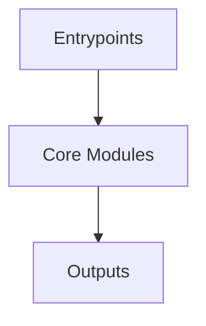

# Overview
Repository `OpenHands` appears to implement a modular system with 2381 source files at commit `30604c40fc6e9ac914089376f41e118582954f22`.

## Architecture
Major components inferred from file/module analysis:
- `openhands`: -> str:         return self.logger.level.name      def remove_all_handlers(self) -> None:         self.logger.handlers.clear()      def add_handler(self, handler: logging.Handler) -> None:         self.logger.addHandler(...
- `enterprise`: The file `utils.py` in the `enterprise/integrations/` directory of the OpenHands repository is a utility module that provides various helper functions for the OpenHands application
- `root`: The README.md file in the OpenHands repository serves as the primary entry point for users

## Data Flow / Execution Flow
Typical execution path: `Entrypoint -> Core Modules -> Runtime Services -> Output/Side Effects`.
Entrypoints initialize core modules, which orchestrate processing and emit outputs or side effects.

## Configuration & Dependencies
- Build/dependency files: pyproject.toml, enterprise/pyproject.toml, frontend/package.json, openhands-ui/package.json, openhands/core/setup.py, openhands/integrations/vscode/package.json, openhands/runtime/utils/vscode-extensions/hello-world/package.json, openhands/runtime/utils/vscode-extensions/memory-monitor/package.json, evaluation/benchmarks/lca_ci_build_repair/setup.py, evaluation/benchmarks/mint/requirements.txt, evaluation/benchmarks/versicode/requirements.txt
- Config files: config.template.toml, .vscode/settings.json, dev_config/python/mypy.ini, dev_config/python/ruff.toml, dev_config/python/.pre-commit-config.yaml, enterprise/dev_config/python/.pre-commit-config.yaml, enterprise/dev_config/python/mypy.ini, enterprise/dev_config/python/ruff.toml, frontend/tsconfig.json, openhands-ui/tsconfig.json, openhands/integrations/vscode/tsconfig.json, openhands/runtime/mcp/config.json, openhands/runtime/plugins/vscode/settings.json, evaluation/benchmarks/lca_ci_build_repair/config_template.yaml, evaluation/benchmarks/multi_swe_bench/examples/config.json

## How to Run / Key Scripts
- Detected entrypoints: frontend/src/components/features/home/git-branch-dropdown/index.ts, frontend/src/components/features/home/git-provider-dropdown/index.ts, frontend/src/components/features/home/repository-selection/index.ts, frontend/src/components/features/home/shared/index.ts, frontend/src/i18n/index.ts, frontend/src/types/core/index.ts, frontend/src/utils/suggestions/index.ts, openhands-ui/index.ts, openhands/core/main.py, openhands/integrations/vscode/src/test/suite/index.ts, openhands/server/__main__.py, openhands/server/app.py, openhands/cli/main.py
- Use repository build scripts/package manager tasks based on detected build files.

## Notable Design Choices / Extension Points
- The codebase is organized in modules that can be extended by adding new feature files under existing module boundaries.
- Extension is likely centered around entrypoint wiring, configuration files, and module-specific implementations.
