# Overview

8.0
    },
    {
      "path": "spec/index.js",
      "kind": "entrypoint",
      "importance": 7.0
    },
    {
      "path": "default_app/package.json",
      "kind": "build_file",
      "importance": 6.0
    },
    {
      "path": "package.json",
      "kind": "build_file",
      "importance": 6.0
    },
    {
      "path": "spec/fixtures/api/app-path/package.json",
      "kind": "build_file",
      "importance": 5.0
    },
    {
      "path": "spec/fixtures/api/command-line/package.json",
      "kind": "build_file",
      "importance": 5.0
    },
    {
      "path": "spec/fixtures/api/context-bridge/context-bridge-mutability/package.json",
      "kind": "build_file",
      "importance": 5.0
    },
    {
      "path": "spec/fixtures/api/cookie-app/package.json",
      "kind": "build_file",
      "importance": 5.0
    }
  ]
}

Evidence pack excerpt:
{
  "evidence": [
    {
      "claim": "Electron is a framework for building native applications with web technologies like JavaScript, HTML, and CSS.",
      "evidence_type": "claim",
      "evidence_data": {
        "evidence_files": [
          "README.md",
          "docs/README.md"
        ],
        "evidence_text": [
          "Electron is a framework for creating native applications with web technologies like JavaScript, HTML, and CSS."
        ]
      }
    },
    {
      "claim": "Electron provides a way to write desktop applications using JavaScript, HTML, and CSS.",
      "evidence_type": "claim",
      "evidence_data": {
        "evidence_files":

## Architecture

.0
    },
    {
      "path": "spec/fixtures/api/app-path/lib/index.js",
      "kind": "entrypoint",
      "importance": 8.0
    },
    {
      "path": "spec/fixtures/api/electron-main-module/app/index.js",
      "kind": "entrypoint",
      "importance": 8.0
    },
    {
      "path": "spec/fixtures/crash-cases/api-browser-destroy/index.js",
      "kind": "entrypoint",
      "importance": 7.0
    },
    {
      "path": "spec/fixtures/crash-cases/early-in-memory-session-create/index.js",
      "kind": "entrypoint",
      "importance": 7.0
    },
    {
      "path": "spec/fixtures/crash-cases/in-memory-session-double-free/index.js",
      "kind": "entrypoint",
      "importance": 7.0
    },
    {
      "path": "spec/fixtures/crash-cases/quit-on-crashed-event/index.js",
      "kind": "entrypoint",
      "importance": 7.0
    },
    {
      "path": "spec/index.js",
      "kind": "entrypoint",
      "importance": 7.0
    }
  ]
}

Evidence pack excerpt:
{
  "evidence_01": {
    "claim": "Electron is a framework for building native applications with web technologies like JavaScript, HTML, and CSS.",
    "evidence": [
      "The README.md file of the repository mentions that Electron is a framework for building native applications with web technologies.",
      "The repository contains JavaScript, HTML, and CSS files, which are used to build Electron applications."
    ]
  },
  "evidence_02": {
    "claim": "Electron uses Chromium as its rendering engine.",
    "evidence": [
      "The README.

### Architecture Graph

```mermaid

flowchart TD
  community_01[shell\nshell/browser/api/electron_api_extensions.cc, shell/browser/api/electron_api_extensions.h]
  community_02[spec\nspec/fixtures/api/app-path/lib/index.js, spec/fixtures/api/electron-main-module/app/index.js]
  community_03[docs\ndocs/api/extensions-api.md, docs/api/extensions.md]
  community_04[patches\npatches/chromium/chore_defer_usb_service_getdevices_request_until_usb_service_is.patch, patches/chromium/custom_protocols_plzserviceworker.patch]
  community_05[README.md\nREADME.md, tsconfig.default_app.json]
  community_06[lib\nlib/browser/api/service-worker-main.ts, lib/browser/api/auto-updater.ts]
  community_07[script\nscript/gen-filenames.ts, script/gen-hunspell-filenames.js]
  community_08[lib\nscript/lib/util.py, script/lib/config.py]

```

## Data Flow / Execution Flow

8.0
    },
    {
      "path": "spec/index.js",
      "kind": "entrypoint",
      "importance": 7.0
    },
    {
      "path": "default_app/package.json",
      "kind": "build_file",
      "importance": 6.0
    },
    {
      "path": "package.json",
      "kind": "build_file",
      "importance": 5.0
    },
    {
      "path": "patches/config.json",
      "kind": "config",
      "importance": 4.0
    },
    {
      "path": "tsconfig.default_app.json",
      "kind": "config",
      "importance": 3.0
    },
    {
      "path": "tsconfig.electron.json",
      "kind": "config",
      "importance": 2.0
    },
    {
      "path": "tsconfig.json",
      "kind": "config",
      "importance": 1.0
    }
  ]
}

Evidence pack excerpt:
{
  "evidence_01": {
    "claim": "The main runtime path from entrypoints through core services or pipelines to outputs and side effects is through the Electron main process and renderer processes.",
    "evidence": [
      {
        "path": "spec/fixtures/api/app-path/lib/index.js",
        "description": "This file is an entrypoint for the Electron application. It is responsible for initializing the Electron application and creating the main window."
      },
      {
        "path": "spec/fixtures/api/electron-main-module/app/index.js",
        "description": "This file is the main entrypoint for the Electron application. It is responsible for creating the main window and handling the application lifecycle."
      },
      {
        "path": "spec/fixtures/api/app-path/lib/index.js",
        "description": "This file is the main entrypoint for the Electron application

## Configuration & Dependencies

8.0
    },
    {
      "path": "spec/index.js",
      "kind": "entrypoint",
      "importance": 7.0
    },
    {
      "path": "default_app/package.json",
      "kind": "build_file",
      "importance": 6.0
    },
    {
      "path": "package.json",
      "kind": "build_file",
      "importance": 5.0
    },
    {
      "path": "tsconfig.default_app.json",
      "kind": "config",
      "importance": 4.0
    },
    {
      "path": "tsconfig.electron.json",
      "kind": "config",
      "importance": 4.0
    },
    {
      "path": "tsconfig.json",
      "kind": "config",
      "importance": 4.0
    },
    {
      "path": "tsconfig.script.json",
      "kind": "config",
      "importance": 4.0
    },
    {
      "path": "tsconfig.spec.json",
      "kind": "config",
      "importance": 4.0
    }
  ],
  "top_edges": [
    {
      "source": "spec/fixtures/extensions/devtools-extension/index.js",
      "target": "community_03",
      "weight": 11.0
    },
    {
      "source": "npm/index.js",
      "target": "community_01",
      "weight": 9.0
    },
    {
      "source": "script/release/notes/index.ts",
      "target": "community_02",
      "weight": 8.0
    },
    {
      "source": "spec/index.js",
      "target": "community_02",
      "weight": 7.0
    },
    {
      "source": "default_app/package.json",
      "target": "community_05",

## How to Run / Key Scripts

": 8.0
    },
    {
      "path": "spec/fixtures/api/app-path/lib/index.js",
      "kind": "entrypoint",
      "importance": 7.0
    },
    {
      "path": "spec/fixtures/api/electron-main-module/app/index.js",
      "kind": "entrypoint",
      "importance": 7.0
    },
    {
      "path": "spec/fixtures/crash-cases/api-browser-destroy/index.js",
      "kind": "entrypoint",
      "importance": 6.0
    },
    {
      "path": "spec/fixtures/crash-cases/early-in-memory-session-create/index.js",
      "kind": "entrypoint",
      "importance": 6.0
    },
    {
      "path": "spec/fixtures/crash-cases/in-memory-session-double-free/index.js",
      "kind": "entrypoint",
      "importance": 6.0
    },
    {
      "path": "spec/fixtures/crash-cases/quit-on-crashed-event/index.js",
      "kind": "entrypoint",
      "importance": 6.0
    },
    {
      "path": "spec/index.js",
      "kind": "entrypoint",
      "importance": 5.0
    }
  ]
}

Evidence pack excerpt:
{
  "evidence_01": {
    "claim": "The main entrypoint for running Electron is the npm/index.js file.",
    "evidence": "The npm/index.js file is the main entrypoint for running Electron. It is the first file that is executed when the Electron application is run."
  },
  "evidence_02": {
    "claim": "The script/release/notes/index.ts file is used for generating release notes.",
    "evidence": "The script/release/notes/index.ts file is used for generating release notes

## Notable Design Choices / Extension Points

importance": 8.0
    },
    {
      "path": "spec/fixtures/api/app-path/lib/index.js",
      "kind": "entrypoint",
      "importance": 7.0
    },
    {
      "path": "spec/fixtures/api/electron-main-module/app/index.js",
      "kind": "entrypoint",
      "importance": 7.0
    },
    {
      "path": "spec/fixtures/crash-cases/api-browser-destroy/index.js",
      "kind": "entrypoint",
      "importance": 6.0
    },
    {
      "path": "spec/fixtures/crash-cases/early-in-memory-session-create/index.js",
      "kind": "entrypoint",
      "importance": 6.0
    },
    {
      "path": "spec/fixtures/crash-cases/in-memory-session-double-free/index.js",
      "kind": "entrypoint",
      "importance": 6.0
    },
    {
      "path": "spec/fixtures/crash-cases/quit-on-crashed-event/index.js",
      "kind": "entrypoint",
      "importance": 6.0
    },
    {
      "path": "spec/index.js",
      "kind": "entrypoint",
      "importance": 5.0
    }
  ],
  "top_edges": [
    {
      "source": "spec/fixtures/api/app-path/lib/index.js",
      "target": "spec/fixtures/api/electron-main-module/app/index.js",
      "weight": 1.0
    },
    {
      "source": "spec/fixtures/api/electron-main-module/app/index.js",
      "target": "spec/fixtures/crash-cases/api-browser-destroy/index.js",
      "weight": 1.0
    },
    {
      "source