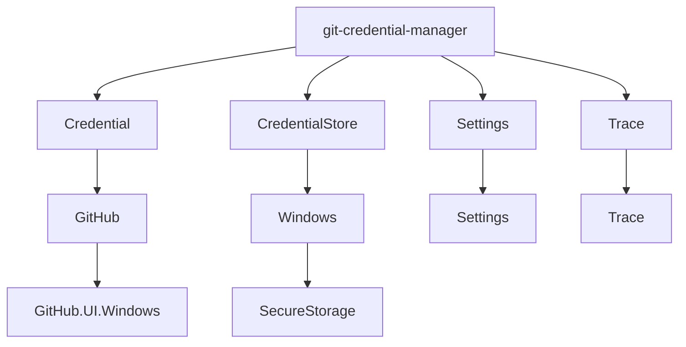

# git-credential-manager

## Overview

The `git-credential-manager` is a comprehensive solution for managing Git credentials. It provides a secure storage for credentials, a way to read and write settings, and a way to write trace information. The module is designed to handle sensitive information, such as secrets, by implementing a secure key-value store in the operating system's secure storage.

The module is structured around four main abstractions: `Credential`, `CredentialStore`, `Settings`, and `Trace`. The `Credential` abstraction represents a username and password, while the `CredentialStore` is a secure storage for `Credential` objects. The `Settings` abstraction provides a way to read and write settings, and the `Trace` abstraction provides a way to write trace information.

## Architecture

## Data Flow / Execution Flow

1. The `git-credential-manager` reads the settings to determine the credential store to use.
2. The `git-credential-manager` uses the credential store to retrieve the credentials for the current Git operation.
3. The `git-credential-manager` uses the credentials to authenticate the Git operation.
4. The `git-credential-manager` writes trace information to the trace object.

## Configuration & Dependencies

The `git-credential-manager` requires the .NET Core runtime to be installed on the system. The configuration is done through the `Settings` abstraction.

## How to Run