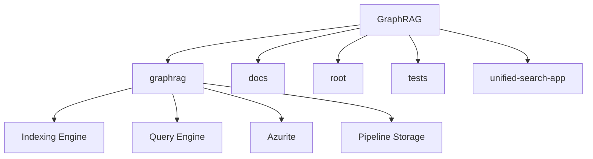

# GraphRAG

## Overview

The GraphRAG project is a data pipeline and transformation suite that is designed to extract meaningful, structured data from unstructured text using the power of LLMs. It is a Python library that uses graph-based data indexing and querying techniques to enhance language model's ability to reason about private datasets.

## Architecture

The repository is structured into several modules, each with its own set of responsibilities. The `graphrag` module, which is responsible for the core functionalities of the GraphRAG library, includes the `Indexing Engine`, `Query Engine`, `Azurite`, and `Pipeline Storage`. The `docs` module, as the main module, is responsible for providing documentation and user guides. It includes files such as `get_started.md`, `index.md`, `visualization_guide.md`, and `config/init.md`.

## Data Flow / Execution Flow

The data flow starts with the user input, which is processed by the `Indexing Engine`. The `Indexing Engine` processes the input data and generates a graph-based representation of the data. This graph-based representation is then used by the `Query Engine` to answer queries about the data.

## Configuration & Dependencies

The configuration files for the project are located in the `tests/fixtures/azure/config.json` and `tests/fixtures/azure/settings.yml` files. The dependencies for the project are managed using `pyproject.toml`.

## How to Run /