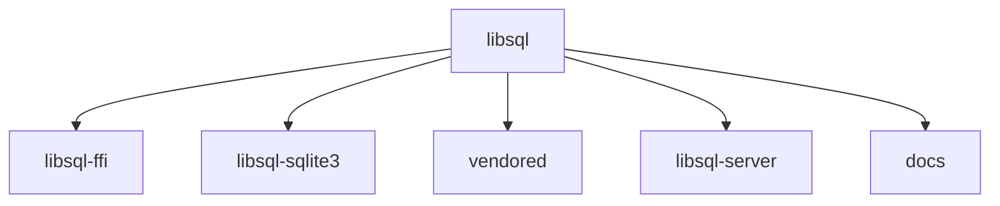

# libsql

## Overview

libsql is an embeddable SQL database engine based on SQLite. It provides a set of features to support replication while retaining compatibility with the SQLite ecosystem, such as the SQL dialect and extensions.

## Architecture

## Data Flow / Execution Flow

1. The user interacts with the libsql API, which communicates with the libsql server.
2. The server manages connections, executes queries, and handles various server-side operations.
3. The libsql-ff