# Overview

.

## community_02
The tools subsystem of Logstash is a collection of utilities and libraries that support the core Logstash functionality. It includes:

- dependencies-report: A tool for generating a report of all dependencies used by Logstash, including transitive dependencies.
- benchmark-cli: A command-line interface for running benchmarks on Logstash.
- jvm-options-parser: A library for parsing JVM options and generating a report of the options used by Logstash.

These tools are used by the Logstash community to maintain and improve the Logstash project. They are written in Java and are part of the Logstash build process.

## community_03
The docs subsystem of Logstash is the collection of documentation for Logstash. It includes:

- README.md: The main README file for Logstash, which provides an overview of the project and instructions for getting started.
- extend/: A directory containing documentation on extending Logstash with new plugins.
- CONTRIBUTING.md: A guide for contributors to the Logstash project.

The docs subsystem is maintained by the Logstash community and is used to help users understand and contribute to the project.

## community_04
The qa subsystem of Logstash is the collection of tests and fixtures for Logstash. It includes:

- integration: A directory containing integration tests for Logstash.
- fixtures: A directory containing test fixtures, which are sample data and configurations used for testing.

The qa subsystem is used by the Logstash community to ensure that Logstash is working correctly and to help maintain the quality of the project.

## community_05
The lib subsystem of Logstash is the collection of libraries that support Logstash. It includes:

- pluginmanager: A directory containing libraries for managing plugins.

The lib subsystem is used by the Logstash community to support the core Logstash functionality and to help maintain the quality of the project.

## community_06
The x-pack subsystem of Logstash is a collection of features and tools that extend the core Logstash functionality. It includes:

- distributions: A directory containing distributions of Logstash,

## Architecture

## community_02
The tools subsystem of Logstash is a collection of utilities and libraries that support the core Logstash functionality. It includes libraries for handling dependencies, benchmarking, and generating reports.

The tools subsystem is structured as a set of Gradle projects, each with its own set of dependencies and tasks. The main projects are dependencies-report, benchmark-cli, and jvm-options-parser.

The tools interact with the rest of the system through a series of interfaces, such as the DependencyReportTask class, which is responsible for generating a report of the Logstash dependencies. It also interacts with the Logstash::PluginManager, which is responsible for loading and managing plugins.

The runtime role of the tools subsystem is to support the core Logstash functionality. It includes tasks for handling dependencies, benchmarking, and generating reports. It also handles the bootstrapping process, which includes setting up the environment, loading configuration files, and initializing the plugin manager.

The likely extension points for the tools subsystem are the addition of new tasks, the ability to handle different types of dependencies, and the ability to generate more detailed reports. However, the exact extension points will depend on the needs of the Logstash community and the future direction of the project.

## community_03
The docs subsystem of Logstash is a collection of documentation and tutorials that support the core Logstash functionality. It includes guides for extending Logstash with new plugins, understanding the architecture, and using the various features of Logstash.

The docs subsystem is structured as a set of Markdown files, each with its own set of sections. The main files are extend/codec-new-plugin.md, extend/community-maintainer.md, and extend/output-new-plugin.md.

The docs interact with the rest of the system through a series of interfaces, such as the Logstash::Docs::Extend::CodecNewPlugin class, which is responsible for generating documentation for extending Logstash with new codecs. It also interacts with the Logstash::PluginManager, which is responsible for loading and managing plugins.

The runtime role of the docs subsystem is to support the core Logstash functionality. It includes documentation and tutorials for extending Logstash with new plugins, understanding the architecture

### Architecture Graph

```mermaid

flowchart TD
  community_01[logstash-core\nlogstash-core/lib/logstash-core.rb, logstash-core/lib/logstash/bootstrap_check/default_config.rb]
  community_02[tools\ntools/dependencies-report/src/main/resources/notices/aws-sdk-core-NOTICE.txt, tools/dependencies-report/src/main/resources/notices/com.fasterxml.jackson.core!jackson-annotations-NOTICE.txt]
  community_03[docs\ndocs/extend/java-codec-plugin.md, docs/extend/java-filter-plugin.md]
  community_04[qa\nqa/docker/fixtures/multiple_pipelines/config/pipelines.yml, qa/integration/build.gradle]
  community_05[lib\nlib/pluginmanager/gem_installer.rb, lib/pluginmanager/offline_plugin_packager.rb]
  community_06[x-pack\nx-pack/spec/config_management/fixtures/pipelines.json, x-pack/distributions/internal/observabilitySRE/qa/acceptance/docker/elasticsearch/config/elasticsearch-fips.yml]
  community_07[README.md\nREADME.md, build.gradle]
  community_08[.buildkite\n.buildkite/scripts/health-report-tests/config/pipelines.yml, .buildkite/scripts/health-report-tests/requirements.txt]

```

## Data Flow / Execution Flow

project.

## community_02
The tools community in Logstash is responsible for developing and maintaining the tools that support the Logstash project. This includes the dependencies-report tool, which is used to generate a report of all the dependencies used by Logstash, and the benchmark-cli tool, which is used to benchmark Logstash.

The tools community also contributes to the Logstash community by maintaining and improving the tools they create. This includes reviewing pull requests, providing feedback, and helping to maintain the tools.

The tools community is likely to continue to grow as the Logstash project matures and more tools are developed. The community could also consider adding new tools to support different aspects of the Logstash project, such as a tool for generating documentation or a tool for managing plugins.

## community_03
The docs community in Logstash is responsible for maintaining and improving the documentation for Logstash. This includes the README files, the extend documentation, and the other documentation files.

The docs community contributes to the Logstash community by providing feedback, suggesting improvements, and helping to maintain the documentation. This could include reviewing pull requests, providing feedback, and helping to improve the documentation.

The docs community is likely to continue to grow as the Logstash project matures and more documentation is developed. The community could consider adding new documentation to support different aspects of the Logstash project, such as a tutorial or a how-to guide.

## community_04
The qa community in Logstash is responsible for maintaining and improving the quality of the Logstash project. This includes the integration tests, the smoke tests, and the other quality assurance tasks.

The qa community contributes to the Logstash community by providing feedback, suggesting improvements, and helping to maintain the quality of the project. This could include reviewing pull requests, providing feedback, and helping to improve the quality of the tests.

The qa community is likely to continue to grow as the Logstash project matures and more quality assurance tasks are developed. The community could consider adding new quality assurance tasks to support different aspects of the Logstash project, such as a performance test or a security test.

## community_05
The lib community in Logstash is responsible for maintaining and improving the libraries that support the Logstash project. This includes the plugin

## Configuration & Dependencies

.

## community_02
The tools subsystem of Logstash is a collection of utilities and libraries that support the core Logstash functionality. It includes:

- dependencies-report: A tool for generating a report of all dependencies used by Logstash, along with their licenses and notices.
- benchmark-cli: A command-line interface for running benchmarks on Logstash.
- jvm-options-parser: A library for parsing JVM options and generating a report of the options used by Logstash.

These tools are written in Java and are used to support the development and testing of Logstash. They are not directly part of the Logstash core, but are used by the core to support its functionality.

## community_03
The docs subsystem of Logstash is a collection of documents that provide information about how to use and extend Logstash. It includes:

- extend/codec-new-plugin.md: A guide on how to create a new codec plugin.
- extend/community-maintainer.md: A guide for community maintainers.

These documents are written in Markdown and are used to provide guidance to the Logstash community. They are not part of the Logstash core, but are used by the community to understand and use Logstash.

## community_04
The qa subsystem of Logstash is a collection of tests and fixtures that support the development and testing of Logstash. It includes:

- integration/build.gradle: The build file for the integration tests.
- integration/fixtures/reload_config_spec.yml: A fixture for testing the reloading of configuration.
- integration/fixtures/settings_spec.yml: A fixture for testing the settings.

These tests and fixtures are used to ensure that Logstash is working correctly and to support the development of new features and bug fixes. They are not part of the Logstash core, but are used by the community to test and develop Logstash.

## community_05
The lib subsystem of Logstash is a collection of libraries that support the core Logstash functionality. It includes:

- pluginmanager/gem_installer.rb: A library for installing gems.
- pluginmanager/

## How to Run / Key Scripts

the project.

## community_02
The tools community in Logstash is responsible for developing and maintaining a set of tools that support the development and operation of Logstash. This includes the dependencies-report tool, which is used to generate a report of the licenses and dependencies of Logstash, and the benchmark-cli tool, which is used to run benchmarks on Logstash.

The tools community also contributes to the Logstash community by maintaining and improving the tools themselves. This includes reviewing pull requests, providing feedback, and helping to maintain the tools.

The tools community is likely to continue to grow as the Logstash community grows, as more tools are developed and maintained by the community. The tools community is also likely to continue to contribute to the Logstash community by improving the tools and providing feedback to the community.

## community_03
The docs community in Logstash is responsible for maintaining and improving the documentation of Logstash. This includes the README files, the CONTRIBUTING guide, and the extend documentation.

The docs community contributes to the Logstash community by providing guidance to new contributors, helping to improve the documentation, and providing feedback to the community.

The docs community is likely to continue to grow as the Logstash community grows, as more people become involved in the community. The docs community is also likely to continue to contribute to the Logstash community by improving the documentation and providing feedback to the community.

## community_04
The qa community in Logstash is responsible for maintaining and improving the quality of Logstash. This includes the integration tests, the docker fixtures, and the settings.

The qa community contributes to the Logstash community by providing feedback to the community, helping to improve the tests, and providing guidance to new contributors.

The qa community is likely to continue to grow as the Logstash community grows, as more people become involved in the community. The qa community is also likely to continue to contribute to the Logstash community by improving the tests and providing feedback to the community.

## community_05
The lib community in Logstash is responsible for maintaining and improving the libraries of Logstash. This includes the pluginmanager, which is used to manage and package plugins.

The lib community contributes to the Logstash

## Notable Design Choices / Extension Points

direction of the project.

## community_02
The tools subsystem of Logstash is a collection of utilities and libraries that support the core Logstash functionality. It includes the dependencies-report tool, which generates a report of all the dependencies of Logstash, and the benchmark-cli tool, which is used for benchmarking Logstash.

The tools subsystem is structured as a collection of Gradle projects, with each project responsible for a specific task. The projects are structured in a way that allows for easy addition of new tools and extensions.

The likely extension points for the tools subsystem are the addition of new tools, the ability to handle different types of benchmarking tasks, and the ability to generate reports on different types of dependencies. However, the exact extension points will depend on the needs of the Logstash community and the future direction of the project.

## community_03
The docs subsystem of Logstash is a collection of documentation and guides that support the use and development of Logstash. It includes guides on how to extend Logstash with new plugins, how to use the benchmarking tools, and how to contribute to the project.

The docs subsystem is structured as a collection of Markdown files, with each file representing a guide. The files are structured in a way that allows for easy addition of new guides and updates to existing ones.

The likely extension points for the docs subsystem are the addition of new guides, the ability to handle different types of documentation, and the ability to generate documentation on different types of plugins. However, the exact extension points will depend on the needs of the Logstash community and the future direction of the project.

## community_04
The qa subsystem of Logstash is a collection of tests and fixtures that support the development and testing of Logstash. It includes tests for the core Logstash functionality, as well as tests for the plugins that are included with Logstash.

The qa subsystem is structured as a collection of Gradle projects, with each project responsible for a specific type of test. The projects are structured in a way that allows for easy addition of new tests and extensions.

The likely extension points for the qa subsystem are the addition of new tests, the ability to handle different types of test cases, and the ability to generate reports on test results. However, the exact extension