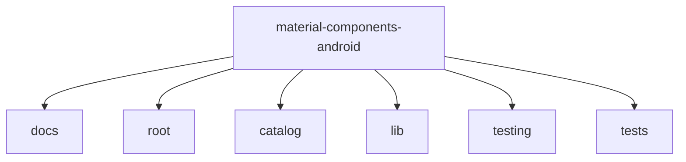

# Material Components for Android

## Overview
Material Components for Android (MDC-Android) is a library that helps developers execute tasks such as engineers and UX designers at Google, enabling them to build beautiful and functional Android apps. MDC-Android is a drop-in replacement for Android's Design Support Library.

## Architecture

## Data Flow / Execution Flow
1. The user interacts with the UI components provided by MDC-Android.
2. The UI components communicate with the underlying data models.
3. The data models update the UI components as needed.
4. The UI components reflect the changes in the data models on the screen.

## Configuration & Dependencies
The configuration and dependencies are managed by the `build.gradle` files in each module. These files define the dependencies, configurations, and settings for the project.

## How to Run / Key Scripts
The project can be built and tested using Gradle. The main build script is `build.gradle` in the root directory. The testing scripts are located in the `testing` directory.

## Notable Design Choices / Extension Points
The library follows the Material Design guidelines and provides a set of UI components that adhere to these guidelines. The library also provides extension points for developers to customize the components as needed. For example, developers can override the default styles of the components to match their app's theme.