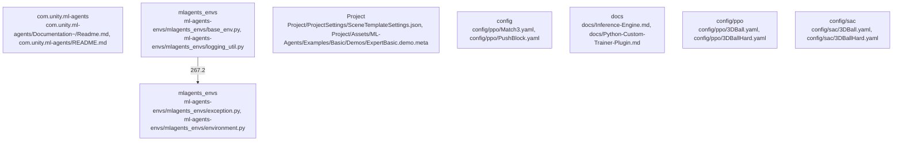

# Overview

space, and reward function of the environment, as well as providing the necessary methods for interacting with the environment.

The subsystem is designed to be modular, allowing for customization and extension. It provides a flexible environment for training and deploying reinforcement learning (RL) models, enabling developers to create complex, multi-agent systems.

Dependencies between the ml-agents-envs subsystem and other subsystems are minimal, with the ml-agents-envs subsystem depending on the ml-agents subsystem. This design allows for flexibility in how these components interact, and for developers to customize their training process based on their specific needs.

At runtime, the ml-agents-envs subsystem provides a Python Environment API for interacting with the Unity environment, allowing developers to define the agent's behavior and reward function. It also provides methods for interacting with the environment, such as resetting the environment and stepping through the environment.

Potential extension points for the ml-agents-envs subsystem include the ability to add custom reward functions, modify the learning algorithm, or add support for different types of environments. This makes it a versatile tool for training a wide range of intelligent agents in Unity.

## community_03
The Project subsystem is the main entry point for using the ML-Agents Toolkit. It provides a user interface for interacting with the training process, visualizing the results, and deploying the trained models.

The subsystem is designed to be modular, allowing for customization and extension. It provides a flexible environment for training and deploying reinforcement learning (RL) models, enabling developers to create complex, multi-agent systems.

Dependencies between the Project subsystem and other subsystems are minimal, with the Project subsystem depending on the ml-agents subsystem. This design allows for flexibility in how these components interact, and for developers to customize their training process based on their specific needs.

At runtime, the Project subsystem provides a user interface for interacting with the training process, visualizing the results, and deploying the trained models. It also provides methods for interacting with the environment, such as resetting the environment and stepping through the environment.

Potential extension points for the Project subsystem include the ability to add custom reward functions, modify the learning algorithm, or add support for different types of environments. This makes

## Architecture

, and reward function of the environment, as well as providing the necessary methods for interacting with the environment.

The ml-agents-envs subsystem is designed to be modular, allowing for customization and extension. It provides a flexible environment for training and deploying reinforcement learning (RL) models, enabling developers to create complex, multi-agent systems.

Dependencies between the ml-agents-envs subsystem and the ml-agents subsystem are minimal, with the ml-agents-envs subsystem depending on the ml-agents subsystem. This design allows for flexibility in how these components interact, and for developers to customize their training process based on their specific needs.

At runtime, the ml-agents-envs subsystem provides the necessary tools for defining the environment in which the agents operate. It provides a flexible environment for defining the agent's behavior, and a powerful inference engine for running the trained models. The subsystem is designed to be extensible, allowing developers to add custom components or modify existing ones to suit their specific needs.

Potential extension points for the ml-agents-envs subsystem include the ability to add custom reward functions, modify the learning algorithm, or add support for different types of environments. This makes it a versatile tool for training a wide range of intelligent agents in Unity.

## community_03
The Project subsystem is the main entry point for users of the ML-Agents Toolkit. It provides a user interface for training and deploying agents in Unity environments, as well as for managing and deploying trained models.

The Project subsystem is designed to be modular, allowing for customization and extension. It provides a flexible environment for training and deploying reinforcement learning (RL) models, enabling developers to create complex, multi-agent systems.

Dependencies between the Project subsystem and the ml-agents subsystem are minimal, with the Project subsystem depending on the ml-agents subsystem. This design allows for flexibility in how these components interact, and for developers to customize their training process based on their specific needs.

At runtime, the Project subsystem provides the necessary tools for training agents using reinforcement learning. It provides a flexible environment for defining the agent's behavior, and a powerful inference engine for running the trained models. The subsystem is designed to be extensible, allowing developers

### Architecture Graph

## Data Flow / Execution Flow

observation space, and reward function of the environment, as well as providing the necessary methods for interacting with the environment.

The ml-agents-envs subsystem is designed to be modular, allowing for customization and extension. It provides a flexible environment for training and deploying reinforcement learning (RL) models, enabling developers to create complex, multi-agent systems.

Dependencies between the ml-agents-envs subsystem and the ml-agents subsystem are minimal, with the ml-agents-envs subsystem depending on the ml-agents subsystem. This design allows for flexibility in how these components interact, and for developers to customize their training process based on their specific needs.

At runtime, the ml-agents-envs subsystem provides the necessary tools for defining the environment in which the agents operate. It provides a flexible environment for defining the agent's behavior, and a powerful inference engine for running the trained models. The subsystem is designed to be extensible, allowing developers to add custom components or modify existing ones to suit their specific needs.

Potential extension points for the ml-agents-envs subsystem include the ability to add custom reward functions, modify the learning algorithm, or add support for different types of environments. This makes it a versatile tool for training a wide range of intelligent agents in Unity.

## community_03
The Project subsystem is the main entry point for training and deploying agents in Unity. It provides a user-friendly interface for configuring and running training sessions, as well as deploying trained models.

The Project subsystem is designed to be modular, allowing for customization and extension. It provides a flexible environment for training and deploying reinforcement learning (RL) models, enabling developers to create complex, multi-agent systems.

Dependencies between the Project subsystem and the ml-agents subsystem are minimal, with the Project subsystem depending on the ml-agents subsystem. This design allows for flexibility in how these components interact, and for developers to customize their training process based on their specific needs.

At runtime, the Project subsystem provides the necessary tools for training agents using reinforcement learning. It provides a flexible environment for defining the agent's behavior, and a powerful inference engine for running the trained models. The subsystem is designed to be extensible, allowing developers to add custom

## Configuration & Dependencies

space, and reward function of the environment, as well as providing the necessary methods for interacting with the environment.

The ml-agents-envs subsystem is designed to be modular, allowing for customization and extension. It provides a flexible environment for training and deploying reinforcement learning (RL) models, enabling developers to create complex, multi-agent systems.

Dependencies between the ml-agents-envs subsystem and other subsystems are minimal, with the ml-agents-envs subsystem depending on the RL Core and the Learning Environment. This design allows for flexibility in how these components interact, and for developers to customize their training process based on their specific needs.

At runtime, the ml-agents-envs subsystem provides the necessary tools for defining the environment in which the agents operate. It provides a flexible environment for defining the agent's behavior, and a powerful inference engine for running the trained models. The subsystem is designed to be extensible, allowing developers to add custom components or modify existing ones to suit their specific needs.

Potential extension points for the ml-agents-envs subsystem include the ability to add custom reward functions, modify the learning algorithm, or add support for different types of environments. This makes it a versatile tool for training a wide range of intelligent agents in Unity.

## community_03
The Project subsystem is the main entry point for using the ML-Agents Toolkit. It provides a set of examples and pre-trained models that developers can use to train their own agents. It also provides a set of tools for visualizing the training process and for deploying the trained models in Unity environments.

The Project subsystem is designed to be modular, allowing for customization and extension. It provides a flexible environment for training and deploying reinforcement learning (RL) models, enabling developers to create complex, multi-agent systems.

Dependencies between the Project subsystem and other subsystems are minimal, with the Project subsystem depending on the RL Core and the Learning Environment. This design allows for flexibility in how these components interact, and for developers to customize their training process based on their specific needs.

At runtime, the Project subsystem provides the necessary tools for training agents using reinforcement learning. It provides a flexible environment for defining the agent's behavior, and a powerful inference engine for running the trained models.

## How to Run / Key Scripts

, observation space, and reward function of the environment, as well as providing the necessary methods for interacting with the environment.

The ml-agents-envs subsystem is designed to be modular, allowing for customization and extension. It provides a flexible environment for training and deploying reinforcement learning (RL) models, enabling developers to create complex, multi-agent systems.

Dependencies between the ml-agents-envs subsystem and other subsystems are minimal, with the ml-agents-envs subsystem depending on the RL Core and the Learning Environment. This design allows for flexibility in how these components interact, and for developers to customize their training process based on their specific needs.

At runtime, the ml-agents-envs subsystem provides the necessary tools for defining the environment in which the agents operate. It provides a flexible environment for defining the agent's behavior, and a powerful inference engine for running the trained models. The subsystem is designed to be extensible, allowing developers to add custom components or modify existing ones to suit their specific needs.

Potential extension points for the ml-agents-envs subsystem include the ability to add custom reward functions, modify the learning algorithm, or add support for different types of environments. This makes it a versatile tool for training a wide range of intelligent agents in Unity.

## community_03
The Project subsystem is the main entry point for training and deploying agents in Unity. It provides a user-friendly interface for configuring and running training sessions, as well as deploying trained models for inference.

The Project subsystem is designed to be modular, allowing for customization and extension. It provides a flexible environment for training and deploying reinforcement learning (RL) models, enabling developers to create complex, multi-agent systems.

Dependencies between the Project subsystem and other subsystems are minimal, with the Project subsystem depending on the RL Core and the Learning Environment. This design allows for flexibility in how these components interact, and for developers to customize their training process based on their specific needs.

At runtime, the Project subsystem provides the necessary tools for training agents using reinforcement learning. It provides a flexible environment for defining the agent's behavior, and a powerful inference engine for running the trained models. The subsystem is designed to be extensible, allowing developers to add custom components or modify existing ones

## Notable Design Choices / Extension Points

environment in which the agents operate, and it provides a flexible interface for defining the agent's behavior.

The ml-agents-envs subsystem is designed to be modular, allowing for customization and extension. It provides a variety of environments for training agents, including simple grid-world environments and more complex, multi-agent environments.

Dependencies between the ml-agents-envs subsystem and the ml-agents subsystem are minimal, with the ml-agents-envs subsystem depending on the ml-agents subsystem. This design allows for flexibility in how these components interact, and for developers to customize their environments based on their specific needs.

Potential extension points for the ml-agents-envs subsystem include the ability to add custom environments, modify the environment's behavior, or add support for different types of agents. This makes it a versatile tool for training a wide range of intelligent agents in Unity.

## community_03
The Project subsystem is the main entry point for using the ML-Agents Toolkit. It provides a user interface for training and deploying agents in Unity environments, and it provides a variety of examples and pre-trained models for training agents.

The Project subsystem is designed to be modular, allowing for customization and extension. It provides a variety of examples for training agents, including simple grid-world examples and more complex, multi-agent examples. It also provides a variety of pre-trained models for training agents, including models trained using different reinforcement learning algorithms.

Dependencies between the Project subsystem and the ml-agents subsystem are minimal, with the Project subsystem depending on the ml-agents subsystem. This design allows for flexibility in how these components interact, and for developers to customize their training process based on their specific needs.

Potential extension points for the Project subsystem include the ability to add custom training processes, modify the training process's behavior, or add support for different types of environments. This makes it a versatile tool for training a wide range of intelligent agents in Unity.

## community_04
The ml-agents-envs subsystem is a key component of the ML-Agents Toolkit, providing a Python Environment API for training and deploying intelligent agents in Unity environments. It is responsible for defining the environment in which the agents operate