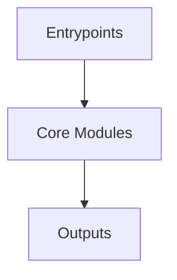

# Overview
Repository `puppeteer` appears to implement a modular system with 1895 source files at commit `c1105f125c71353587a837958c2748097ef2927d`.

## Architecture
Major components inferred from file/module analysis:
- `packages`: The puppeteer repository's packages module is responsible for managing the core API for controlling headless Chrome over the DevTools Protocol, as well as the dependencies and scripts necessary for downloading and launch...
- `docs`: the BoxModel object in the Puppeteer API
- `root`: The Puppeteer repository, as a Node.js module, is responsible for automating browser actions using JavaScript
- `examples`: The Puppeteer module in the repository is a collection of examples demonstrating the use of Puppeteer, a Node.js library developed by the Chrome team
- `test`: The Puppeteer testing suite module is a key component of the repository, responsible for managing and building the test environment
- `tools`: The Puppeteer repository's "tools" module is a comprehensive suite of tools for the Puppeteer project
- `website`: The "website" module in the "puppeteer" repository is a crucial component of the project, responsible for managing and configuring the Docusaurus website

## Data Flow / Execution Flow
Typical execution path: `Entrypoint -> Core Modules -> Runtime Services -> Output/Side Effects`.
Entrypoints initialize core modules, which orchestrate processing and emit outputs or side effects.

## Configuration & Dependencies
- Build/dependency files: package.json, examples/puppeteer-in-browser/package.json, examples/puppeteer-in-extension/package.json, packages/browsers/package.json, packages/ng-schematics/package.json, packages/puppeteer-core/package.json, packages/puppeteer-core/third_party/parsel-js/package.json, packages/puppeteer/package.json, packages/testserver/package.json, test/package.json, test/installation/package.json, tools/docgen/package.json, tools/doctest/package.json, tools/eslint/package.json, tools/mocha-runner/package.json, website/package.json
- Config files: tsconfig.base.json, release-please-config.json, packages/browsers/tsconfig.json, packages/browsers/src/tsconfig.cjs.json, packages/browsers/src/tsconfig.esm.json, packages/browsers/test/src/tsconfig.json, packages/ng-schematics/tsconfig.json, packages/ng-schematics/src/schematics/config/schema.json, packages/ng-schematics/test/tsconfig.json, packages/puppeteer-core/tsconfig.json, packages/puppeteer-core/src/tsconfig.cjs.json, packages/puppeteer-core/src/tsconfig.esm.json, packages/puppeteer-core/third_party/tsconfig.cjs.json, packages/puppeteer-core/third_party/tsconfig.json, packages/puppeteer/tsconfig.json, packages/puppeteer/src/tsconfig.cjs.json, packages/puppeteer/src/tsconfig.esm.json, packages/testserver/tsconfig.json, test/tsconfig.json, test/installation/tsconfig.json, test/installation/assets/puppeteer/tsconfig.json, tools/tsconfig.json, tools/docgen/tsconfig.json, tools/doctest/tsconfig.json, tools/eslint/tsconfig.json, tools/mocha-runner/tsconfig.json

## How to Run / Key Scripts
- Detected entrypoints: packages/ng-schematics/src/builders/puppeteer/index.ts, packages/ng-schematics/src/schematics/config/index.ts, packages/ng-schematics/src/schematics/e2e/index.ts, packages/ng-schematics/src/schematics/ng-add/index.ts, packages/puppeteer-core/src/index.ts, packages/testserver/src/index.ts, test/assets/simple-extension-firefox/index.js, test/assets/simple-extension/index.js, website/src/theme/SearchBar/index.js, website/src/theme/SearchMetadata/index.js, website/src/theme/SearchPage/index.js
- Use repository build scripts/package manager tasks based on detected build files.

## Notable Design Choices / Extension Points
- The codebase is organized in modules that can be extended by adding new feature files under existing module boundaries.
- Extension is likely centered around entrypoint wiring, configuration files, and module-specific implementations.
