# Overview

count map that tracks the global package version as a local, monotonic counter. The second chunk, chunk::2, is responsible for managing metadata for search functionality. It uses the `Head` component from `@docusaurus/Head` to add metadata to the HTML document head. The metadata includes the language and a counter. The counter is a monotonic count map that tracks the global package version as a local, monotonic counter.

## community_02
The Puppeteer repository, a part of the larger Docusaurus project, is a subsystem responsible for managing metadata for search functionality. It uses the `Head` component from `@docusaurus/Head` to add metadata to the HTML document head. The metadata includes the language and a counter. The counter is a monotonic count map that tracks the global package version as a local, monotonic counter. This subsystem is crucial for the functioning of the search feature in Docusaurus, as it provides unique identifiers for each webpage.

The subsystem is structured internally with two chunks of code: `website/src/theme/SearchMetadata/index.js`. The first chunk, chunk::1, is responsible for managing metadata for search functionality. It uses the `Head` component from `@docusaurus/Head` to add metadata to the HTML document head. The metadata includes the language and a counter. The counter is a monotonic count map that tracks the global package version as a local, monotonic counter. The second chunk, chunk::2, is responsible for managing metadata for search functionality. It uses the `Head` component from `@docusaurus/Head` to add metadata to the HTML document head. The metadata includes the language and a counter. The counter is a monotonic count map that tracks the global package version as a local, monotonic counter.

## community_03
The Puppeteer repository, a part of the larger Docusaurus project, is a subsystem responsible for managing metadata for search functionality. It uses the `Head` component from `@docusaurus/Head` to add metadata to the HTML document head. The metadata includes the language and a counter. The counter is a monotonic count map that tracks the global package version as a local, monotonic counter. This subsystem is crucial for the functioning of the search feature in Docusaurus, as it provides

## Architecture

map that tracks the global package version as a local, monotonic counter. The second chunk, chunk::2, is responsible for managing the search bar component. It uses the `SearchBar` component from `@docusaurus/theme-common` to add a search bar to the website.

## community_02
The Puppeteer repository, a part of the larger Docusaurus project, is a subsystem responsible for managing metadata for search functionality. It uses the `Head` component from `@docusaurus/Head` to add metadata to the HTML document head. The metadata includes the language and a counter. The counter is a monotonic count map that tracks the global package version as a local, monotonic counter. This subsystem is crucial for the functioning of the search feature in Docusaurus, as it provides unique identifiers for each webpage.

The subsystem is structured internally with two chunks of code: `website/src/theme/SearchMetadata/index.js`. The first chunk, chunk::1, is responsible for managing metadata for search functionality. It uses the `Head` component from `@docusaurus/Head` to add metadata to the HTML document head. The metadata includes the language and a counter. The counter is a monotonic count map that tracks the global package version as a local, monotonic counter. The second chunk, chunk::2, is responsible for managing the search bar component. It uses the `SearchBar` component from `@docusaurus/theme-common` to add a search bar to the website.

## community_03
The Puppeteer repository, a part of the larger Docusaurus project, is a subsystem responsible for managing metadata for search functionality. It uses the `Head` component from `@docusaurus/Head` to add metadata to the HTML document head. The metadata includes the language and a counter. The counter is a monotonic count map that tracks the global package version as a local, monotonic counter. This subsystem is crucial for the functioning of the search feature in Docusaurus, as it provides unique identifiers for each webpage.

The subsystem is structured internally with two chunks of code: `website/src/theme/SearchMetadata/index.js`. The first chunk, chunk::1, is responsible for managing metadata for search functionality.

### Architecture Graph

```mermaid

flowchart TD
  community_01[website\nwebsite/src/theme/SearchMetadata/index.js, website/versioned_docs/version-24.17.1/api/puppeteer.browser.installextension.md]
  community_02[docs\ndocs/api/puppeteer.browser.installextension.md, docs/api/puppeteer.browser.uninstallextension.md]
  community_03[packages\npackages/testserver/src/index.ts, packages/browsers/package.json]
  community_04[test\ntest/src/cdp/extensions.spec.ts, test/src/webExtension.spec.ts]
  community_05[README.md\nREADME.md, package.json]
  community_06[packages/puppeteer-core/src\npackages/puppeteer-core/src/index.ts, packages/puppeteer-core/src/tsconfig.cjs.json]
  community_07[docs\ndocs/CHANGELOG.md, docs/contributing.md]
  community_08[packages/puppeteer-core\npackages/puppeteer-core/package.json, packages/puppeteer-core/tsconfig.json]

```

## Data Flow / Execution Flow

onic count map that tracks the global package version as a local, monotonic counter. The second chunk, chunk::2, is responsible for managing metadata for search functionality. It uses the `Head` component from `@docusaurus/Head` to add metadata to the HTML document head. The metadata includes the language and a counter. The counter is a monotonic count map that tracks the global package version as a local, monotonic counter.

## community_02
The Puppeteer repository, a part of the larger Docusaurus project, is a subsystem responsible for managing metadata for search functionality. It uses the `Head` component from `@docusaurus/Head` to add metadata to the HTML document head. The metadata includes the language and a counter. The counter is a monotonic count map that tracks the global package version as a local, monotonic counter. This subsystem is crucial for the functioning of the search feature in Docusaurus, as it provides unique identifiers for each webpage.

The subsystem is structured internally with two chunks of code: `website/src/theme/SearchMetadata/index.js`. The first chunk, chunk::1, is responsible for managing metadata for search functionality. It uses the `Head` component from `@docusaurus/Head` to add metadata to the HTML document head. The metadata includes the language and a counter. The counter is a monotonic count map that tracks the global package version as a local, monotonic counter. The second chunk, chunk::2, is responsible for managing metadata for search functionality. It uses the `Head` component from `@docusaurus/Head` to add metadata to the HTML document head. The metadata includes the language and a counter. The counter is a monotonic count map that tracks the global package version as a local, monotonic counter.

## community_03
The Puppeteer repository, a part of the larger Docusaurus project, is a subsystem responsible for managing metadata for search functionality. It uses the `Head` component from `@docusaurus/Head` to add metadata to the HTML document head. The metadata includes the language and a counter. The counter is a monotonic count map that tracks the global package version as a local, monotonic counter. This subsystem is crucial for the functioning of the search feature in Docusaurus, as it

## Configuration & Dependencies

count map that tracks the global package version as a local, monotonic counter. The second chunk, chunk::2, is responsible for managing metadata for search functionality. It uses the `Head` component from `@docusaurus/Head` to add metadata to the HTML document head. The metadata includes the language and a counter. The counter is a monotonic count map that tracks the global package version as a local, monotonic counter.

## community_02
The Puppeteer repository, a part of the larger Docusaurus project, is a subsystem responsible for managing metadata for search functionality. It uses the `Head` component from `@docusaurus/Head` to add metadata to the HTML document head. The metadata includes the language and a counter. The counter is a monotonic count map that tracks the global package version as a local, monotonic counter. This subsystem is crucial for the functioning of the search feature in Docusaurus, as it provides unique identifiers for each webpage.

The subsystem is structured internally with two chunks of code: `website/src/theme/SearchMetadata/index.js`. The first chunk, chunk::1, is responsible for managing metadata for search functionality. It uses the `Head` component from `@docusaurus/Head` to add metadata to the HTML document head. The metadata includes the language and a counter. The counter is a monotonic count map that tracks the global package version as a local, monotonic counter. The second chunk, chunk::2, is responsible for managing metadata for search functionality. It uses the `Head` component from `@docusaurus/Head` to add metadata to the HTML document head. The metadata includes the language and a counter. The counter is a monotonic count map that tracks the global package version as a local, monotonic counter.

## community_03
The Puppeteer repository, a part of the larger Docusaurus project, is a subsystem responsible for managing metadata for search functionality. It uses the `Head` component from `@docusaurus/Head` to add metadata to the HTML document head. The metadata includes the language and a counter. The counter is a monotonic count map that tracks the global package version as a local, monotonic counter. This subsystem is crucial for the functioning of the search feature in Docusaurus, as it provides

## How to Run / Key Scripts

monotonic count map that tracks the global package version as a local, monotonic counter. The second chunk, chunk::2, is responsible for managing the search bar component. It uses the `SearchBar` component from `@docusaurus/theme-common` to add a search bar to the website.

## community_02
The Puppeteer repository, a part of the larger Docusaurus project, is a subsystem responsible for managing metadata for search functionality. It uses the `Head` component from `@docusaurus/Head` to add metadata to the HTML document head. The metadata includes the language and a counter. The counter is a monotonic count map that tracks the global package version as a local, monotonic counter. This subsystem is crucial for the functioning of the search feature in Docusaurus, as it provides unique identifiers for each webpage.

The subsystem is structured internally with two chunks of code: `website/src/theme/SearchMetadata/index.js`. The first chunk, chunk::1, is responsible for managing metadata for search functionality. It uses the `Head` component from `@docusaurus/Head` to add metadata to the HTML document head. The metadata includes the language and a counter. The counter is a monotonic count map that tracks the global package version as a local, monotonic counter. The second chunk, chunk::2, is responsible for managing the search bar component. It uses the `SearchBar` component from `@docusaurus/theme-common` to add a search bar to the website.

## community_03
The Puppeteer repository, a part of the larger Docusaurus project, is a subsystem responsible for managing metadata for search functionality. It uses the `Head` component from `@docusaurus/Head` to add metadata to the HTML document head. The metadata includes the language and a counter. The counter is a monotonic count map that tracks the global package version as a local, monotonic counter. This subsystem is crucial for the functioning of the search feature in Docusaurus, as it provides unique identifiers for each webpage.

The subsystem is structured internally with two chunks of code: `website/src/theme/SearchMetadata/index.js`. The first chunk, chunk::1, is responsible for managing metadata for

## Notable Design Choices / Extension Points

is a monotonic count map that tracks the global package version as a local, monotonic counter. The second chunk, chunk::2, is responsible for managing metadata for search functionality. It uses the `Head` component from `@docusaurus/Head` to add metadata to the HTML document head. The metadata includes the language and a counter. The counter is a monotonic count map that tracks the global package version as a local, monotonic counter.

## community_02
The Puppeteer repository, a part of the larger Docusaurus project, is a subsystem responsible for managing metadata for search functionality. It uses the `Head` component from `@docusaurus/Head` to add metadata to the HTML document head. The metadata includes the language and a counter. The counter is a monotonic count map that tracks the global package version as a local, monotonic counter. This subsystem is crucial for the functioning of the search feature in Docusaurus, as it provides unique identifiers for each webpage.

The subsystem is structured internally with two chunks of code: `website/src/theme/SearchMetadata/index.js`. The first chunk, chunk::1, is responsible for managing metadata for search functionality. It uses the `Head` component from `@docusaurus/Head` to add metadata to the HTML document head. The metadata includes the language and a counter. The counter is a monotonic count map that tracks the global package version as a local, monotonic counter. The second chunk, chunk::2, is responsible for managing metadata for search functionality. It uses the `Head` component from `@docusaurus/Head` to add metadata to the HTML document head. The metadata includes the language and a counter. The counter is a monotonic count map that tracks the global package version as a local, monotonic counter.

## community_03
The Puppeteer repository, a part of the larger Docusaurus project, is a subsystem responsible for managing metadata for search functionality. It uses the `Head` component from `@docusaurus/Head` to add metadata to the HTML document head. The metadata includes the language and a counter. The counter is a monotonic count map that tracks the global package version as a local, monotonic counter. This subsystem is crucial for the functioning of the search feature in Docusaurus