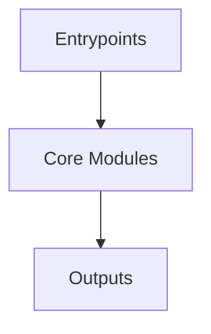

# Overview
Repository `qmk_firmware` appears to implement a modular system with 22246 source files at commit `1a58fce043e7f2e2b938dee03945dabc29e48d73`.

## Architecture
Major components inferred from file/module analysis:
- `docs`: sections, which are represented as nested objects within the main array
- `lib`: = label_len - len(label)     label_left = label[:label_leftover // 2]     label_right = label[label_leftover // 2 + label_leftover % 2:]      top_line = box_chars['top_left'] + label_left + box_chars['horizontal'] * labe...
- `root`: The qmk_firmware repository serves as the primary hub for the Quantum Mechanical Keyboard (QMK) project
- `builddefs`: The qmk_firmware repository's builddefs module is responsible for defining the build environment and processes
- `keyboards`: The `keyboards/ergodox_ez/util/keymap_beautifier/requirements.txt` file in the `qmk_firmware` repository serves as a high-level description of the dependencies needed to run the `keymap_beautifier` tool
- `util`: The `requirements.txt` file in the `qmk_firmware` repository serves as a high-level overview of the dependencies required for the Continuous Integration (CI) process
- `data`: The qmk_firmware repository's data module is responsible for managing and organizing metadata about QMK-supported keyboards

## Data Flow / Execution Flow
Typical execution path: `Entrypoint -> Core Modules -> Runtime Services -> Output/Side Effects`.
Entrypoints initialize core modules, which orchestrate processing and emit outputs or side effects.

## Configuration & Dependencies
- Build/dependency files: requirements.txt, builddefs/docsgen/package.json, keyboards/ergodox_ez/util/keymap_beautifier/requirements.txt, util/ci/requirements.txt
- Config files: .vscode/settings.json

## How to Run / Key Scripts
- Detected entrypoints: builddefs/docsgen/.vitepress/theme/index.ts, lib/python/qmk/cli/doctor/main.py
- Use repository build scripts/package manager tasks based on detected build files.

## Notable Design Choices / Extension Points
- The codebase is organized in modules that can be extended by adding new feature files under existing module boundaries.
- Extension is likely centered around entrypoint wiring, configuration files, and module-specific implementations.
