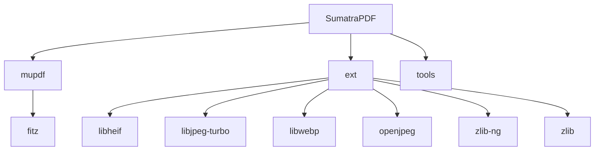

# Overview
SumatraPDF is a free, open-source PDF viewer for Windows. It supports a wide range of document formats including PDF, EPUB, MOBI, CBZ, CBR, FB2, CHM, XPS, and DjVu. The software is licensed under the AGPLv3, with some components under the BSD license.

# Architecture

# Data Flow / Execution Flow
1. User opens a PDF document using SumatraPDF.
2. SumatraPDF loads the document using the mupdf library.
3. mupdf handles the PDF document and provides a rendering interface.
4. SumatraPDF uses the rendering interface to display the document.
5. User interacts with the document, such as navigating to different pages or searching for text.
6. SumatraPDF updates the display based on user interactions.

# Configuration & Dependencies
SumatraPDF has several configuration files located in the `ext` directory, including `.circleci/config.yml`, `tsconfig.json`, and `jsconfig.json`. These files configure the build process and development environment for various tools and libraries used in the project.

# How to Run / Key Scripts
1. Clone the SumatraPDF repository from GitHub.
2. Navigate to the repository directory in your terminal.
3. Run the `sumatrapdf.py` script to start SumatraPDF.

# Notable Design Choices