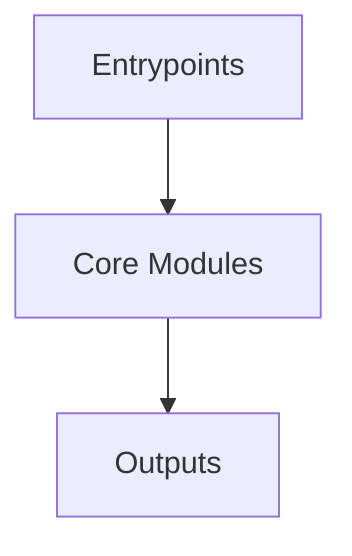

# Overview
Repository `svelte` appears to implement a modular system with 7854 source files at commit `be645b4d9f84cb7580683c7b2336d1023906c4da`.

## Architecture
Major components inferred from file/module analysis:
- `root`: Prettier should ignore
- `packages`: The Svelte repository, specifically the `packages/svelte` directory, is the primary hub for the Svelte project
- `playgrounds`: The Svelte playgrounds sandbox module is a key component of the Svelte project
- `documentation`: changes, not just when the ref's value changes
- `.changeset`: The .changeset directory in the Svelte repository serves as the primary hub for managing versioning and publishing of code changes
- `.vscode`: The .vscode/launch.json file in the Svelte repository serves as a configuration for Visual Studio Code's debugging feature

## Data Flow / Execution Flow
Typical execution path: `Entrypoint -> Core Modules -> Runtime Services -> Output/Side Effects`.
Entrypoints initialize core modules, which orchestrate processing and emit outputs or side effects.

## Configuration & Dependencies
- Build/dependency files: package.json, packages/svelte/package.json, packages/svelte/compiler/package.json, playgrounds/sandbox/package.json
- Config files: .changeset/config.json, .vscode/settings.json, benchmarking/tsconfig.json, packages/svelte/tsconfig.generated.json, packages/svelte/tsconfig.json, packages/svelte/tsconfig.runtime.json, packages/svelte/tests/types/tsconfig.json, playgrounds/sandbox/tsconfig.json

## How to Run / Key Scripts
- Detected entrypoints: benchmarking/benchmarks/reactivity/index.js, benchmarking/benchmarks/ssr/index.js, benchmarking/compare/index.js, packages/svelte/scripts/process-messages/index.js, packages/svelte/src/animate/index.js, packages/svelte/src/attachments/index.js, packages/svelte/src/compiler/index.js, packages/svelte/src/compiler/migrate/index.js, packages/svelte/src/compiler/phases/1-parse/index.js, packages/svelte/src/compiler/phases/2-analyze/index.js, packages/svelte/src/compiler/phases/2-analyze/visitors/shared/a11y/index.js, packages/svelte/src/compiler/phases/3-transform/index.js, packages/svelte/src/compiler/phases/3-transform/client/transform-template/index.js, packages/svelte/src/compiler/phases/3-transform/css/index.js, packages/svelte/src/compiler/preprocess/index.js, packages/svelte/src/easing/index.js, packages/svelte/src/events/index.js, packages/svelte/src/internal/index.js, packages/svelte/src/internal/client/index.js, packages/svelte/src/internal/flags/index.js, packages/svelte/src/internal/server/index.js, packages/svelte/src/motion/index.js, packages/svelte/src/reactivity/window/index.js, packages/svelte/src/server/index.js, packages/svelte/src/store/shared/index.js, packages/svelte/src/transition/index.js
- Use repository build scripts/package manager tasks based on detected build files.

## Notable Design Choices / Extension Points
- The codebase is organized in modules that can be extended by adding new feature files under existing module boundaries.
- Extension is likely centered around entrypoint wiring, configuration files, and module-specific implementations.
