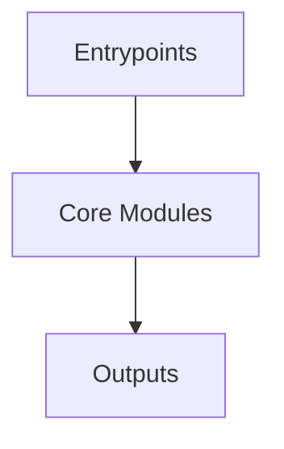

# Overview
Repository `trino` appears to implement a modular system with 14307 source files at commit `d1501ee536c0c6883ed960a184ba7b3f9e36a6c3`.

## Architecture
Major components inferred from file/module analysis:
- `docs`: The Trino repository's docs module is a comprehensive resource for understanding and using Trino, a high-performance, distributed SQL query engine
- `core`: The trino-web-ui module in the Trino repository is responsible for managing the build process of the web user interface of the project
- `service`: The trino-proxy module in the repository is a key component of Trino, a distributed SQL query engine
- `testing`: The "trino-testing-services" module in the Trino project is a testing utility module, primarily designed for the purpose of providing services for testing
- `client`: The trino-client module in the repository is responsible for managing the dependencies and build configuration of the Trino client
- `lib`: The trino-array module in the Trino project is a crucial component that provides support for arrays in the distributed SQL query engine
- `root`: Trino, a fast, distributed SQL query engine for big data analytics, is a crucial component of big data ecosystems

## Data Flow / Execution Flow
Typical execution path: `Entrypoint -> Core Modules -> Runtime Services -> Output/Side Effects`.
Entrypoints initialize core modules, which orchestrate processing and emit outputs or side effects.

## Configuration & Dependencies
- Build/dependency files: pom.xml, client/trino-cli/pom.xml, client/trino-client/pom.xml, client/trino-jdbc/pom.xml, core/trino-grammar/pom.xml, core/trino-main/pom.xml, core/trino-parser/pom.xml, core/trino-server-core/pom.xml, core/trino-server-main/pom.xml, core/trino-server/pom.xml, core/trino-spi/pom.xml, core/trino-web-ui/pom.xml, core/trino-web-ui/src/main/resources/webapp-preview/package.json, core/trino-web-ui/src/main/resources/webapp/src/package.json, docs/pom.xml, lib/trino-array/pom.xml, lib/trino-cache/pom.xml, lib/trino-filesystem-alluxio/pom.xml, lib/trino-filesystem-azure/pom.xml, lib/trino-filesystem-cache-alluxio/pom.xml, lib/trino-filesystem-gcs/pom.xml, lib/trino-filesystem-manager/pom.xml, lib/trino-filesystem-s3/pom.xml, lib/trino-filesystem/pom.xml, lib/trino-geospatial-toolkit/pom.xml, lib/trino-hdfs/pom.xml, lib/trino-hive-formats/pom.xml, lib/trino-matching/pom.xml, lib/trino-memory-context/pom.xml, lib/trino-metastore/pom.xml, lib/trino-orc/pom.xml, lib/trino-parquet/pom.xml, lib/trino-plugin-toolkit/pom.xml, lib/trino-record-decoder/pom.xml, plugin/trino-ai-functions/pom.xml, plugin/trino-base-jdbc/pom.xml, plugin/trino-bigquery/pom.xml, plugin/trino-blackhole/pom.xml, plugin/trino-cassandra/pom.xml, plugin/trino-clickhouse/pom.xml, plugin/trino-delta-lake/pom.xml, plugin/trino-druid/pom.xml, plugin/trino-duckdb/pom.xml, plugin/trino-elasticsearch/pom.xml, plugin/trino-example-http/pom.xml, plugin/trino-example-jdbc/pom.xml, plugin/trino-exasol/pom.xml, plugin/trino-exchange-filesystem/pom.xml, plugin/trino-exchange-hdfs/pom.xml, plugin/trino-faker/pom.xml, plugin/trino-functions-python/pom.xml, plugin/trino-geospatial/pom.xml, plugin/trino-google-sheets/pom.xml, plugin/trino-hive/pom.xml, plugin/trino-http-event-listener/pom.xml, plugin/trino-http-server-event-listener/pom.xml, plugin/trino-hudi/pom.xml, plugin/trino-iceberg/pom.xml, plugin/trino-ignite/pom.xml, plugin/trino-jmx/pom.xml, plugin/trino-kafka-event-listener/pom.xml, plugin/trino-kafka/pom.xml, plugin/trino-lakehouse/pom.xml, plugin/trino-ldap-group-provider/pom.xml, plugin/trino-loki/pom.xml, plugin/trino-mariadb/pom.xml, plugin/trino-memory/pom.xml, plugin/trino-ml/pom.xml, plugin/trino-mongodb/pom.xml, plugin/trino-mysql-event-listener/pom.xml, plugin/trino-mysql/pom.xml, plugin/trino-opa/pom.xml, plugin/trino-openlineage/pom.xml, plugin/trino-opensearch/pom.xml, plugin/trino-oracle/pom.xml, plugin/trino-password-authenticators/pom.xml, plugin/trino-pinot/pom.xml, plugin/trino-postgresql/pom.xml, plugin/trino-prometheus/pom.xml, plugin/trino-ranger/pom.xml, plugin/trino-redis/pom.xml, plugin/trino-redshift/pom.xml, plugin/trino-resource-group-managers/pom.xml, plugin/trino-session-property-managers/pom.xml, plugin/trino-singlestore/pom.xml, plugin/trino-snowflake/pom.xml, plugin/trino-spooling-filesystem/pom.xml, plugin/trino-sqlserver/pom.xml, plugin/trino-teradata-functions/pom.xml, plugin/trino-thrift-api/pom.xml, plugin/trino-thrift-testing-server/pom.xml, plugin/trino-thrift/pom.xml, plugin/trino-tpcds/pom.xml, plugin/trino-tpch/pom.xml, plugin/trino-vertica/pom.xml, service/trino-proxy/pom.xml, service/trino-verifier/pom.xml, testing/trino-benchmark-queries/pom.xml, testing/trino-benchto-benchmarks/pom.xml, testing/trino-faulttolerant-tests/pom.xml, testing/trino-plugin-reader/pom.xml, testing/trino-plugin-reader/src/test/resources/pom.xml, testing/trino-plugin-reader/src/test/resources/lib/other-module/pom.xml, testing/trino-plugin-reader/src/test/resources/plugin/example-connector/pom.xml, testing/trino-plugin-reader/src/test/resources/plugin/other-connector/pom.xml, testing/trino-product-tests-groups/pom.xml, testing/trino-product-tests-launcher/pom.xml, testing/trino-product-tests/pom.xml, testing/trino-server-dev/pom.xml, testing/trino-test-jdbc-compatibility-old-driver/pom.xml, testing/trino-test-jdbc-compatibility-old-server/pom.xml, testing/trino-testing-containers/pom.xml, testing/trino-testing-kafka/pom.xml, testing/trino-testing-resources/pom.xml, testing/trino-testing-services/pom.xml, testing/trino-testing/pom.xml, testing/trino-tests/pom.xml
- Config files: core/trino-main/src/test/resources/security-config-file-with-unknown-rules.json, core/trino-main/src/test/resources/oidc/openid-configuration-invalid-issuer.json, core/trino-main/src/test/resources/oidc/openid-configuration-with-access-token-issuer.json, core/trino-main/src/test/resources/oidc/openid-configuration-without-end-session-url.json, core/trino-main/src/test/resources/oidc/openid-configuration-without-userinfo.json, core/trino-main/src/test/resources/oidc/openid-configuration.json, core/trino-web-ui/src/main/resources/webapp-preview/tsconfig.app.json, core/trino-web-ui/src/main/resources/webapp-preview/tsconfig.json, core/trino-web-ui/src/main/resources/webapp-preview/tsconfig.node.json, lib/trino-plugin-toolkit/src/test/resources/file-based-system-security-config-file-with-unknown-rules.json, plugin/trino-exchange-filesystem/src/test/resources/kms/config.yml, plugin/trino-resource-group-managers/src/test/resources/resource_groups_config.json, plugin/trino-resource-group-managers/src/test/resources/resource_groups_config_bad_extract_variable.json, plugin/trino-resource-group-managers/src/test/resources/resource_groups_config_bad_group_id.json, plugin/trino-resource-group-managers/src/test/resources/resource_groups_config_bad_query_priority_scheduling_policy.json, plugin/trino-resource-group-managers/src/test/resources/resource_groups_config_bad_query_type.json, plugin/trino-resource-group-managers/src/test/resources/resource_groups_config_bad_root.json, plugin/trino-resource-group-managers/src/test/resources/resource_groups_config_bad_selector.json, plugin/trino-resource-group-managers/src/test/resources/resource_groups_config_bad_soft_memory_limit.json, plugin/trino-resource-group-managers/src/test/resources/resource_groups_config_bad_sub_group.json, plugin/trino-resource-group-managers/src/test/resources/resource_groups_config_bad_weighted_scheduling_policy.json, plugin/trino-resource-group-managers/src/test/resources/resource_groups_config_extract_variable.json, plugin/trino-resource-group-managers/src/test/resources/resource_groups_config_legacy.json, plugin/trino-resource-group-managers/src/test/resources/resource_groups_config_original_auth_user.json, plugin/trino-resource-group-managers/src/test/resources/resource_groups_config_query_type.json, plugin/trino-resource-group-managers/src/test/resources/resource_groups_config_unused_field.json, plugin/trino-resource-group-managers/src/test/resources/resource_groups_config_user_groups.json, plugin/trino-session-property-managers/src/test/resources/io/trino/plugin/session/file/session-property-config.json, testing/trino-product-tests-launcher/src/main/resources/docker/trino-product-tests/common/hadoop-kerberos-kms/tempto-configuration.yaml, testing/trino-product-tests-launcher/src/main/resources/docker/trino-product-tests/common/hadoop-kerberos/tempto-configuration.yaml, testing/trino-product-tests-launcher/src/main/resources/docker/trino-product-tests/common/hydra-identity-provider/tempto-configuration-for-docker-oauth2.yaml, testing/trino-product-tests-launcher/src/main/resources/docker/trino-product-tests/conf/environment/multinode-clickhouse/tempto-configuration.yaml, testing/trino-product-tests-launcher/src/main/resources/docker/trino-product-tests/conf/environment/multinode-exasol/tempto-configuration.yaml, testing/trino-product-tests-launcher/src/main/resources/docker/trino-product-tests/conf/environment/multinode-gcs/tempto-configuration.yaml, testing/trino-product-tests-launcher/src/main/resources/docker/trino-product-tests/conf/environment/multinode-ignite/tempto-configuration.yaml, testing/trino-product-tests-launcher/src/main/resources/docker/trino-product-tests/conf/environment/multinode-kafka-confluent-license/tempto-configuration.yaml, testing/trino-product-tests-launcher/src/main/resources/docker/trino-product-tests/conf/environment/multinode-kafka-sasl-plaintext/tempto-configuration.yaml, testing/trino-product-tests-launcher/src/main/resources/docker/trino-product-tests/conf/environment/multinode-kafka-ssl/tempto-configuration.yaml, testing/trino-product-tests-launcher/src/main/resources/docker/trino-product-tests/conf/environment/multinode-kafka/tempto-configuration.yaml, testing/trino-product-tests-launcher/src/main/resources/docker/trino-product-tests/conf/environment/multinode-mariadb/tempto-configuration.yaml, testing/trino-product-tests-launcher/src/main/resources/docker/trino-product-tests/conf/environment/multinode-secrets-provider/tempto-configuration.yaml, testing/trino-product-tests-launcher/src/main/resources/docker/trino-product-tests/conf/environment/multinode-tls-kerberos-delegation/tempto-configuration.yaml, testing/trino-product-tests-launcher/src/main/resources/docker/trino-product-tests/conf/environment/singlenode-compatibility/legacy-tempto-configuration.yaml, testing/trino-product-tests-launcher/src/main/resources/docker/trino-product-tests/conf/environment/singlenode-compatibility/tempto-configuration.yaml, testing/trino-product-tests-launcher/src/main/resources/docker/trino-product-tests/conf/environment/singlenode-delta-lake-databricks/tempto-configuration.yaml, testing/trino-product-tests-launcher/src/main/resources/docker/trino-product-tests/conf/environment/singlenode-delta-lake-oss/tempto-configuration.yaml, testing/trino-product-tests-launcher/src/main/resources/docker/trino-product-tests/conf/environment/singlenode-ldap-and-file/tempto-configuration.yaml, testing/trino-product-tests-launcher/src/main/resources/docker/trino-product-tests/conf/tempto/tempto-configuration-for-docker-default.yaml, testing/trino-product-tests-launcher/src/main/resources/docker/trino-product-tests/conf/tempto/tempto-configuration-for-docker-ldap.yaml, testing/trino-product-tests-launcher/src/main/resources/docker/trino-product-tests/conf/tempto/tempto-configuration-for-docker-tls.yaml, testing/trino-product-tests-launcher/src/main/resources/docker/trino-product-tests/conf/tempto/tempto-configuration-for-hms-only.yaml, testing/trino-product-tests-launcher/src/main/resources/docker/trino-product-tests/conf/tempto/tempto-configuration-profile-config-file.yaml, testing/trino-product-tests/src/main/resources/tempto-configuration.yaml, testing/trino-tests/src/test/resources/resource_groups_client_tags_based_config.json, testing/trino-tests/src/test/resources/resource_groups_config_dashboard.json, testing/trino-tests/src/test/resources/resource_groups_config_original_user.json, testing/trino-tests/src/test/resources/resource_groups_config_simple.json, testing/trino-tests/src/test/resources/resource_groups_config_soft_limits.json, testing/trino-tests/src/test/resources/resource_groups_query_type_based_config.json, testing/trino-tests/src/test/resources/resource_groups_resource_estimate_based_config.json

## How to Run / Key Scripts
- Detected entrypoints: core/trino-web-ui/src/main/resources/webapp-preview/src/store/index.ts
- Use repository build scripts/package manager tasks based on detected build files.

## Notable Design Choices / Extension Points
- The codebase is organized in modules that can be extended by adding new feature files under existing module boundaries.
- Extension is likely centered around entrypoint wiring, configuration files, and module-specific implementations.
