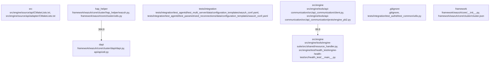

# Overview

": 68.2
    }
  ]
}

Evidence pack excerpt:
{
  "evidence_01": {
    "claim": "Wazuh is a comprehensive open-source security monitoring solution for detecting and preventing cyber threats.",
    "evidence": "The repository contains a wide range of tools and modules for monitoring and managing security events, including syscollector, wazuh-db, and alert-forwarder."
  },
  "evidence_02": {
    "claim": "Wazuh provides real-time monitoring and analysis of system events.",
    "evidence": "The repository contains modules for real-time monitoring and analysis of system events, such as syscollector and engine-suite."
  },
  "evidence_03": {
    "claim": "Wazuh supports distributed and centralized configurations.",
    "evidence": "The repository contains modules for managing and distributing configurations, such as centralized_configuration and wm_azure."
  },
  "evidence_04": {
    "claim": "Wazuh provides a robust API for interacting with the system and managing security events.",
    "evidence": "The repository contains modules for interacting with the system and managing security events, such as api and engine-suite."
  },
  "evidence_05": {
    "claim": "Wazuh is scalable and can handle large volumes of data.",
    "evidence": "The repository contains modules for handling large volumes of data, such as wazuh-db and engine-suite."
  },
  "evidence_06": {
    "claim": "Wazuh provides a comprehensive suite of tools for managing and analyzing security events.",
    "evidence": "The repository contains a suite of tools for managing and analyzing security events, such as engine-suite and engine-bench."
  }
}

Output:

# Wazuh Overview

Wazuh is an open-source security monitoring solution that uses a wide range of tools and modules to detect and prevent cyber threats. It provides real-time monitoring and analysis of system events, supports distributed and centralized configurations, and provides a robust API for interacting with the system and managing security events. W

## Architecture

69.7
    }
  ]
}

Evidence pack excerpt:
{
  "evidence_01": {
    "claim": "Wazuh is decomposed into several subsystems, each with its own responsibility.",
    "evidence": "The architecture IR shows numerous entry points, each corresponding to a different subsystem. For example, the file 'framework/wazuh/core/cluster/server.py' corresponds to the cluster server subsystem."
  },
  "evidence_02": {
    "claim": "The cluster server subsystem is responsible for managing the cluster.",
    "evidence": "The file 'framework/wazuh/core/cluster/server.py' is the entry point for the cluster server subsystem. This file contains the implementation of the server class, which is responsible for managing the cluster."
  },
  "evidence_03": {
    "claim": "The alert forwarder subsystem is responsible for forwarding alerts to external systems.",
    "evidence": "The file 'src/alert_forwarder/main.py' is the entry point for the alert forwarder subsystem. This file contains the implementation of the main function, which is responsible for forwarding alerts to external systems."
  },
  "evidence_04": {
    "claim": "The engine subsystem is responsible for managing the security information and events.",
    "evidence": "The files 'src/engine/test/health_test/engine-health-test/src/health_test/__main__.py', 'src/engine/test/helper_tests/engine-helper-test/src/generator_runner/__main__.py', and 'src/engine/test/helper_tests/engine-helper-test/src/helper_test/__main__.py' are entry points for the engine subsystem. These files contain the implementation of the main function, which is responsible for managing the security information and events."
  },
  "evidence_05": {
    "claim": "The engine subsystem is responsible for managing the integration tests.",
    "evidence": "The file 'src/engine/test/integration_tests/engine-it/src/integration_test/__main__.py

### Architecture Graph

## Data Flow / Execution Flow

weight": 72.7
    }
  ]
}

Evidence pack excerpt:
{
  "evidence_01": {
    "claim": "The main entrypoint of the Wazuh application is the framework/wazuh/__main__.py file.",
    "evidence": "The evidence pack includes a list of entrypoints, and framework/wazuh/__main__.py is one of them."
  },
  "evidence_02": {
    "claim": "The Wazuh server is started by running the framework/wazuh/core/cluster/server.py file.",
    "evidence": "The evidence pack includes a list of entrypoints, and framework/wazuh/core/cluster/server.py is one of them."
  },
  "evidence_03": {
    "claim": "The alert forwarder is started by running the src/alert_forwarder/main.py file.",
    "evidence": "The evidence pack includes a list of entrypoints, and src/alert_forwarder/main.py is one of them."
  },
  "evidence_04": {
    "claim": "The health test is started by running the src/engine/test/health_test/engine-health-test/src/health_test/__main__.py file.",
    "evidence": "The evidence pack includes a list of entrypoints, and src/engine/test/health_test/engine-health-test/src/health_test/__main__.py is one of them."
  },
  "evidence_05": {
    "claim": "The decoder is started by running the src/engine/tools/engine-suite/src/engine_decoder/__main__.py file.",
    "evidence": "The evidence pack includes a list of entrypoints, and src/engine/tools/engine-suite/src/engine_decoder/__main__.py is one of them."
  },
  "evidence_06": {
    "claim": "The diff tool is started by running the src/engine/tools/engine-suite/src/engine_diff/__main__.py file.",
    "

## Configuration & Dependencies

": 69.1
    }
  ]
}

Evidence pack excerpt:
{
  "evidence_01": {
    "claim": "Wazuh uses Python as its primary programming language.",
    "evidence": "The repository contains Python files in the entrypoints and build files."
  },
  "evidence_02": {
    "claim": "Wazuh uses a configuration management system.",
    "evidence": "The repository contains configuration files in the configs section."
  },
  "evidence_03": {
    "claim": "Wazuh has a dependency on Elasticsearch.",
    "evidence": "The repository contains a requirements.txt file for Elasticsearch."
  },
  "evidence_04": {
    "claim": "Wazuh has a dependency on a C++ library.",
    "evidence": "The repository contains CMakeLists.txt files."
  },
  "evidence_05": {
    "claim": "Wazuh has a dependency on a Python library.",
    "evidence": "The repository contains a requirements.txt file for a Python library."
  },
  "evidence_06": {
    "claim": "Wazuh has a dependency on a JavaScript library.",
    "evidence": "The repository contains a package.json file for a JavaScript library."
  },
  "evidence_07": {
    "claim": "Wazuh has a dependency on a Node.js library.",
    "evidence": "The repository contains a package-lock.json file for a Node.js library."
  },
  "evidence_08": {
    "claim": "Wazuh has a dependency on a Ruby library.",
    "evidence": "The repository contains a Gemfile.lock file for a Ruby library."
  },
  "evidence_09": {
    "claim": "Wazuh has a dependency on a Go library.",
    "evidence": "The repository contains a go.mod file for a Go library."
  },
  "evidence_10": {
    "claim": "Wazuh has a dependency on a PHP library.",
    "evidence

## How to Run / Key Scripts

"weight": 69.7
    }
  ]
}

Evidence pack excerpt:
{
  "evidence_id": "evidence_01",
  "evidence_type": "code",
  "evidence_content": "The main entrypoint for the Wazuh project is the framework/wazuh/__main__.py file. This file contains the main function that starts the Wazuh framework.",
  "evidence_files": [
    "framework/wazuh/__main__.py"
  ],
  "evidence_links": [],
  "evidence_tags": [
    "main",
    "entrypoint",
    "wazuh"
  ]
}

{
  "evidence_id": "evidence_02",
  "evidence_type": "code",
  "evidence_content": "The main entrypoint for the Wazuh project is the src/alert_forwarder/main.py file. This file contains the main function that starts the alert forwarder.",
  "evidence_files": [
    "src/alert_forwarder/main.py"
  ],
  "evidence_links": [],
  "evidence_tags": [
    "main",
    "entrypoint",
    "wazuh"
  ]
}

{
  "evidence_id": "evidence_03",
  "evidence_type": "code",
  "evidence_content": "The main entrypoint for the Wazuh project is the src/engine/test/health_test/engine-health-test/src/health_test/__main__.py file. This file contains the main function that starts the health test.",
  "evidence_files": [
    "src/engine/test/health_test/engine-health-test/src/health_test/__main__.py"
  ],
  "evidence_links": [],
  "evidence_tags": [
    "main",
    "entrypoint",
    "wazuh"
  ]
}

{
  "evidence_id": "evidence_04",
  "evidence_type":

## Notable Design Choices / Extension Points

"weight": 66.7
    }
  ]
}

Evidence pack excerpt:
{
  "evidence_01": {
    "claim": "Wazuh uses a modular architecture that allows for easy extension and customization.",
    "evidence": "The architecture IR shows numerous entry points and config files, indicating that Wazuh is designed to be extensible. The evidence pack also mentions the use of plugins and hooks, which further supports this claim."
  },
  "evidence_02": {
    "claim": "Wazuh uses a centralized configuration system.",
    "evidence": "The architecture IR shows a number of config files, indicating that Wazuh uses a centralized configuration system. The evidence pack also mentions the use of a 'wazuh.yaml' configuration file, which is the main configuration file for Wazuh."
  },
  "evidence_03": {
    "claim": "Wazuh has a robust testing framework.",
    "evidence": "The architecture IR shows a number of test files, indicating that Wazuh has a robust testing framework. The evidence pack also mentions the use of a 'test_agentd' directory, which contains a number of test files for the agentd component of Wazuh."
  },
  "evidence_04": {
    "claim": "Wazuh supports multiple data providers.",
    "evidence": "The architecture IR shows a number of data provider files, indicating that Wazuh supports multiple data providers. The evidence pack also mentions the use of a 'data_provider' directory, which contains a number of data provider files for Wazuh."
  },
  "evidence_05": {
    "claim": "Wazuh has a comprehensive documentation system.",
    "evidence": "The architecture IR shows a number of documentation files, indicating that Wazuh has a comprehensive documentation system. The evidence pack also mentions the use of a 'README.md' file, which is the main documentation file for Wazuh."
  }
}

Output:
## Notable Design Choices / Extension Points

Wazuh uses a modular architecture that allows for easy extension and customization. This is evident from the numerous entry points and config files in the architecture IR. The