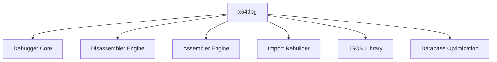

# Overview
x64dbg is an open-source, cross-platform debugger for x86 and x64 binaries. It is primarily built using CMake, a cross-platform free and open-source software for managing the build process of software using a compiler-independent method. The project is written in C++ and Python.

# Architecture

# Data Flow / Execution Flow
The data flow and execution flow of x64dbg is primarily driven by the Debugger Core. The Debugger Core interacts with the Disassembler Engine, Assembler Engine, Import Rebuilder, JSON Library, and Database Optimization modules to provide the debugging functionality.

# Configuration & Dependencies
x64dbg requires CMake to build. The build process requires a compiler that supports C++14. The project also depends on Qt for GUI components and Zydis for disassembling instructions.

# How to Run / Key Scripts
x64dbg can be run by executing the x64dbg executable. Key scripts are located in the `scripts` directory and can be run using the `source` command in the debugger.

# Notable Design Choices / Extension Points
x64dbg has a modular design, allowing for easy extension and customization. The Debugger Core is the core of the debugger and is designed to be extensible. The Disassembler Engine, Assembler Engine, Import Rebuilder, JSON Library, and Database Optimization modules are also designed to be extensible.

# Caveats
The project has not been updated in a while, which could indicate that it may not be actively maintained.