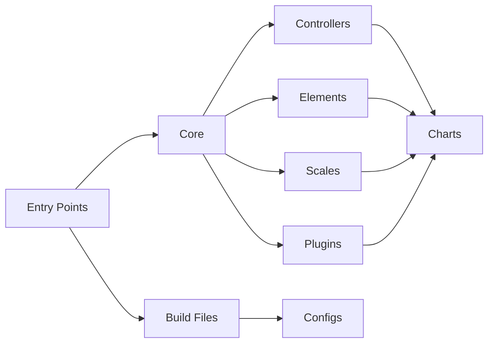

immediate visual representation of your data.
### Customization
Chart.js is highly customizable, allowing you to tailor the appearance and behavior of your charts to your specific needs.
### Performance
Chart.js is optimized for performance, ensuring smooth and responsive charts even with large datasets.
### Responsiveness
Chart.js is fully responsive, adapting to the size of the container it's placed in.
### Accessibility
Chart.js is accessible, with ARIA attributes and keyboard navigation support.
### Scalability
Chart.js is scalable, capable of handling complex data structures and large datasets.
### Extensibility
Chart.js is extensible, with a rich ecosystem of plugins and extensions available.

## Architecture

The architecture of Chart.js revolves around a central core module, which interacts with controllers, elements, scales, and plugins. These modules work together to create charts, with the entry points serving as the starting point for the library. The build files and configs are responsible for managing the project's build process and configuration.

## Data Flow / Execution Flow

1. The user initializes a chart by creating a new instance of the Chart.js class, passing in the necessary data and options.
2. The core module takes the data and options, creating a new chart object.
3. The core module delegates the creation of the chart's controllers, elements, and scales to the appropriate modules based on the chart type and user-defined options.
4. Each controller, element, and scale is responsible for its specific functionality, such as handling user interactions, rendering chart components, or calculating scale values.
5. The chart object is then rendered to the DOM, displaying the chart to the user.
6. The chart remains interactive, allowing the user to interact with it and update the data as needed.

## Configuration & Dependencies

Chart.js relies on several dependencies, including:

- TypeScript (for type checking and development)
- Rollup (for bundling)
- Karma (for testing)
- Various plugins for Rollup, such as `@rollup/plugin-commonjs`, `@rollup/plugin-inject`, `@rollup/plugin-json`, and `@rollup/plugin-node-resolve`

The library also provides extensive configuration options for customizing the appearance and behavior of the charts, with options available for each chart type, axis, and plugin.

## How to Run / Key Scripts

To run the Chart.js project, follow these steps:

1. Install dependencies: `npm install`
2. Build the project: `npm run build`
3. Run tests: `npm test`

Key scripts in the `package.json` file include:

- `build`: Builds the project using Rollup
- `test`: Runs tests using Karma
- `dev`: Starts a development server for live reloading and hot module replacement

## Notable Design Choices / Extension Points

- Chart.js is designed to be highly custom