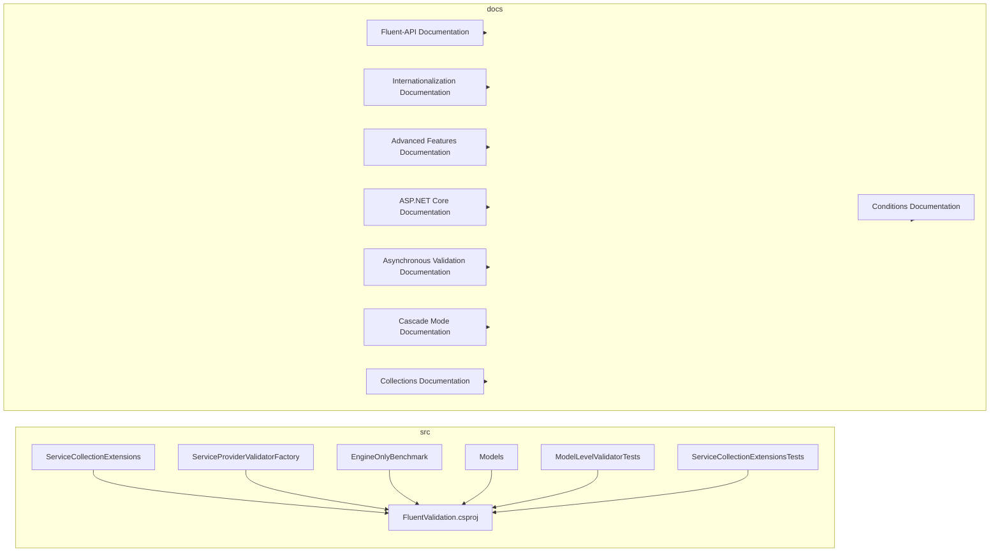

# Overview

FluentValidation is a library for .NET applications that provides a flexible and readable syntax for defining validation rules for models and objects. It adheres to the business rules and ensures data integrity.

# Architecture

The FluentValidation repository consists of a main `src` module and a `docs` module. The `src` module contains the core validation functionalities, while the `docs` module provides documentation for the library.

# Data Flow / Execution Flow

The execution flow in FluentValidation begins with the creation of a validator instance, which is typically done through dependency injection. The validator instance is then used to validate a model or object by invoking its `Validate` or `ValidateAsync` method. The validator applies the defined validation rules to the model, and if any rule fails, a `ValidationResult` object is returned, containing the errors.

# Configuration & Dependencies

FluentValidation can be configured through the `IServiceCollection` interface extension methods, which allow developers to register validators as services in a service collection. The library also supports dependency injection and can be used with the ASP.NET Service Provider.

# How to Run / Key Scripts

To run the FluentValidation library, you can include it as a dependency in your .NET project and use the provided extension methods to register validators as services. You can then inject the validator into your controllers or services and invoke the `Validate` or `ValidateAsync` method to validate your models.

# Notable Design Choices / Extension Points

FluentValidation provides several extension points for customization, such as the `PreValidate` method for running custom code every time a validator is invoked, asynchronous validation for working with external APIs, and the ability to set the cascade mode to customize the execution of rules and validators. It also supports the validation of collections of simple and complex types, as well as the use of conditions to control when rules should execute.