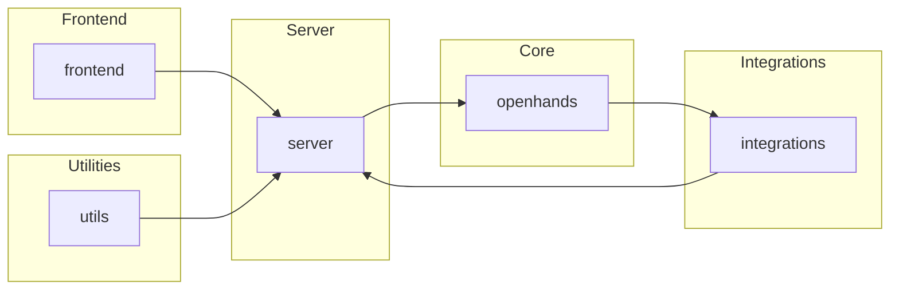

!NOTE]
> 如果您遇到问题，请查看[问题解决方案](#troubleshooting)。
### Option 1: CLI Launcher (Recommended)
**安装uv** (如果您还没有安装):
**启动OpenHands**:

## Overview
OpenHands is an AI-powered platform for software development agents. It allows developers to create, manage, and interact with AI agents that can perform various tasks, such as modifying code, running commands, browsing the web, and calling APIs. The platform consists of several modules, including a frontend, server, and core components, as well as various integrations and utilities.

## Architecture
The following diagram illustrates the high-level architecture of OpenHands:

In this diagram, the Frontend, Server, Core, Integrations, and Utilities modules are represented as separate components. The Frontend communicates with the Server, which in turn interacts with the Core, Integrations, and Utilities modules. The Core module contains the main AI model, while the Integrations and Utilities modules provide additional functionality and support for the platform.

## Data Flow / Execution Flow
1. The user interacts with the OpenHands frontend, which sends requests to the OpenHands server.
2. The OpenHands server processes the request, interacts with the OpenHands core to generate a response, and sends the response back to the frontend.
3. The frontend displays the response to the user.
4. If the response requires additional actions, such as modifying code or running commands, the frontend sends another request to the OpenHands server, which then interacts with the appropriate Integrations or Utilities modules to perform the requested action.
5. The Integrations or Utilities modules return the results of the action to the OpenHands server, which then sends the results back to the frontend for display to the user.

## Configuration & Dependencies
The OpenHands project uses several configuration files and dependencies to manage its environment and ensure consistent behavior across the system. Key configuration files include:

- `pyproject.toml`: Project configuration for Poetry, a dependency management tool.
- `pytest.ini`: Configuration for the pytest testing framework.
- `README.md`: Project documentation and information.

Key dependencies include:

- Python: The primary programming language used in the OpenHands project.
- Poetry: A dependency management tool for Python projects.
- pytest: A testing framework for Python projects.
- Flask: A micro web framework for building web applications in Python.
- FastAPI: A modern, fast (high-performance), web framework for building APIs with Python.
- TypeScript: A statically typed superset of JavaScript used for the frontend.
- React: A JavaScript library for building user interfaces.
- Redux: A predictable state container for JavaScript apps.

## How to Run / Key Scripts
To run OpenHands, follow these steps: