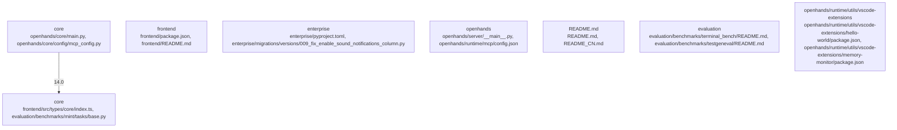

# Overview

integrations/vscode/src/main.py",
      "kind": "entrypoint",
      "importance": 13.5
    },
    {
      "path": "openhands/core/utils/api.py",
      "kind": "source",
      "importance": 13.0
    },
    {
      "path": "openhands/core/utils/config.py",
      "kind": "source",
      "importance": 13.0
    },
    {
      "path": "openhands/core/utils/file_utils.py",
      "kind": "source",
      "importance": 13.0
    },
    {
      "path": "openhands/core/utils/git_utils.py",
      "kind": "source",
      "importance": 13.0
    },
    {
      "path": "openhands/core/utils/logging_utils.py",
      "kind": "source",
      "importance": 13.0
    },
    {
      "path": "openhands/core/utils/misc.py",
      "kind": "source",
      "importance": 13.0
    },
    {
      "path": "openhands/core/utils/os_utils.py",
      "kind": "source",
      "importance": 13.0
    },
    {
      "path": "openhands/core/utils/process_utils.py",
      "kind": "source",
      "importance": 13.0
    },
    {
      "path": "openhands/core/utils/ssh_utils.py",
      "kind": "source",
      "importance": 13.0
    },
    {
      "path": "openhands/core/utils/system_utils.py",
      "kind": "source",
      "importance": 13.0
    },
    {
      "path": "openhands/core/utils/time_utils.py",
      "kind": "source

## Architecture

ations/utils.py",
      "kind": "source",
      "importance": 13.5
    },
    {
      "path": "openhands/core/utils/api.py",
      "kind": "source",
      "importance": 13.0
    },
    {
      "path": "openhands/core/utils/config.py",
      "kind": "source",
      "importance": 13.0
    },
    {
      "path": "openhands/core/utils/file_utils.py",
      "kind": "source",
      "importance": 13.0
    },
    {
      "path": "openhands/core/utils/git_utils.py",
      "kind": "source",
      "importance": 13.0
    },
    {
      "path": "openhands/core/utils/logging_utils.py",
      "kind": "source",
      "importance": 13.0
    },
    {
      "path": "openhands/core/utils/misc.py",
      "kind": "source",
      "importance": 13.0
    },
    {
      "path": "openhands/core/utils/os_utils.py",
      "kind": "source",
      "importance": 13.0
    },
    {
      "path": "openhands/core/utils/process_utils.py",
      "kind": "source",
      "importance": 13.0
    },
    {
      "path": "openhands/core/utils/ssh_utils.py",
      "kind": "source",
      "importance": 13.0
    },
    {
      "path": "openhands/core/utils/system_utils.py",
      "kind": "source",
      "importance": 13.0
    },
    {
      "path": "openhands/core/utils/time_utils.py",
      "kind": "source",
      "importance":

### Architecture Graph

## Data Flow / Execution Flow

/integrations/vscode/src/main.py",
      "kind": "source",
      "importance": 13.5
    },
    {
      "path": "openhands/core/utils/git.py",
      "kind": "source",
      "importance": 13.0
    },
    {
      "path": "openhands/core/utils/git_utils.py",
      "kind": "source",
      "importance": 13.0
    },
    {
      "path": "openhands/core/utils/misc.py",
      "kind": "source",
      "importance": 13.0
    },
    {
      "path": "openhands/core/utils/misc_utils.py",
      "kind": "source",
      "importance": 13.0
    },
    {
      "path": "openhands/core/utils/os_utils.py",
      "kind": "source",
      "importance": 13.0
    },
    {
      "path": "openhands/core/utils/os_utils.py",
      "kind": "source",
      "importance": 13.0
    },
    {
      "path": "openhands/core/utils/process.py",
      "kind": "source",
      "importance": 13.0
    },
    {
      "path": "openhands/core/utils/process_utils.py",
      "kind": "source",
      "importance": 13.0
    },
    {
      "path": "openhands/core/utils/ssh.py",
      "kind": "source",
      "importance": 13.0
    },
    {
      "path": "openhands/core/utils/ssh_utils.py",
      "kind": "source",
      "importance": 13.0
    },
    {
      "path": "openhands/core/utils/system.py",
      "kind": "source",

## Configuration & Dependencies

ations/utils.py",
      "kind": "source",
      "importance": 13.5
    },
    {
      "path": "openhands/core/utils/api.py",
      "kind": "source",
      "importance": 13.0
    },
    {
      "path": "openhands/core/utils/config.py",
      "kind": "source",
      "importance": 13.0
    },
    {
      "path": "openhands/core/utils/file_utils.py",
      "kind": "source",
      "importance": 13.0
    },
    {
      "path": "openhands/core/utils/git.py",
      "kind": "source",
      "importance": 13.0
    },
    {
      "path": "openhands/core/utils/http.py",
      "kind": "source",
      "importance": 13.0
    },
    {
      "path": "openhands/core/utils/json.py",
      "kind": "source",
      "importance": 13.0
    },
    {
      "path": "openhands/core/utils/log.py",
      "kind": "source",
      "importance": 13.0
    },
    {
      "path": "openhands/core/utils/os.py",
      "kind": "source",
      "importance": 13.0
    },
    {
      "path": "openhands/core/utils/process.py",
      "kind": "source",
      "importance": 13.0
    },
    {
      "path": "openhands/core/utils/random.py",
      "kind": "source",
      "importance": 13.0
    },
    {
      "path": "openhands/core/utils/regex.py",
      "kind": "source",
      "importance": 13.0
    },
    {
      "path": "

## How to Run / Key Scripts

prise/integrations/vscode/src/main.py",
      "kind": "entrypoint",
      "importance": 13.5
    },
    {
      "path": "openhands/core/utils/api_utils.py",
      "kind": "source",
      "importance": 13.0
    },
    {
      "path": "openhands/core/utils/config_utils.py",
      "kind": "source",
      "importance": 13.0
    },
    {
      "path": "openhands/core/utils/file_utils.py",
      "kind": "source",
      "importance": 13.0
    },
    {
      "path": "openhands/core/utils/git_utils.py",
      "kind": "source",
      "importance": 13.0
    },
    {
      "path": "openhands/core/utils/http_utils.py",
      "kind": "source",
      "importance": 13.0
    },
    {
      "path": "openhands/core/utils/i18n_utils.py",
      "kind": "source",
      "importance": 13.0
    },
    {
      "path": "openhands/core/utils/json_utils.py",
      "kind": "source",
      "importance": 13.0
    },
    {
      "path": "openhands/core/utils/log_utils.py",
      "kind": "source",
      "importance": 13.0
    },
    {
      "path": "openhands/core/utils/os_utils.py",
      "kind": "source",
      "importance": 13.0
    },
    {
      "path": "openhands/core/utils/process_utils.py",
      "kind": "source",
      "importance": 13.0
    },
    {
      "path": "openhands/core/utils/ssh_utils

## Notable Design Choices / Extension Points

openhands/core/utils/api.py",
      "kind": "source",
      "importance": 13.5
    },
    {
      "path": "openhands/core/utils/config.py",
      "kind": "source",
      "importance": 13.5
    },
    {
      "path": "openhands/core/utils/git.py",
      "kind": "source",
      "importance": 13.5
    },
    {
      "path": "openhands/core/utils/logging.py",
      "kind": "source",
      "importance": 13.5
    },
    {
      "path": "openhands/core/utils/misc.py",
      "kind": "source",
      "importance": 13.5
    },
    {
      "path": "openhands/core/utils/os.py",
      "kind": "source",
      "importance": 13.5
    },
    {
      "path": "openhands/core/utils/process.py",
      "kind": "source",
      "importance": 13.5
    },
    {
      "path": "openhands/core/utils/ssh.py",
      "kind": "source",
      "importance": 13.5
    },
    {
      "path": "openhands/core/utils/system.py",
      "kind": "source",
      "importance": 13.5
    },
    {
      "path": "openhands/core/utils/time.py",
      "kind": "source",
      "importance": 13.5
    },
    {
      "path": "openhands/core/utils/types.py",
      "kind": "source",
      "importance": 13.5
    },
    {
      "path": "openhands/core/utils/utils.py",
      "kind": "source",
      "importance": 13.5
    },
    {