# Overview

"kind": "entrypoint",
      "importance": 10.0
    },
    {
      "path": "shell/browser/api/electron_api_extensions.cc",
      "kind": "top_paths",
      "importance": 9.0
    },
    {
      "path": "shell/browser/api/electron_api_extensions.h",
      "kind": "top_paths",
      "importance": 9.0
    },
    {
      "path": "shell/browser/api/electron_api_service_worker_context.cc",
      "kind": "top_paths",
      "importance": 9.0
    },
    {
      "path": "shell/browser/api/electron_api_service_worker_context.h",
      "kind": "top_paths",
      "importance": 9.0
    },
    {
      "path": "shell/browser/api/electron_api_service_worker_main.cc",
      "kind": "top_paths",
      "importance": 9.0
    },
    {
      "path": "shell/browser/api/electron_api_service_worker_main.h",
      "kind": "top_paths",
      "importance": 9.0
    },
    {
      "path": "lib/browser/api/service-worker-main.ts",
      "kind": "top_paths",
      "importance": 8.0
    },
    {
      "path": "lib/browser/api/auto-updater.ts",
      "kind": "top_paths",
      "importance": 8.0
    }
  ]
}

Evidence Pack:
- Electron is a framework for building cross-platform desktop applications using web technologies like JavaScript, HTML, and CSS.
- It is built on top of Chromium and Node.js, allowing developers to access the full power of both platforms.
- The main problem it solves is enabling developers to create desktop applications using web technologies, while providing a native look and feel.
- The repository contains a large number of test cases (

## Architecture

kind": "entrypoint",
      "importance": 10.0
    },
    {
      "path": "shell/browser/api/electron_api_extensions.cc",
      "kind": "community_08",
      "importance": 9.0
    },
    {
      "path": "shell/browser/api/electron_api_extensions.h",
      "kind": "community_08",
      "importance": 9.0
    },
    {
      "path": "shell/browser/api/electron_api_service_worker_context.cc",
      "kind": "community_08",
      "importance": 8.0
    },
    {
      "path": "shell/browser/api/electron_api_service_worker_context.h",
      "kind": "community_08",
      "importance": 8.0
    },
    {
      "path": "shell/browser/api/electron_api_service_worker_main.cc",
      "kind": "community_08",
      "importance": 8.0
    },
    {
      "path": "shell/browser/api/electron_api_service_worker_main.h",
      "kind": "community_08",
      "importance": 8.0
    },
    {
      "path": "lib/browser/api/service-worker-main.ts",
      "kind": "community_06",
      "importance": 7.0
    },
    {
      "path": "lib/browser/api/auto-updater.ts",
      "kind": "community_06",
      "importance": 7.0
    }
  ]
}

The Electron repository is primarily composed of several major subsystems, each with distinct responsibilities.

1. **Entry Points**: The repository has multiple entry points, primarily `npm/index.js` and `script/release/notes/index.ts`. These files serve as the main entry points for the application and the release notes, respectively. Other entry points include test cases

### Architecture Graph

```mermaid

flowchart TD
  community_01[shell\nshell/browser/api/electron_api_extensions.cc, shell/browser/api/electron_api_extensions.h]
  community_02[spec\nspec/fixtures/api/app-path/lib/index.js, spec/fixtures/api/electron-main-module/app/index.js]
  community_03[docs\ndocs/api/extensions-api.md, docs/api/extensions.md]
  community_04[patches\npatches/chromium/chore_defer_usb_service_getdevices_request_until_usb_service_is.patch, patches/chromium/custom_protocols_plzserviceworker.patch]
  community_05[README.md\nREADME.md, tsconfig.default_app.json]
  community_06[lib\nlib/browser/api/service-worker-main.ts, lib/browser/api/auto-updater.ts]
  community_07[script\nscript/gen-filenames.ts, script/gen-hunspell-filenames.js]
  community_08[lib\nscript/lib/util.py, script/lib/config.py]

```



## Data Flow / Execution Flow

"kind": "entrypoint",
      "importance": 10.0
    },
    {
      "path": "shell/browser/api/electron_api_extensions.cc",
      "kind": "community",
      "importance": 9.0
    },
    {
      "path": "shell/browser/api/electron_api_extensions.h",
      "kind": "community",
      "importance": 9.0
    },
    {
      "path": "shell/browser/api/electron_api_service_worker_context.cc",
      "kind": "community",
      "importance": 8.0
    },
    {
      "path": "shell/browser/api/electron_api_service_worker_context.h",
      "kind": "community",
      "importance": 8.0
    },
    {
      "path": "shell/browser/api/electron_api_service_worker_main.cc",
      "kind": "community",
      "importance": 8.0
    },
    {
      "path": "shell/browser/api/electron_api_service_worker_main.h",
      "kind": "community",
      "importance": 8.0
    },
    {
      "path": "lib/browser/api/service-worker-main.ts",
      "kind": "library",
      "importance": 7.0
    },
    {
      "path": "lib/browser/api/auto-updater.ts",
      "kind": "library",
      "importance": 7.0
    }
  ]
}

The main runtime path in Electron starts at the entrypoints, which include `npm/index.js`, various test files, and the devtools extension. The entrypoint `npm/index.js` initializes the main process, creating a new BrowserWindow and starting the renderer process.

The main process communicates with the renderer process through IPC (Inter-Process Communication) channels. The renderer process, in turn, can create new renderer processes for each web

## Configuration & Dependencies

kind": "entrypoint",
      "importance": 10.0
    },
    {
      "path": "shell/browser/api/electron_api_extensions.cc",
      "kind": "top_paths",
      "importance": 9.0
    },
    {
      "path": "shell/browser/api/electron_api_extensions.h",
      "kind": "top_paths",
      "importance": 9.0
    },
    {
      "path": "shell/browser/api/electron_api_service_worker_context.cc",
      "kind": "top_paths",
      "importance": 9.0
    },
    {
      "path": "shell/browser/api/electron_api_service_worker_context.h",
      "kind": "top_paths",
      "importance": 9.0
    },
    {
      "path": "shell/browser/api/electron_api_service_worker_main.cc",
      "kind": "top_paths",
      "importance": 9.0
    },
    {
      "path": "shell/browser/api/electron_api_service_worker_main.h",
      "kind": "top_paths",
      "importance": 9.0
    },
    {
      "path": "spec/fixtures/api/app-path/lib/index.js",
      "kind": "entrypoint",
      "importance": 8.0
    },
    {
      "path": "spec/fixtures/api/electron-main-module/app/index.js",
      "kind": "entrypoint",
      "importance": 8.0
    }
  ]
}

Evidence Pack excerpt:
- The `npm/index.js` file is the main entrypoint for the repository.
- The `package.json` file is the main build file for the repository.
- The `tsconfig.json` file is the main configuration file for TypeScript in the repository.
- The `spec/fixtures/extensions/devtools-extension/index.js`

## How to Run / Key Scripts

"kind": "entrypoint",
      "importance": 10.0
    },
    {
      "path": "spec/fixtures/api/app-path/lib/index.js",
      "kind": "entrypoint",
      "importance": 9.0
    },
    {
      "path": "spec/fixtures/api/electron-main-module/app/index.js",
      "kind": "entrypoint",
      "importance": 9.0
    },
    {
      "path": "spec/fixtures/crash-cases/api-browser-destroy/index.js",
      "kind": "entrypoint",
      "importance": 8.0
    },
    {
      "path": "spec/fixtures/crash-cases/early-in-memory-session-create/index.js",
      "kind": "entrypoint",
      "importance": 8.0
    },
    {
      "path": "spec/fixtures/crash-cases/in-memory-session-double-free/index.js",
      "kind": "entrypoint",
      "importance": 8.0
    },
    {
      "path": "spec/fixtures/crash-cases/quit-on-crashed-event/index.js",
      "kind": "entrypoint",
      "importance": 8.0
    },
    {
      "path": "spec/fixtures/crash-cases/webview-remove-on-wc-close/index.js",
      "kind": "entrypoint",
      "importance": 7.0
    },
    {
      "path": "spec/fixtures/crash-cases/webview-move-between-windows/index.js",
      "kind": "entrypoint",
      "importance": 7.0
    }
  ]
}

## How to Run / Key Scripts

To run the Electron repository, you can use the following commands:

1. **Building the project:**
   ```
   npm run build
   ```
   This command will build the project using the

## Notable Design Choices / Extension Points

",
      "kind": "entrypoint",
      "importance": 10.0
    },
    {
      "path": "shell/browser/api/electron_api_extensions.cc",
      "kind": "top_paths",
      "importance": 9.0
    },
    {
      "path": "shell/browser/api/electron_api_extensions.h",
      "kind": "top_paths",
      "importance": 9.0
    },
    {
      "path": "shell/browser/api/electron_api_service_worker_context.cc",
      "kind": "top_paths",
      "importance": 9.0
    },
    {
      "path": "shell/browser/api/electron_api_service_worker_context.h",
      "kind": "top_paths",
      "importance": 9.0
    },
    {
      "path": "shell/browser/api/electron_api_service_worker_main.cc",
      "kind": "top_paths",
      "importance": 9.0
    },
    {
      "path": "shell/browser/api/electron_api_service_worker_main.h",
      "kind": "top_paths",
      "importance": 9.0
    },
    {
      "path": "lib/browser/api/service-worker-main.ts",
      "kind": "top_paths",
      "importance": 8.0
    },
    {
      "path": "lib/browser/api/auto-updater.ts",
      "kind": "top_paths",
      "importance": 8.0
    }
  ]
}

Evidence Pack excerpt:
- Electron's architecture is built on top of Chromium, with additional APIs and features added to support desktop applications.
- Electron provides a simple API for creating desktop applications using web technologies like HTML, CSS, and JavaScript.
- Electron applications are essentially Chromium browsers with additional features like native menus, dialogs, and desktop capturing.
- Electron applications can