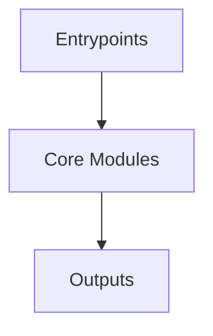

# Overview
Repository `electron` appears to implement a modular system with 2535 source files at commit `828fd59a72e673acf03f878b4f488a40fca46dfe`.

## Architecture
Major components inferred from file/module analysis:
- `docs`: The `electron/docs` module is a collection of documentation files that provide guidelines, explanations, and solutions for various aspects of Electron development
- `root`: The `root` module in the Electron repository serves as the central hub for managing the project's development environment and providing resources for creating cross-platform desktop applications using JavaScript, HTML, a...
- `default_app`: The `electron/default_app` module is a fundamental part of the Electron application, serving as the entry point and configuration hub
- `npm`: The `npm` module in the `electron` repository is responsible for managing the project's dependencies, scripts, and metadata using the Node Package Manager (npm)
- `script`: The `script/lib/util.py` module in the Electron repository serves as a utility module, offering a collection of reusable functions and classes for various tasks such as file operations, network downloads, process executi...
- `spec`: , and manage dependencies and scripts through the `dependencies`, `devDependencies`, and `scripts` sections

## Data Flow / Execution Flow
Typical execution path: `Entrypoint -> Core Modules -> Runtime Services -> Output/Side Effects`.
Entrypoints initialize core modules, which orchestrate processing and emit outputs or side effects.

## Configuration & Dependencies
- Build/dependency files: package.json, default_app/package.json, npm/package.json, spec/package.json, spec/is-valid-window/package.json, spec/fixtures/api/app-path/package.json, spec/fixtures/api/command-line/package.json, spec/fixtures/api/context-bridge/context-bridge-mutability/package.json, spec/fixtures/api/cookie-app/package.json, spec/fixtures/api/default-menu/package.json, spec/fixtures/api/exit-closes-all-windows-app/package.json, spec/fixtures/api/first-party-sets/base/package.json, spec/fixtures/api/first-party-sets/command-line/package.json, spec/fixtures/api/ipc-main-listeners/package.json, spec/fixtures/api/locale-check/package.json, spec/fixtures/api/mixed-sandbox-app/package.json, spec/fixtures/api/net-log/package.json, spec/fixtures/api/quit-app/package.json, spec/fixtures/api/relaunch/package.json, spec/fixtures/api/safe-storage/decrypt-app/package.json, spec/fixtures/api/safe-storage/encrypt-app/package.json, spec/fixtures/api/shared-dictionary/package.json, spec/fixtures/api/singleton-data/package.json, spec/fixtures/api/singleton-userdata/package.json, spec/fixtures/api/singleton/package.json, spec/fixtures/api/test-menu-null/package.json, spec/fixtures/api/test-menu-visibility/package.json, spec/fixtures/api/utility-process/env-app/package.json, spec/fixtures/api/utility-process/inherit-stderr/package.json, spec/fixtures/api/utility-process/inherit-stdout/package.json, spec/fixtures/api/window-all-closed/package.json, spec/fixtures/apps/crash/package.json, spec/fixtures/apps/node-options-utility-process/package.json, spec/fixtures/apps/open-new-window-from-link/package.json, spec/fixtures/apps/refresh-page/package.json, spec/fixtures/apps/remote-control/package.json, spec/fixtures/apps/self-module-paths/package.json, spec/fixtures/apps/set-path/package.json, spec/fixtures/apps/xwindow-icon/package.json, spec/fixtures/auto-update/check-with-headers/package.json, spec/fixtures/auto-update/check/package.json, spec/fixtures/auto-update/initial/package.json, spec/fixtures/auto-update/update-json/package.json, spec/fixtures/auto-update/update-stack/package.json, spec/fixtures/auto-update/update/package.json, spec/fixtures/esm/import-meta/package.json, spec/fixtures/esm/package/package.json, spec/fixtures/native-addon/echo/package.json, spec/fixtures/native-addon/external-ab/package.json, spec/fixtures/native-addon/osr-gpu/package.json, spec/fixtures/native-addon/uv-dlopen/package.json, spec/fixtures/snapshot-items-available/package.json
- Config files: tsconfig.default_app.json, tsconfig.electron.json, tsconfig.json, tsconfig.script.json, tsconfig.spec.json, patches/config.json, spec/ts-smoke/tsconfig.json

## How to Run / Key Scripts
- Detected entrypoints: npm/index.js, script/release/notes/index.ts, spec/index.js, spec/fixtures/api/app-path/lib/index.js, spec/fixtures/api/electron-main-module/app/index.js, spec/fixtures/auto-update/check-with-headers/index.js, spec/fixtures/auto-update/check/index.js, spec/fixtures/auto-update/initial/index.js, spec/fixtures/auto-update/update-json/index.js, spec/fixtures/auto-update/update-stack/index.js, spec/fixtures/auto-update/update/index.js, spec/fixtures/crash-cases/api-browser-destroy/index.js, spec/fixtures/crash-cases/early-in-memory-session-create/index.js, spec/fixtures/crash-cases/fs-promises-renderer-crash/index.js, spec/fixtures/crash-cases/in-memory-session-double-free/index.js, spec/fixtures/crash-cases/js-execute-iframe/index.js, spec/fixtures/crash-cases/native-window-open-exit/index.js, spec/fixtures/crash-cases/node-options-parsing/index.js, spec/fixtures/crash-cases/quit-on-crashed-event/index.js, spec/fixtures/crash-cases/safe-storage/index.js, spec/fixtures/crash-cases/setimmediate-renderer-crash/index.js, spec/fixtures/crash-cases/setimmediate-window-open-crash/index.js, spec/fixtures/crash-cases/transparent-window-get-background-color/index.js, spec/fixtures/crash-cases/utility-process-app-ready/index.js, spec/fixtures/crash-cases/webcontents-create-leak-exit/index.js, spec/fixtures/crash-cases/webcontentsview-create-leak-exit/index.js, spec/fixtures/crash-cases/webview-attach-destroyed/index.js, spec/fixtures/crash-cases/webview-contents-error-on-creation/index.js, spec/fixtures/crash-cases/webview-move-between-windows/index.js, spec/fixtures/crash-cases/webview-remove-on-wc-close/index.js, spec/fixtures/crash-cases/worker-multiple-destroy/index.js, spec/fixtures/extensions/devtools-extension/index.js, spec/fixtures/native-addon/uv-dlopen/index.js
- Use repository build scripts/package manager tasks based on detected build files.

## Notable Design Choices / Extension Points
- The codebase is organized in modules that can be extended by adding new feature files under existing module boundaries.
- Extension is likely centered around entrypoint wiring, configuration files, and module-specific implementations.
