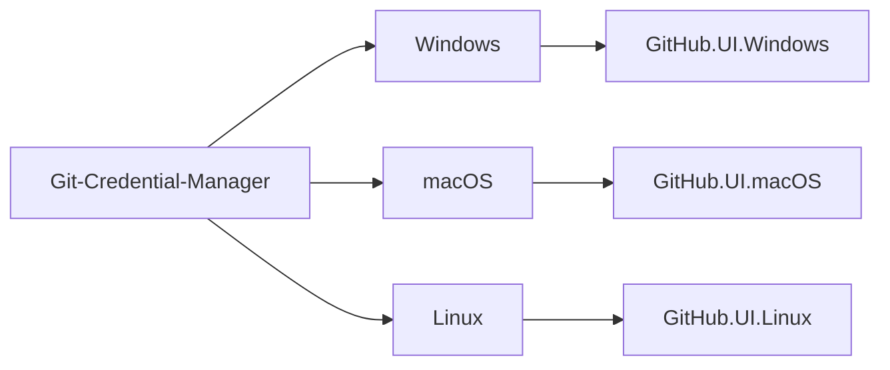

# Overview

The `git-credential-manager` repository is a versatile Git credential helper built on .NET, designed to provide a secure and consistent authentication experience for multiple source control hosting services. The repository includes modules for various platforms, such as Windows, macOS, and Linux, and supports popular platforms like Azure DevOps, Azure DevOps Server, Bitbucket, GitHub, and GitLab.

# Architecture

The main Git-Credential-Manager module is responsible for handling authentication and managing credentials across different platforms. It communicates with platform-specific user interface modules (GitHub.UI.Windows, GitHub.UI.macOS, GitHub.UI.Linux) to provide a seamless user experience.

# Data Flow / Execution Flow

1. Git initiates a push or pull operation to a remote repository.
2. Git detects the need for authentication and calls the Git credential helper (Git-Credential-Manager).
3. Git-Credential-Manager determines the appropriate platform and communicates with the corresponding user interface module (GitHub.UI.Windows, GitHub.UI.macOS, GitHub.UI.Linux).
4. The user interface module prompts the user for authentication credentials if necessary.
5. The user interface module securely stores the credentials and returns them to Git-Credential-Manager.
6. Git-Credential-Manager stores the credentials securely and provides them to Git for the ongoing operation.

# Configuration & Dependencies

Configuration options can be set using environment variables, Git configuration settings, or enterprise configuration. The repository provides documentation on configuration options, network and HTTP configuration, credential stores, host provider